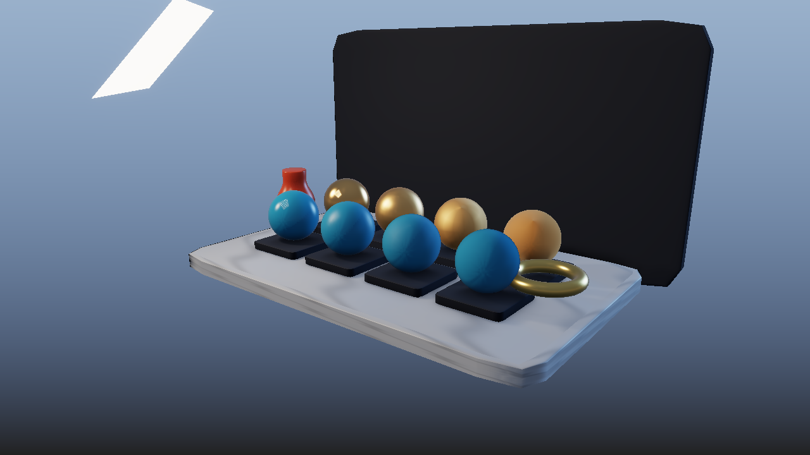
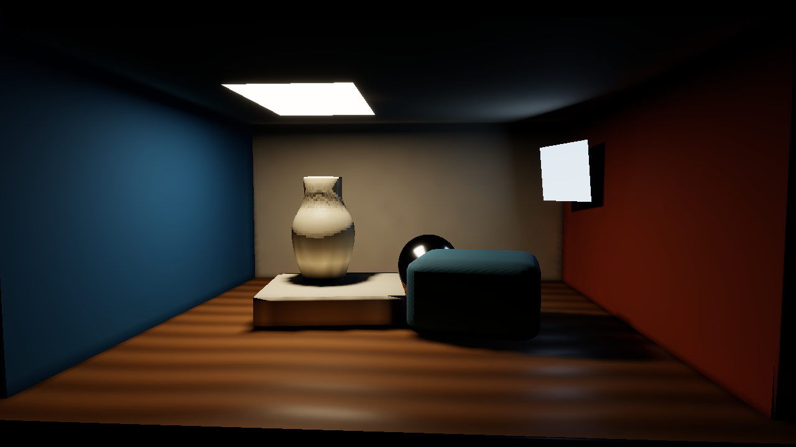
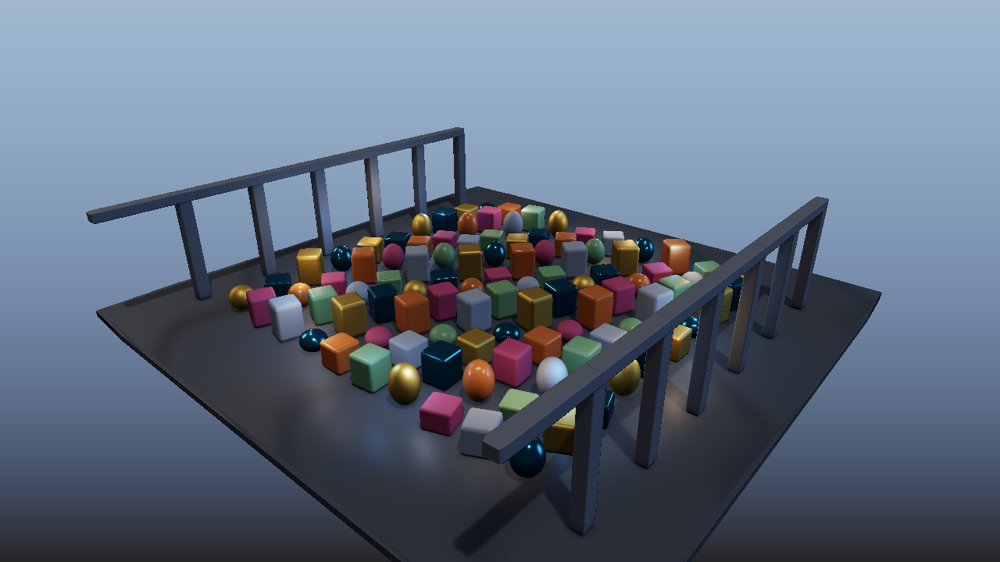

# EmberFrame Engine

一个采用 **C++20 / Vulkan 1.3** 的实时渲染引擎与场景编辑器，面向游戏引擎实习演示：在同一场景中比较渲染算法，查看真实 GPU 执行与资源交接，而不只展示孤立的效果截图。

包含三个无需外部模型包的程序化代表场景、HDR 环境导入、可编辑场景、全帧执行图和逐 Pass 性能分析。它是有明确预算与近似边界的个人项目，不是生产级游戏引擎。

## 快速开始

源码构建需要 Windows x64、Visual Studio 2022 的 C++ 桌面开发组件、CMake 和 Vulkan SDK；运行需要满足引擎功能要求的 GPU 驱动。具体要求与便携包说明见 [Windows 演示包交付](docs/DEMO_DELIVERY.md)。

在仓库根目录的 **PowerShell** 中执行：

```powershell
.\scripts\build-windows.ps1 -Config Release -Target emberframe_workbench
.\bin\Release\emberframe_workbench.exe --showcase materials --fit-viewport
```

也可双击 `Start-EmberFrame.cmd`。日常启动不会自动运行 CPU 对照、测试或基准；不支持的实时配置会提示原因并保留旧画面，不悄悄切成 CPU 渲染。

## 三个代表场景

每个场景自带默认镜头与渲染设置，几何、细分网格、纹理及所需环境均可离线生成。通过顶部“演示场景”菜单切换；菜单预览可用“返回原场景”恢复进入前的工程。

| 场景 | 观察目标 | 建议对比 |
| --- | --- | --- |
| `materials` · 材质展台 | 金属与非金属、粗糙度、法线细节、清漆和环境高光 | 选中材质球修改参数；切换 KC 能量补偿，比较粗糙金属 |
| `interior` · 室内画廊 | 面积光、接触阴影、墙面颜色与间接光 | 固定镜头与曝光，比较关闭 GI / LPV，避免用整体调亮代替反弹光 |
| `many-objects` · 多物体灯光场 | 共享网格实例、近远层次与多盏局部光源 | 比较 All / Tiled / Clustered 的画面与 GPU 成本，不把灯表切换当成视觉特效 |

```powershell
.\bin\Release\emberframe_workbench.exe --showcase materials
.\bin\Release\emberframe_workbench.exe --showcase interior
.\bin\Release\emberframe_workbench.exe --showcase many-objects
```

以下截图来自真实 Vulkan GPU 读回，PNG 由 BMP 无损转换，不是概念效果图。实际尺寸、图片哈希与生成它们的程序版本见 [画面来源记录](docs/evidence/media.json)。







## 导入与编辑

- **场景与对象：**Ctrl+N 新建场景；场景树右键创建模型、节点或光源。静态 GLB / glTF / OBJ 可追加导入，W / E / R 切换平移、旋转、缩放，Ctrl+Z / Ctrl+Y 撤销、重做。
- **资源与材质：**节点编辑实例变换和资源引用；资源检查器编辑共享网格、材质或纹理。PNG / JPG / TGA / BMP 可绑定颜色、金属/粗糙度、法线、AO、自发光槽；可为单个实例创建独立材质。
- **HDR 环境：**拖入 Radiance `.hdr`，或用“文件 → 导入 HDR 环境…”。同一环境驱动背景与 IBL，可调整强度、旋转；未导入时保留解析天空。支持尺寸、数值与内存预算检查，不支持 EXR。
- **工程保存：**`.ember` 保存场景、相机、设置与资源；HDR 数据嵌入工程，不依赖原文件的绝对路径。外部 glTF 自身的纹理/Buffer 依赖仍需完整提供。

```powershell
# 使用仓库中的可选 CC0 环境，也可替换为自己的 Radiance HDR 路径
.\bin\Release\emberframe_workbench.exe --showcase materials --environment .\assets\showcase\studio_small_08_1k.hdr
```

该可选环境由 Poly Haven 的 Sergej Majboroda 创作，采用 CC0；来源、文件哈希与许可见 [资产清单](assets/showcase/ASSETS.json)。三个代表场景不依赖它。实际导入画面见 [HDR 示例](docs/media/external-hdr.png)。

右键拖动或 Alt+左键环绕相机，Shift 配合拖动平移，滚轮缩放，F 聚焦，F11 全屏。选中模型后 Ctrl+左键拖动可旋转物体。

## 可以演示的技术

- **材质与光照：**Metallic-Roughness PBR、GGX / Smith / Schlick、Kulla–Conty 能量补偿；Disney 清漆/各向异性/Sheen；HDR 预过滤、Split-Sum IBL 与 BRDF LUT；LTC 矩形面积光。
- **多光源与可见性：**Forward / Deferred、Tiled / Clustered 灯表、GPU 视锥剔除与 Indirect Draw；Reversed-Z、实际 LOD 链，以及 BVH / 八叉树查询。
- **阴影与间接光：**PCF / PCSS、稳定化 CSM、VSM / SAT / VSSM / MSM；SSR / SSGI、RSM / LPV / Voxel Cone Tracing；SH / 静态 PRT 与网格距离场预计算。
- **时域与后处理：**SSAO / GTAO、投影 jitter、相机与刚体运动重投影、历史拒绝/钳制、SVGF 基础版、多级 Bloom；在线性 HDR 中计算，统一曝光、Tone Mapping 与 sRGB 输出。
- **引擎工程：**全帧 Render Graph、CPU / GPU Profiler、任务依赖与工作窃取；后台资产解析、预算化上传、Staging Ring / Fence 回收、不可变快照；Shader 热重载失败回退与驱动 Pipeline Cache。

主体位于 [`engine/lab`](engine/lab)。CPU 光栅化、路径追踪及数值对照是显式开发工具，不冒充 GPU 实时效果。学习材料另见 [学习路线](docs/learning/LEARNING_PATH.md) 与 [高级渲染专题](docs/learning/ADVANCED_RENDERING_TRACK.md)。

## 性能、运动回放与全帧执行图

打开 **视图 → 性能分析（View → Profiler）**，查看已完成提交的 CPU 帧阶段、逐 Pass 命令录制时间与 GPU timestamp，并导出该帧 JSON。没有有效 GPU 时间时明确显示“不可用”；嵌套 Pass 的时间不能直接相加，CPU 录制耗时也不是 GPU 执行耗时。

可查看 [实际 Profiler 界面](docs/media/editor-profiler.png) 与 [已完成材质场景帧](docs/evidence/profile-materials.json)，而非仅看 UI 示意图。

使用刚体运动回放观察时域效果；下面开启 SSGI，让低采样间接光的 SVGF 过滤与 TAA 都有可观察输入：

```powershell
.\bin\Release\emberframe_workbench.exe --showcase materials --object-replay --gi 2 --taa --svgf
```

`--object-replay` 对网格节点进行平移/旋转，使用当前与上一帧变换建立运动关系；不是蒙皮动画。菜单“演示场景 → 所选物体运动 / TAA、SVGF”可回放选中对象，“停止物体运动并还原”恢复初始姿态。

**全帧执行图（Full Graph）**串联当前配置实际启用的几何/光照、时域过滤、Bloom、Tone Mapping、编辑器 UI 与 Present 布局交接，记录资源读写依赖和 Vulkan 屏障，而不是静态概念图。导出实际提交的图：

```powershell
.\bin\Release\emberframe_workbench.exe --showcase many-objects --frames 32 --graph-output output\fullgraph
```

输出包含 JSON / DOT，随配置改变。当前为单队列、整资源状态管理；部分模块内部子步骤仍自行管理屏障，没有异步 Compute 或物理内存 Alias 分配。此处的“全帧”指最终呈现链路纳入执行图，不等于所有内部 Dispatch 已完全自动调度。

运动回放的 [实际执行图](docs/evidence/graph-motion.json)、[已完成帧分析](docs/evidence/profile-motion.json) 和 [GPU 画面](docs/media/moving-object.png) 可按对应版本与配置对照。

## 验证记录与交付

本轮最终本机验收在 NVIDIA GeForce RTX 4060 Laptop GPU 上通过：**279 项 CPU 检查、217 项 GPU/配套检查**，以及 **8 组真实 Vulkan 场景与 A/B 用例**；用例退出码均为 0，未发现 Validation 错误。详细配置与结果见 [实习 Demo 验证记录](docs/evidence/internship-demo.json)。不同检查集合不相加，场景通过也不等同于逐项人工编辑器验收。

包围球缓存的受控 A/B 在 640×360 下每组采集 48 个计时样本：**CPU 几何准备中位数为 0.0666 ms（缓存）/ 0.8029 ms（无缓存），局部收益约 12.0555556×**。这只是命令录制的一个子阶段。GPU 中位数分别为 **1.026912 ms（缓存）/ 1.025024 ms（无缓存）**，并不相同，数据不支持 GPU 加速，也不能外推为整帧 FPS 提升。该组 PFM 完全一致，不推广为所有渲染算法的零误差保证。

上述最终记录绑定程序 SHA256：`4ADBBD56E6D1D9733D8A2B926DE0F9AA0BB6EC4910B5C1990461122543652F5B`。每份证据只适用于它绑定的版本与配置，重新构建后需要重新验证和导出，不能用旧记录证明新版已通过。GPU 时间包含诊断开销，不承诺跨机器 FPS；系统文件选择器与鼠标布局的人工验收需单独说明。截图不能代替性能采样。

旧版运行记录仅作为 [README 历史存档](docs/README_HISTORY.md) 保留，不作为本轮公共验收依据。

已有新版 Release 后可生成便携包：

```powershell
.\scripts\package-workbench.ps1 -SkipBuild
# 同时携带上述可选 HDR 与许可
.\scripts\package-workbench.ps1 -SkipBuild -AssetManifestPath assets/showcase/ASSETS.json
```

依赖、预编译 Shader、字体许可、资源清单与包验收步骤见 [Windows 演示包交付](docs/DEMO_DELIVERY.md)。打包不自动运行测试；生成 ZIP 不等于已完成异机验收或发布 Release。本轮 GitHub 远程 CI 尚未运行。

便携运行单独见 [同机迁移记录](docs/evidence/portable-runtime.json)，可用 [便携复验脚本](scripts/verify-portable-workbench.ps1) 重现，参数见交付文档。记录绑定包与 EXE 哈希，列出移除 SDK PATH、显式验证层不可用、中文/空格解压路径、无关工作目录下的场景运行，以及 payload 哈希和包文件列表检查；实际通过范围与数量以记录为准，不并入其他场景计数，也不以未启用验证层的成功运行代替 Validation 检查。

这类迁移验收仍在同一机器进行，宿主机 SDK 仍安装、源码仍保留；不等同于只读 ACL、完全无 SDK/源码环境或跨机器验收，不作相应兼容性承诺。

## 近似与边界

- SSR / SSGI / AO 依赖屏幕可见信息，无法完整获得屏幕外或被遮挡的几何；低采样会有噪声，时域过滤仍可能拖影。SVGF 未实现完整漫反射/镜面分离与反照率解调。
- RSM / LPV / VCT 使用一盏主 GI 光源；面积光采用灯心近似，LPV 是低阶传播，体素为 16³ / 32³ 各向同性网格，材质体素化不完整烘焙贴图/Alpha。它们是实时近似，不是无漏光的多次反弹解算器。
- LTC 使用粗拟合表；部分材质项采用有限面积求积。IBL 的 LUT/预过滤分辨率有限，未提供完整各向异性、清漆环境积分。VSM / VSSM 可能漏光，MSM 退化时回退 VSM，Float32 SAT 存在精度限制。
- GPU 灯表最多 64 盏；CSM 与 GPU 距离场阴影需要方向光。QEM 有输入预算、无全局自相交保证，LOD 不做 geomorphing；SH / PRT 是低阶静态漫反射近似。
- 模型以静态网格为主，FBX、骨骼/形变动画、硬件光追不在当前支持范围；刚体回放不是动画系统。CPU 路径追踪用于参考，也不覆盖完整透明折射。

## 来源与许可

保留 [Vulkan Guide](https://github.com/vblanco20-1/vulkan-guide) 上游章节及来源；[Piccolo](https://github.com/BoomingTech/Piccolo) 仅作为架构阅读参考。新增工作台与上游代码的边界见 [UPSTREAM.md](UPSTREAM.md)。原许可文件见 [LICENSE.txt](LICENSE.txt)，依赖、字体与资产分别遵循各自许可，详见 [第三方许可说明](docs/THIRD_PARTY_LICENSES.md)。
