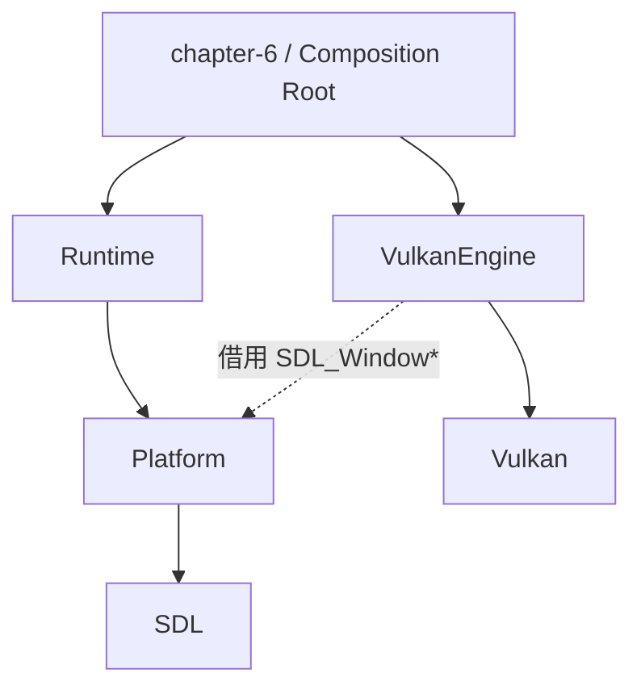
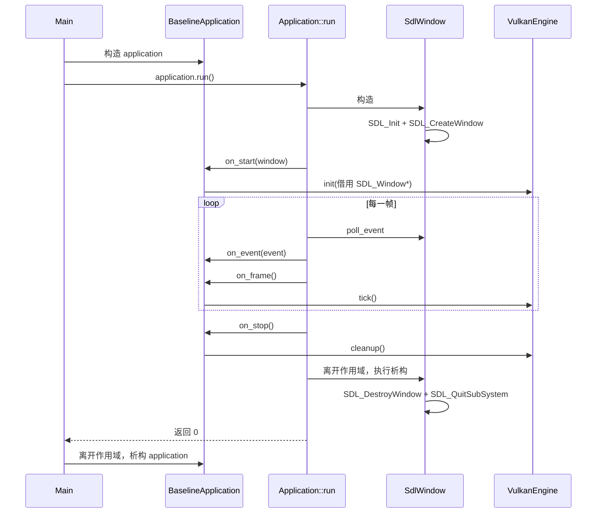

# B2：RAII、Platform 与 Runtime 完整学习指南

> 本文是一份自包含课程。只阅读本文、运行文中的命令并完成实验，就可以完整学习 B2；源码链接只用于最后对照，不是理解本文的前提。
>
> 对应代码快照：2026-09-16。

## 0. 本课最终要解决什么

B1 已经完成了最原始的 SDL 程序：初始化 SDL、创建窗口、处理事件、销毁窗口。B2 不增加新的画面效果，而是把这段过程变成可以继续承载 Vulkan 和引擎模块的工程结构。

本课结束后，你应当能完整回答：

1. RAII 为什么不只是内存管理？
2. `SdlWindow`、`Application`、`BaselineApplication` 和 `VulkanEngine` 分别拥有什么？
3. “拥有一个指针”和“借用一个指针”有什么区别？
4. 为什么窗口要放在 Platform，主循环要放在 Runtime，渲染要放在 Renderer？
5. 正常退出、运行中抛异常、构造中抛异常时，清理路径分别是什么？
6. 为什么 Vulkan 必须在 SDL 窗口之前清理？
7. 当前代码在哪些地方已经做到异常安全，哪里仍有缺口？
8. CMake 如何表达 `Runtime → Platform → SDL` 的依赖关系？

## 1. B2 的知识地图

```mermaid
flowchart LR
    B1["B1 手动 SDL 生命周期"]
    Resource["资源、作用域与生命周期"]
    RAII["RAII 包装 SdlWindow"]
    Ownership["所有权与借用"]
    Platform["Platform 平台层"]
    Runtime["Runtime 主循环"]
    Root["Composition Root 组合根"]
    Exception["异常与栈展开"]
    Verify["日志和故障注入验证"]

    B1 --> Resource --> RAII --> Ownership
    Ownership --> Platform --> Runtime --> Root
    Root --> Exception --> Verify
```



本课不深入 Vulkan Instance、Device、Swapchain、Pipeline 和同步。`VulkanEngine` 在 B2 中只作为一个需要被 Runtime 启动、逐帧调用和停止的子系统。

## 2. 先建立五个基础概念

### 2.1 资源

资源是程序从某个系统申请、使用完后必须归还的东西。它不只包括堆内存。

| 资源 | 获取方式 | 释放方式 |
|---|---|---|
| 堆内存 | `new` | `delete` |
| SDL 窗口 | `SDL_CreateWindow` | `SDL_DestroyWindow` |
| Vulkan Device | `vkCreateDevice` | `vkDestroyDevice` |
| 文件 | 打开文件 | 关闭文件 |
| 互斥锁 | 加锁 | 解锁 |
| 线程 | 创建线程 | `join` 或其他受控结束 |

只要存在“获取成功后必须释放”这条规则，它就是生命周期资源。

### 2.2 作用域与生命周期

局部对象的生命周期通常由花括号决定：

```cpp
{
    SdlWindow window(config); // 生命周期开始
    // window 在这里有效
} // 生命周期结束，自动调用 ~SdlWindow()
```

作用域回答“这个名字在哪里可以使用”，生命周期回答“这个对象从什么时候存在到什么时候销毁”。对于这里的局部对象，两者结束的位置相同。

### 2.3 所有权与借用

拥有者负责资源的最终释放；借用者只能在拥有者保证资源有效时使用它。

```cpp
SDL_Window* handle = window.native_handle();
```

这里：

- `SdlWindow` 拥有真正的 SDL 窗口；
- `handle` 只是借用指针；
- 借用者不能调用 `SDL_DestroyWindow(handle)`；
- `SdlWindow` 销毁后，`handle` 立即变成悬空指针，不能继续使用。

是否使用裸指针不能单独判断所有权。这里使用裸指针，但注释、接口和销毁职责明确规定它是借用关系。

### 2.4 RAII

RAII 的全称是 **Resource Acquisition Is Initialization**，中文常译为“资源获取即初始化”。它是一种对象生命周期设计方法：

1. 构造函数获取资源；
2. 对象存在期间保证资源有效；
3. 析构函数释放资源；
4. 通过控制对象作用域控制资源生命周期。

RAII 的直接价值不是少写一行 `Destroy`，而是让正常返回、提前返回和大多数异常路径都经过同一个析构位置。

### 2.5 异常与栈展开

代码执行 `throw` 后，C++ 会寻找能够处理该异常的 `catch`。在进入匹配的处理器或离开已经确定要展开的作用域时，会销毁已经成功构造的局部对象，这个过程叫 **Stack Unwinding，栈展开**。

关键限制：构造函数没有完整返回时，该对象没有构造成功，因此不会调用这个对象自己的析构函数。已经构造完成的成员和基类仍会按规则析构，但构造函数直接获取的裸资源必须在失败路径上处理。

## 3. 为什么要分成 Platform、Runtime 和 Renderer

### 3.1 三层职责

| 层 | 立即负责什么 | 输入 | 输出 | 不应该负责什么 |
|---|---|---|---|---|
| Platform | SDL 初始化、窗口、平台事件 | 窗口配置、操作系统事件 | 有效窗口、尺寸、事件 | Vulkan Pipeline、游戏逻辑 |
| Runtime | 程序启动、主循环、退出和生命周期回调 | Platform 能力、Application 回调 | 稳定的帧循环 | 具体绘制算法 |
| Renderer | Vulkan 初始化、渲染一帧、GPU 资源清理 | 借用的窗口、场景数据 | 最终帧 | 创建主循环、拥有 SDL 窗口 |

### 3.2 依赖方向



依赖方向表达的是“谁需要知道谁”：

- Platform 知道 SDL，但不知道 Runtime 和 Renderer；
- Runtime 知道 Platform，但不知道具体 Vulkan 实现；
- 组合根知道 Runtime 和 VulkanEngine，并把它们连接起来。

这样将来替换 Renderer、制作无窗口测试或增加其他 Sample 时，不需要重写窗口类和主循环。

## 4. Platform 接口：`sdl_window.h`

下面是本课需要理解的完整接口：

```cpp
#pragma once

#include <cstdint>
#include <string>

union SDL_Event;
struct SDL_Window;

namespace emberframe::platform {

struct WindowConfig {
    std::string title { "EmberFrame Engine" };
    std::uint32_t width { 1700 };
    std::uint32_t height { 900 };
    bool resizable { true };
};

struct WindowExtent {
    std::uint32_t width;
    std::uint32_t height;
};

class SdlWindow {
public:
    explicit SdlWindow(const WindowConfig& config);
    ~SdlWindow();

    SdlWindow(const SdlWindow&) = delete;
    SdlWindow& operator=(const SdlWindow&) = delete;
    SdlWindow(SdlWindow&&) = delete;
    SdlWindow& operator=(SdlWindow&&) = delete;

    [[nodiscard]] SDL_Window* native_handle() const noexcept;
    [[nodiscard]] WindowExtent extent() const noexcept;
    bool poll_event(SDL_Event& event) const noexcept;

private:
    SDL_Window* window_ { nullptr };
};

} // namespace emberframe::platform
```

### 4.1 `#pragma once`

头文件可能通过不同路径被包含多次。`#pragma once` 要求编译器在一个翻译单元中只处理它一次，避免类型重复定义。

### 4.2 为什么这里只前置声明 SDL 类型

```cpp
union SDL_Event;
struct SDL_Window;
```

这两行告诉编译器“存在这些类型”，但暂时不提供内部布局。头文件只使用它们的指针或引用：

```cpp
SDL_Window*
SDL_Event&
```

指针和引用的大小在类型不完整时也是已知的，所以不需要在公共头文件中包含完整 `SDL.h`。这样可以减少编译依赖，并避免让所有包含本头文件的代码都间接看到大量 SDL 声明。

如果类要把 `SDL_Window` 本体作为值成员，编译器就必须知道完整大小，前置声明将不够用。

### 4.3 `WindowConfig` 和 `WindowExtent`

`WindowConfig` 是创建窗口的输入：标题、初始宽高和是否允许缩放。花括号中的内容是默认成员初始化值。

```cpp
WindowConfig config; // 自动得到默认值
```

`WindowExtent` 是查询当前尺寸的输出。初始配置和当前尺寸是两个概念：用户拖动窗口后，当前尺寸可能已经改变。

### 4.4 构造函数参数

```cpp
explicit SdlWindow(const WindowConfig& config);
```

- `const`：不能通过这个参数修改调用者的配置；
- `&`：通过引用读取，避免复制 `std::string title`；
- `explicit`：禁止编译器把一份 `WindowConfig` 隐式当作 `SdlWindow`。

推荐的调用明确写出构造动作：

```cpp
SdlWindow window(config);
```

#### 理解深化：`explicit` 到底阻止了什么

`explicit` 的意思不是“必须手动调用构造函数”，而是禁止编译器把其他类型**隐式转换**成当前类型。

假设构造函数没有 `explicit`：

```cpp
SdlWindow(const WindowConfig& config);
```

那么下面这种写法可能触发编译器自动构造一个 `SdlWindow`：

```cpp
WindowConfig config;
SdlWindow window = config; // 隐式地调用 SdlWindow(config)
```

加上 `explicit` 后，上述隐式写法被禁止，必须明确写成：

```cpp
SdlWindow window(config);
// 或
SdlWindow window{config};
```

窗口构造会初始化 SDL、创建操作系统资源并且可能抛异常，因此让调用者明确写出“我正在创建窗口”比允许静默转换更安全。

### 4.5 析构函数

```cpp
~SdlWindow();
```

析构函数没有返回值，也不接收参数。对象生命周期结束时由 C++ 自动调用。它是 SDL 资源释放的唯一所有者入口。

### 4.6 为什么删除复制和移动

如果默认复制内部裸指针：

```cpp
SdlWindow first(config);
SdlWindow second = first;
```

就可能得到：

```text
first.window_  ─┐
                ├─→ 同一个 SDL_Window
second.window_ ─┘
```

两个对象析构时都会销毁同一个窗口，产生重复释放和未定义行为。因此删除复制构造和复制赋值：

```cpp
SdlWindow(const SdlWindow&) = delete;
SdlWindow& operator=(const SdlWindow&) = delete;
```

移动并非理论上不能实现。一个正确的移动构造函数可以把指针交给新对象，再把旧对象指针设为 `nullptr`。当前代码不需要转移窗口所有权，所以也删除移动，让对象位置和所有权保持稳定：

```cpp
SdlWindow(SdlWindow&&) = delete;
SdlWindow& operator=(SdlWindow&&) = delete;
```

### 4.7 三个公开方法

```cpp
[[nodiscard]] SDL_Window* native_handle() const noexcept;
```

返回借用指针，供 Vulkan 创建 Surface 或查询平台信息。`const` 表示不修改 `SdlWindow` 的成员，`noexcept` 表示不向调用者抛异常，`[[nodiscard]]` 请求编译器在调用者忽略结果时给出警告。

注意：返回类型是 `SDL_Window*`，不是 `const SDL_Window*`。成员函数的 `const` 只限制它不能改变 `window_` 这个成员，不自动保证外部 SDL 对象不可变。

#### 理解深化：为什么返回裸指针仍然只是借用

返回类型 `SDL_Window*` 本身没有表达所有权。判断是否转移所有权，要看谁最终销毁资源以及返回时原拥有者是否放弃资源。

`native_handle()` 的实现只是复制地址：

```cpp
SDL_Window* SdlWindow::native_handle() const noexcept
{
    return window_;
}
```

调用后会有两个指针值指向同一个 SDL 窗口，但 `SdlWindow` 仍保留 `window_`，析构时仍由它调用 `SDL_DestroyWindow()`。函数没有把 `window_` 设为 `nullptr`，也没有名为 `release()` 的所有权释放操作，所以没有发生所有权转移。

如果接口真的要转移所有权，通常需要类似下面的语义：

```cpp
SDL_Window* release() noexcept
{
    SDL_Window* result = window_;
    window_ = nullptr; // 原对象明确放弃所有权
    return result;
}
```

当前项目没有提供这种函数，因此调用者只能借用。

#### 理解深化：`SdlWindow` 类、对象和成员分别是什么

`class SdlWindow` 是一个类型定义，规定这种对象内部保存什么数据、能够执行什么函数：

```cpp
class SdlWindow {
public:
    bool poll_event(SDL_Event& event) const noexcept;

private:
    SDL_Window* window_ { nullptr };
};
```

只有真正声明变量时，才创建了一个 `SdlWindow` 对象：

```cpp
SdlWindow window(config);
//        ^^^^^^ 这是对象变量的名字
```

可以分别理解为：

| 名称 | 属于什么 | 含义 |
|---|---|---|
| `SdlWindow` | 类/类型 | 规定窗口包装器的结构和行为 |
| `window` | 对象/实例 | 根据 `SdlWindow` 类型创建出来的一份真实数据 |
| `window.window_` | 对象的成员 | 这一个对象内部保存的 SDL 窗口地址 |

如果再创建一个变量：

```cpp
SdlWindow second_window(other_config);
```

内存中就是两个互相独立的对象，每个对象都有自己的 `window_` 成员。

调用：

```cpp
window.poll_event(event);
```

时，“当前 `SdlWindow` 对象”就是点号左边的 `window`。进入成员函数后，C++ 通过一个隐含的 `this` 指针知道正在操作哪一个对象。概念上可以理解为：

```cpp
const SdlWindow* this = &window;
```

尾部 `const` 约束的就是 `this` 指向的这一份 `SdlWindow` 对象，而不是程序中的所有数据。

#### 理解深化：指针本身和指向对象是两层不同的 const

需要分别问两个问题：

1. 指针变量中保存的地址能不能改变？
2. 能不能通过这个指针修改它指向的对象？

| 写法 | 地址能否改变 | 指向对象能否通过该指针修改 |
|---|---|---|
| `SDL_Window* p` | 能 | 能 |
| `SDL_Window* const p` | 不能 | 能 |
| `const SDL_Window* p` | 能 | 不能 |
| `const SDL_Window* const p` | 不能 | 不能 |

在这个成员函数中：

```cpp
SDL_Window* native_handle() const noexcept;
```

末尾的 `const` 让当前 `SdlWindow` 对象被当成只读对象，因此函数内部不能执行：

```cpp
window_ = nullptr; // 错误：修改了 SdlWindow 的指针成员
```

但 `window_` 的声明仍是 `SDL_Window*`，指向的 SDL 窗口不是 const，所以理论上仍可通过它调用会修改窗口的 SDL 函数。准确说法是：**不能修改成员 `window_` 保存的地址，但可以修改 `window_` 指向的 SDL 窗口对象。**

调用者得到的是指针值的一份副本：

```cpp
SDL_Window* handle = window.native_handle();
handle = nullptr; // 只修改 handle，不会修改 window.window_
```

把局部变量 `handle` 改成别的地址，不影响 `SdlWindow` 内部保存的地址。

```cpp
[[nodiscard]] WindowExtent extent() const noexcept;
```

返回当前窗口宽高。返回一个小型值对象比暴露两个可写引用更容易理解。

```cpp
bool poll_event(SDL_Event& event) const noexcept;
```

从 SDL 全局事件队列取出一个事件，成功时返回 `true` 并写入 `event`。它不修改 `SdlWindow::window_`，所以成员函数可以是 `const`；但它会改变 SDL 外部事件队列。`const` 只描述当前 C++ 对象的可观察成员状态，不代表整个系统完全没有变化。

#### 理解深化：`poll_event()` 到底改变了什么

调用前假设 SDL 的全局队列中有两个事件：

```text
[键盘事件 A, 关闭事件 B]
```

执行：

```cpp
SDL_Event event;
bool received = window.poll_event(event);
```

执行后：

```text
event        = 键盘事件 A
SDL 事件队列 = [关闭事件 B]
received     = true
window_      = 原来的窗口地址，没有变化
```

因此这个函数改变了两处数据：

- 通过非 const 引用 `SDL_Event& event`，写入调用者提供的事件变量；
- 通过 SDL API，从 SDL 管理的外部全局队列中移除一个事件。

它没有改变 `SdlWindow` 自己的成员 `window_`，所以仍然可以声明为 const 成员函数。

### 4.8 私有资源句柄

```cpp
SDL_Window* window_ { nullptr };
```

指针初始化为 `nullptr`，表示尚未持有窗口。放在 `private` 中可以阻止调用者任意替换它。外部只能通过受控接口借用。

## 5. Platform 实现：`sdl_window.cpp`

### 5.1 构造函数完整代码

```cpp
SdlWindow::SdlWindow(const WindowConfig& config)
{
    if (SDL_Init(SDL_INIT_VIDEO) != 0) {
        throw std::runtime_error(
            std::string("SDL video initialization failed: ")
            + SDL_GetError());
    }

    auto flags = static_cast<SDL_WindowFlags>(SDL_WINDOW_VULKAN);
    if (config.resizable) {
        flags = static_cast<SDL_WindowFlags>(
            flags | SDL_WINDOW_RESIZABLE);
    }

    window_ = SDL_CreateWindow(
        config.title.c_str(),
        SDL_WINDOWPOS_UNDEFINED,
        SDL_WINDOWPOS_UNDEFINED,
        static_cast<int>(config.width),
        static_cast<int>(config.height),
        flags);

    if (window_ == nullptr) {
        const std::string error = SDL_GetError();
        SDL_QuitSubSystem(SDL_INIT_VIDEO);
        throw std::runtime_error(
            "SDL window creation failed: " + error);
    }
}
```

逐步执行：

1. `SDL_Init(SDL_INIT_VIDEO)` 初始化 SDL 视频子系统；
2. 返回 `0` 表示成功，非零表示失败；
3. 失败时先复制 `SDL_GetError()` 的错误文本，再抛出 `std::runtime_error`；
4. 初始 Flags 包含 `SDL_WINDOW_VULKAN`，表示窗口可与 Vulkan Surface 配合；
5. 如果允许缩放，通过按位或 `|` 加入 `SDL_WINDOW_RESIZABLE`；
6. `SDL_CreateWindow` 返回 `SDL_Window*`，成功后交给 `window_` 持有；
7. `nullptr` 表示创建失败。

`static_cast` 在这里进行显式类型转换：配置宽高使用 `std::uint32_t`，而 SDL 参数需要 `int`；Flags 做按位运算后也显式转换回 `SDL_WindowFlags`。

### 5.2 为什么窗口创建失败要手动退出 SDL

失败发生在构造函数尚未返回的时候：

```text
SDL_Init 成功
→ SDL_CreateWindow 失败
→ SdlWindow 对象没有构造完成
→ 不会调用 SdlWindow::~SdlWindow()
```

因此必须在抛异常前手动释放已经成功获取的 SDL Video 子系统：

```cpp
SDL_QuitSubSystem(SDL_INIT_VIDEO);
throw std::runtime_error(...);
```

这不是违反 RAII，而是在资源还没成功交给一个完整 RAII 对象前，构造函数必须自行回滚。

### 5.3 三条构造路径

| 路径 | 已获得什么 | 谁负责清理 | 结果 |
|---|---|---|---|
| `SDL_Init` 失败 | 什么都没有 | 不需要清理窗口 | 抛异常 |
| SDL 成功、窗口失败 | SDL Video 子系统 | 构造函数失败分支 | 清理 SDL 后抛异常 |
| 两者都成功 | SDL Video + Window | 完整对象的析构函数 | 返回有效对象 |

### 5.4 析构函数完整代码

```cpp
SdlWindow::~SdlWindow()
{
    if (window_ != nullptr) {
        SDL_DestroyWindow(window_);
        window_ = nullptr;
    }
    SDL_QuitSubSystem(SDL_INIT_VIDEO);
}
```

创建顺序是：

```text
SDL Video → SDL Window
```

销毁顺序必须相反：

```text
SDL Window → SDL Video
```

窗口依赖 SDL Video 子系统，所以不能先关闭子系统再销毁窗口。把指针设为 `nullptr` 不是为了让已经结束的析构函数再次使用，而是明确表示资源已经释放，并让调试状态更清晰。

析构函数没有显式写 `noexcept`，但没有 `noexcept(false)` 的普通析构函数默认是 `noexcept(true)`。析构期间不应让异常逃出，否则在另一个异常的栈展开过程中可能直接触发 `std::terminate()`。

### 5.5 三个方法的实现

```cpp
SDL_Window* SdlWindow::native_handle() const noexcept
{
    return window_;
}
```

只返回借用句柄，不转移所有权。

```cpp
WindowExtent SdlWindow::extent() const noexcept
{
    int width = 0;
    int height = 0;
    SDL_GetWindowSize(window_, &width, &height);
    return {
        static_cast<std::uint32_t>(width),
        static_cast<std::uint32_t>(height),
    };
}
```

SDL 通过输出参数写入宽高，包装层再把两个值组合为 `WindowExtent` 返回。当前实现假设有效窗口尺寸不会是负数，因此转换为无符号整数。

```cpp
bool SdlWindow::poll_event(SDL_Event& event) const noexcept
{
    return SDL_PollEvent(&event) != 0;
}
```

传入的是引用，调用 SDL 时用 `&event` 取得地址。SDL 返回非零表示取到了事件，包装层把它转换为清晰的 `bool`。

## 6. Runtime 接口：`application.h`

完整接口如下：

```cpp
#pragma once

#include "platform/sdl_window.h"

union SDL_Event;

namespace emberframe::runtime {

class Application {
public:
    explicit Application(platform::WindowConfig window_config = {});
    virtual ~Application() = default;

    Application(const Application&) = delete;
    Application& operator=(const Application&) = delete;

    int run();

protected:
    virtual void on_start(platform::SdlWindow& window) = 0;
    virtual void on_event(SDL_Event& event) = 0;
    virtual void on_frame() = 0;
    virtual void on_stop() noexcept = 0;

private:
    platform::WindowConfig window_config_;
};

} // namespace emberframe::runtime
```

### 6.1 `Application` 是什么类型

它是抽象基类。四个函数末尾的 `= 0` 表示纯虚函数，`Application` 只规定生命周期协议，不提供具体渲染行为，因此不能直接创建：

```cpp
Application app; // 错误：抽象类不能实例化
```

派生类必须实现四个回调：

| 回调 | Runtime 何时调用 | 具体应用通常做什么 |
|---|---|---|
| `on_start` | 窗口创建后、主循环前 | 初始化 Renderer |
| `on_event` | 每取出一个平台事件 | 更新输入、处理窗口变化 |
| `on_frame` | 每轮主循环 | 更新并渲染一帧 |
| `on_stop` | 正常退出或已启动后的异常路径 | 清理 Renderer |

### 6.2 为什么需要虚析构函数

```cpp
virtual ~Application() = default;
```

如果将来通过基类指针销毁派生对象：

```cpp
Application* app = new BaselineApplication();
delete app;
```

虚析构保证先执行派生类析构，再执行基类析构。`= default` 表示让编译器生成默认实现。

即使当前代码使用栈对象而不是 `new`，抽象多态基类仍应该提供虚析构，避免接口留下危险使用方式。

### 6.3 `protected` 和 `private`

- `protected` 回调允许派生类覆盖，但普通外部调用者不能直接调用；
- `private window_config_` 只由 `Application` 自己管理；
- 外部入口只有 `run()`，因此 Runtime 能控制生命周期调用顺序。

三种访问级别可以这样区分：

| 访问级别 | 类自己 | 派生类 | 普通外部代码 |
|---|---:|---:|---:|
| `public` | 可以 | 可以 | 可以 |
| `protected` | 可以 | 可以 | 不可以 |
| `private` | 可以 | 不可以 | 不可以 |

例如 `BaselineApplication` 是 `Application` 的派生类，所以它可以覆盖 protected 回调：

```cpp
void on_frame() override
{
    renderer_.tick();
}
```

但 `main()` 中的普通外部代码不能绕过 Runtime 自己启动某个阶段：

```cpp
BaselineApplication application;
application.on_start(window); // 错误：on_start 是 protected
application.run();            // 正确：run 是 public
```

`Application::run()` 是基类自己的成员函数，所以它可以调用这些 protected 虚函数。虚函数机制会在运行时转到 `BaselineApplication` 的实际实现。

`window_config_` 是 private，因此派生类也不能直接读写它：

```cpp
window_config_.width = 1280; // 在 BaselineApplication 中错误
```

派生类只能在构造基类时提交配置，之后由 `Application` 自己保存和使用。这样外部只能从 `run()` 进入，执行顺序就被固定为“创建窗口 → 启动 → 事件/帧循环 → 停止”，不能随意跳过阶段或重复调用。

这体现了 Template Method（模板方法）结构：基类的 `run()` 固定整体流程，派生类只填入各阶段行为。这里学习的是现代工程中的生命周期组织，不要求背设计模式名称。

### 6.4 为什么 `on_stop()` 是 `noexcept`

清理函数经常在异常处理期间调用。如果它再次抛异常，程序可能无法继续栈展开并直接终止。`noexcept` 要求实现者保证清理不把异常传播出去。

如果 `on_stop()` 内部调用的函数真的抛出了异常，因为函数承诺了 `noexcept`，程序会调用 `std::terminate()`。所以 `noexcept` 不是“自动处理异常”，而是一份必须由实现满足的契约。

## 7. Runtime 实现：`application.cpp`

### 7.1 配置为什么按值接收再移动

```cpp
Application::Application(platform::WindowConfig window_config)
    : window_config_(std::move(window_config))
{
}
```

参数按值接收后，构造函数拥有自己的一份 `window_config`，再把其中的字符串资源移动给成员。调用者传左值时会先复制一份，传右值时可以直接移动；实现保持统一。

`std::move` 本身不移动数据，它把表达式转换成可被移动构造或移动赋值处理的右值形式。真正的资源转移由 `std::string` 等类型的移动操作完成。

#### 理解深化：这段代码里实际存在三个对象

以调用者传入一个已有配置为例：

```cpp
WindowConfig user_config; // 对象 A
SomeApplication app(user_config);
```

构造过程可以拆成：

```text
对象 A：调用者的 user_config
    ↓ 因为传入的是左值，复制构造
对象 B：构造函数参数 window_config
    ↓ std::move 允许调用移动构造
对象 C：成员 window_config_
```

对应源码：

```cpp
Application::Application(WindowConfig window_config) // B
    : window_config_(std::move(window_config))        // C 从 B 移动构造
{
}
```

结果是：

- 对象 A 保持不变；
- 对象 B 在构造函数结束后销毁；
- 对象 C 保存配置，并与 `Application` 生命周期一致；
- `std::string title` 通常可以把内部字符缓冲区从 B 转给 C，避免再复制整段字符串；
- `width`、`height`、`resizable` 这类小型标量移动时本质上仍是复制数值。

如果传入临时对象：

```cpp
SomeApplication app(WindowConfig{
    .title = "EmberFrame",
    .width = 1280,
    .height = 720,
    .resizable = true,
});
```

参数 B 可以直接由临时值构造，再移动给成员 C，通常不需要先复制一份调用者对象。

为什么不直接接收 `const WindowConfig&`？下面这种写法也正确：

```cpp
Application::Application(const WindowConfig& config)
    : window_config_(config) // 复制给成员
{
}
```

但无论调用者传已有对象还是临时对象，成员通常都要复制。按值接收再移动可以用一个实现同时处理复制输入和移动输入。

成员初始化列表中的：

```cpp
: window_config_(...)
```

表示直接构造成员，而不是先默认构造成员、进入函数体后再赋值。

### 7.2 `run()` 完整代码

```cpp
int Application::run()
{
    platform::SdlWindow window(window_config_);
    bool started = false;

    try {
        on_start(window);
        started = true;

        bool quit_requested = false;
        while (!quit_requested) {
            SDL_Event event;
            while (window.poll_event(event)) {
                if (event.type == SDL_QUIT) {
                    quit_requested = true;
                }
                on_event(event);
            }

            if (!quit_requested) {
                on_frame();
            }
        }

        on_stop();
        return 0;
    } catch (...) {
        if (started) {
            on_stop();
        }
        throw;
    }
}
```

### 7.3 为什么窗口是 `run()` 的局部对象

```cpp
platform::SdlWindow window(window_config_);
```

窗口只应在应用运行期间有效。把它放在 `run()` 的局部作用域中，使生命周期自然覆盖：

```text
run 开始 → 创建窗口 → 启动子系统 → 主循环 → 停止子系统 → 销毁窗口 → run 结束
```

`on_start()` 接收引用，只能借用这个窗口。派生类不应保存超过 `run()` 生命周期的引用。

### 7.4 主循环逐步执行

1. 调用 `on_start(window)` 初始化具体应用；
2. 完整返回后才把 `started` 设为 `true`；
3. 外层 `while` 表示一帧一轮；
4. 内层 `while` 取完当前积累的所有事件；
5. 收到 `SDL_QUIT` 后将退出标志设为 `true`；
6. 当前事件仍会传给 `on_event(event)`，让 ImGui 或其他系统看到关闭事件；
7. 如果已经请求退出，本轮不再调用 `on_frame()`；
8. 离开循环后调用 `on_stop()`；
9. 返回 `0` 表示正常完成。

### 7.5 正常退出路径

```text
SdlWindow 构造成功
→ on_start 成功
→ started = true
→ 主循环
→ SDL_QUIT
→ on_stop：清理 Vulkan
→ return 0
→ SdlWindow 析构：销毁窗口
```

Vulkan 先于窗口清理，因为 Vulkan Surface 依赖 SDL 窗口。依赖关系决定逆序销毁。

### 7.6 `on_frame()` 抛异常的路径

```text
on_frame 抛异常
→ catch (...) 捕获任意 C++ 异常
→ started 为 true
→ on_stop 清理 Vulkan
→ throw; 重新抛出原异常
→ 外层处理器接收异常
→ run 中的 SdlWindow 随栈展开析构
```

`throw;` 不创建新异常，也不会丢失原异常类型和信息。`throw e;` 则可能复制异常并造成类型切片，因此重新抛出应使用无参数的 `throw;`。

为了让最后的栈展开和错误报告完全可控，程序入口应提供外层 `try/catch`，后面的实验会给出代码。

### 7.7 `started` 解决了什么

如果 `SdlWindow` 构造失败，执行还没进入 `try`，不会调用 `on_stop()`，这是正确的，因为 Renderer 尚未开始。

如果 `on_event()` 或 `on_frame()` 在成功启动后失败，`started` 为 `true`，Runtime 会调用 `on_stop()`。

它表达的是“`on_start()` 是否完整成功”，而不是“是否创建过任何资源”。

### 7.8 当前的部分初始化缺口

```cpp
on_start(window);
started = true;
```

假设 `renderer_.init()` 已经创建 Vulkan Instance 和 Surface，却在创建 Device 时抛异常：

1. `on_start()` 没有完整返回；
2. `started` 仍为 `false`；
3. catch 不调用 `on_stop()`；
4. 已创建的部分 Vulkan 资源可能泄漏。

不能简单改成：

```cpp
started = true;
on_start(window);
```

因为当前 `cleanup()` 可能假设所有 Vulkan 成员都已经初始化，强行清理未创建的对象同样危险。

正确方向有两种：

- 最终方案：让 Vulkan Instance、Surface、Device 等资源分别成为 RAII 对象，已成功构造的部分自动逆序析构；
- 过渡方案：记录每个初始化阶段，让 `cleanup()` 只释放实际创建成功的资源，并保证重复调用安全。

B2 要求你能发现并解释这个缺口。具体 Vulkan 资源的 RAII 拆分会在 B4 以后结合对应资源实现，不能在还不了解 Vulkan 依赖关系时盲目重构。

## 8. 组合根：`chapter-6/main.cpp`

当前连接代码如下：

```cpp
#include <vk_engine.h>
#include <runtime/application.h>

namespace {

class BaselineApplication final
    : public emberframe::runtime::Application {
protected:
    void on_start(emberframe::platform::SdlWindow& window) override
    {
        renderer_.init(window.native_handle());
    }

    void on_event(SDL_Event& event) override
    {
        renderer_.process_event(event);
    }

    void on_frame() override
    {
        renderer_.tick();
    }

    void on_stop() noexcept override
    {
        renderer_.cleanup();
    }

private:
    VulkanEngine renderer_;
};

} // namespace

int main(int argc, char* argv[])
{
    BaselineApplication application;
    return application.run();
}
```

### 8.1 组合根是什么

Composition Root（组合根）是创建具体对象并连接依赖的位置。这里它完成：

```text
Application 生命周期协议
        +
VulkanEngine 具体实现
        =
BaselineApplication 可运行程序
```

底层模块不需要知道最终程序如何组合；组合根可以知道所有具体类型。

### 8.2 `final` 和 `override`

```cpp
class BaselineApplication final : public Application
```

`final` 表示不允许继续继承这个具体应用。

```cpp
void on_frame() override
```

`override` 让编译器检查函数是否真的覆盖基类虚函数。参数、`const` 或 `noexcept` 不匹配时会直接报错，避免误写成一个无关的新函数。

### 8.3 `renderer_` 为什么是值成员

```cpp
VulkanEngine renderer_;
```

`BaselineApplication` 直接拥有这个 C++ 对象，不需要 `new`、`delete` 或共享所有权。成员对象在所属对象析构时自动析构。

但“C++ 对象自动析构”不等于“其内部 Vulkan 资源已经自动释放”。当前 `VulkanEngine` 的 Vulkan Handle 仍依赖显式 `cleanup()`，这正是它尚未完整 RAII 化的原因。

### 8.4 四个回调如何适配 Renderer

| Runtime 协议 | VulkanEngine 实现 | 数据关系 |
|---|---|---|
| `on_start(window)` | `init(native_handle)` | 借用 SDL 窗口，创建 Vulkan 资源 |
| `on_event(event)` | `process_event(event)` | 临时借用当前事件 |
| `on_frame()` | `tick()` | 渲染一帧 |
| `on_stop()` | `cleanup()` | 释放 Vulkan 资源，不销毁 SDL 窗口 |

## 9. 完整所有权模型

| 对象或资源 | 所有者 | 借用者 | 最终释放者 |
|---|---|---|---|
| `BaselineApplication application` | `main()` 局部作用域 | `main()` | C++ 作用域自动析构 |
| `VulkanEngine renderer_` C++ 对象 | `BaselineApplication` | 生命周期回调 | 成员自动析构 |
| Vulkan Handles | 当前由 `VulkanEngine` 手动持有 | 渲染函数 | `VulkanEngine::cleanup()` |
| `WindowConfig window_config_` | `Application` | `run()` | 成员自动析构 |
| `SdlWindow window` | `Application::run()` 局部作用域 | 回调和事件循环 | C++ 作用域自动析构 |
| `SDL_Window* window_` | `SdlWindow` | `VulkanEngine` | `SdlWindow::~SdlWindow()` |
| `SDL_Event event` | 当前循环迭代 | `on_event()` | 当前迭代结束时自动销毁 |

可以准确复述为：

> Runtime 在 `run()` 期间拥有 `SdlWindow`；`SdlWindow` 独占 SDL 窗口资源；Renderer 只借用原生窗口指针。具体 Application 以值成员拥有 Renderer 对象，并通过生命周期回调让 Vulkan 资源在窗口销毁前完成清理。

## 10. CMake 如何表达模块依赖

### 10.1 Platform

```cmake
add_library(emberframe_platform STATIC
  sdl_window.cpp
  sdl_window.h
)

target_include_directories(emberframe_platform
  PUBLIC "${PROJECT_SOURCE_DIR}/engine"
)

target_link_libraries(emberframe_platform PUBLIC SDL2::SDL2)
```

它把 Platform 编译为静态库，并声明对 SDL 的依赖。

### 10.2 Runtime

```cmake
add_library(emberframe_runtime STATIC
  application.cpp
  application.h
)

target_include_directories(emberframe_runtime
  PUBLIC "${PROJECT_SOURCE_DIR}/engine"
)

target_link_libraries(emberframe_runtime PUBLIC emberframe_platform)
```

Runtime 依赖 Platform，不直接重新实现 SDL 窗口生命周期。

### 10.3 Chapter 6

```cmake
target_link_libraries(chapter_6
  emberframe_runtime
  vkguide_shared
  vkbootstrap
  imgui
  fastgltf::fastgltf
)
```

`chapter_6` 是最终可执行目标，链接 Runtime 和具体渲染依赖。

`PUBLIC` 表示依赖会传递给使用该目标的下游目标。例如 Runtime 的公共接口包含 `SdlWindow`，因此使用 Runtime 的代码也需要知道 Platform 的公共包含路径和链接要求。

## 11. 完整运行时序



销毁顺序的核心依据不是“习惯”，而是依赖：Vulkan Surface 使用窗口创建，所以 Surface 和其他 Vulkan 资源必须先释放，随后才能销毁窗口。

## 12. 动手实验

### 实验前构建

关闭仍在运行的 EmberFrame Sample，然后在仓库根目录执行：

```powershell
.\scripts\build-windows.ps1 -Config Release -Target chapter_6
.\bin\Release\chapter_6.exe
```

如果最后提示无法覆盖 `bin/Release/SDL2.dll`，说明某个进程仍在加载该 DLL。先关闭对应 Sample，再重新构建。这是 Windows 文件占用问题，不是 C++ 编译错误。

### 实验 1：修改配置并预测结果

给 `BaselineApplication` 增加公开构造函数：

```cpp
class BaselineApplication final
    : public emberframe::runtime::Application {
public:
    BaselineApplication()
        : Application(emberframe::platform::WindowConfig{
              .title = "EmberFrame B2",
              .width = 1280,
              .height = 720,
              .resizable = true,
          })
    {
    }

protected:
    // 原有四个回调保持不变
};
```

运行前先预测：标题变为 `EmberFrame B2`，初始客户区尺寸变为 `1280×720`，窗口仍可缩放。

这个实验验证 `WindowConfig → Application 成员 → run() → SdlWindow 构造` 的数据流。

### 实验 2：观察正常清理顺序

临时在对应位置增加日志：

```cpp
// SdlWindow 构造成功后
std::cout << "[1] window created\n";

// on_start 成功后
std::cout << "[2] renderer started\n";

// on_stop 中 cleanup 后
std::cout << "[3] renderer stopped\n";

// SdlWindow 析构开头
std::cout << "[4] window destroying\n";
```

需要在使用日志的 `.cpp` 中加入：

```cpp
#include <iostream>
```

关闭窗口后，预期关键顺序：

```text
[1] window created
[2] renderer started
[3] renderer stopped
[4] window destroying
```

如果 `[4]` 出现在 `[3]` 前面，就意味着窗口先被销毁，而 Renderer 仍可能需要 Surface，生命周期设计错误。

### 实验 3：验证运行阶段异常清理

不要在 Vulkan 初始化中故意破坏资源。选择已经完整启动后的 `on_frame()` 注入异常，更容易隔离 Runtime 行为。

```cpp
#include <cstdint>
#include <stdexcept>

class BaselineApplication final
    : public emberframe::runtime::Application {
protected:
    void on_frame() override
    {
        ++frame_count_;
        if (frame_count_ == 120) {
            throw std::runtime_error("B2 injected frame failure");
        }
        renderer_.tick();
    }

private:
    VulkanEngine renderer_;
    std::uint32_t frame_count_ { 0 };
};
```

同时让 `main()` 成为最外层异常边界：

```cpp
#include <exception>
#include <iostream>

int main()
{
    try {
        BaselineApplication application;
        return application.run();
    } catch (const std::exception& error) {
        std::cerr << "Application failed: " << error.what() << '\n';
        return 1;
    }
}
```

预期顺序：

```text
on_frame 抛异常
→ Application::run 的 catch 调用 on_stop
→ renderer.cleanup
→ throw; 重新抛出
→ run 中的 window 析构
→ main 的 catch 打印错误
→ 返回 1
```

验证完成后删除故障注入，不能把每 120 帧崩溃留在正常程序中。

### 为什么实验 3 不测试 `on_start()` 中途失败

当前 `VulkanEngine::cleanup()` 只有在完整初始化标志成立时才执行主要清理，不能证明部分初始化安全。直接在初始化中抛异常可能只制造泄漏，而不是验证 Runtime。

本课应记录这个限制；后续拆分 Vulkan Context 时，再让每个 Vulkan 资源具备明确的部分初始化回滚能力。

## 13. 常见错误及准确解释

### 错误 1：RAII 就是智能指针

不准确。智能指针是管理动态内存或对象所有权的一类 RAII 工具；`SdlWindow` 没用智能指针，同样是 RAII。

### 错误 2：有裸指针就一定不安全

不准确。危险来自所有权和生命周期不明确。这里的裸指针是明确的非拥有借用，但仍需要保证不越过 `SdlWindow` 生命周期。

### 错误 3：析构函数能处理构造函数的所有失败

错误。对象本身构造未完成时，不会调用本对象析构函数，所以构造函数必须回滚自己已经获取、尚未交给完整成员管理的资源。

### 错误 4：把所有对象都放进 `shared_ptr`

这会模糊唯一所有权，还增加引用计数开销。窗口明显只有一个最终销毁者，值对象或唯一所有权更合适。

### 错误 5：Renderer 应该拥有主循环

这会把平台事件、程序退出、时间和渲染强耦合。Runtime 应组织帧循环，Renderer 只完成一帧渲染。

### 错误 6：把 `started = true` 放到 `on_start()` 前就解决异常安全

错误。这样只能强制调用 `cleanup()`，不能保证 `cleanup()` 能安全处理未初始化的 Vulkan Handle。必须让资源本身支持部分构造回滚或分阶段清理。

### 错误 7：`const` 成员函数什么都不能改变

不准确。它不能通过普通成员访问修改当前 C++ 对象的非 `mutable` 成员，但可以调用外部系统，`poll_event()` 就会改变 SDL 的事件队列。

### 错误 8：`noexcept` 会自动吞掉异常

错误。异常如果逃出 `noexcept` 函数，程序会调用 `std::terminate()`。实现者仍必须确保内部操作不会向外抛异常。

## 14. 面试时如何回答 B2

### 问：你为什么把窗口封装成 RAII 对象？

可以回答：

> SDL 窗口属于需要成对创建和销毁的外部资源。我把 SDL Video 初始化和窗口创建放在 `SdlWindow` 构造过程，把窗口销毁和子系统退出放在析构过程，并删除复制操作，确保单一所有权。这样窗口生命周期由作用域控制，正常退出和运行阶段异常都能走统一清理路径。

### 问：为什么 `VulkanEngine` 不拥有窗口？

可以回答：

> 窗口属于 Platform，Renderer 只需要借用原生句柄创建 Surface 和查询尺寸。让 Renderer 销毁窗口会造成跨模块双重所有权，也会让无窗口渲染或替换平台实现变困难。销毁时先清理 Vulkan，再由 Platform 销毁窗口。

### 问：Platform 和 Runtime 有什么区别？

可以回答：

> Platform 封装 SDL 这类平台能力，提供窗口、尺寸和事件；Runtime 组织应用生命周期和主循环，通过回调驱动具体应用；Renderer 只实现初始化、事件响应和逐帧渲染。组合根负责把三者连接起来。

### 问：你的异常安全是否完整？

不要回答“已经完全安全”。准确答案是：

> `SdlWindow` 的构造失败和已构造后的栈展开已经处理；Runtime 也能在完整启动后的事件或帧异常中调用 `on_stop()`。当前 VulkanEngine 仍是手动 `init/cleanup`，初始化中途失败时存在部分资源回滚缺口。后续会把 Vulkan Context 分解为独立 RAII 资源，或者用明确的阶段状态实现幂等清理。

这个答案比声称“用了 RAII 所以什么都不会泄漏”更可信。

## 15. 自测题

先不看答案，独立回答。

1. RAII 管理的对象一定来自 `new` 吗？
2. `SdlWindow` 的真正外部资源是什么？
3. `native_handle()` 返回所有权还是借用？
4. 为什么复制两个持有同一 `SDL_Window*` 的对象危险？
5. 正确移动一个资源包装器至少要做哪两件事？
6. 为什么头文件可以只写 `struct SDL_Window;`？
7. `extent() const` 中的 `const` 限制什么？
8. 为什么 `poll_event() const` 仍能改变 SDL 事件队列？
9. `SDL_CreateWindow()` 失败时为什么要手动调用 `SDL_QuitSubSystem()`？
10. `Application` 为什么是抽象类？
11. 为什么抽象基类需要虚析构？
12. `on_stop() noexcept` 表达什么契约？
13. 为什么退出时先调用 `renderer_.cleanup()`？
14. `started` 能覆盖哪些异常路径，不能覆盖什么路径？
15. 为什么不能简单把 `started = true` 移到 `on_start()` 前？
16. 组合根解决了什么问题？
17. `renderer_` 是值成员意味着什么？
18. C++ 对象自动析构，是否代表其所有 Vulkan Handle 必然自动释放？

## 16. 自测答案

1. 不一定。窗口、文件、锁、线程和 Vulkan Handle 都可以用 RAII 管理。
2. `SDL_CreateWindow()` 返回、必须由 `SDL_DestroyWindow()` 释放的 SDL 窗口资源。
3. 借用。最终销毁权仍属于 `SdlWindow`。
4. 两个析构函数可能重复销毁同一窗口。
5. 把资源句柄交给新对象，并把旧对象句柄重置为空；同时保证其他状态也正确转移。
6. 只使用其指针或引用时，不需要知道完整类型大小和成员布局。
7. 限制函数修改当前 `SdlWindow` 的普通成员，不限制整个外部系统。
8. SDL 事件队列是外部状态，不是 `SdlWindow` 的成员。
9. `SdlWindow` 尚未构造成功，不会执行自己的析构函数，但 SDL Video 已经初始化成功。
10. 它只规定生命周期协议，具体启动、事件、帧和停止行为必须由派生应用实现。
11. 保证通过基类接口销毁派生对象时执行完整析构链。
12. 清理函数承诺不把异常传播给调用者；违反时会终止程序。
13. Vulkan Surface 和相关资源依赖仍然有效的 SDL 窗口。
14. 能覆盖 `on_start()` 完整成功后的事件和帧异常；不能覆盖 `on_start()` 中途失败形成的部分初始化。
15. 当前 cleanup 可能假设完整初始化，强行清理未创建资源也可能出错。
16. 在一个高层位置创建具体模块并连接依赖，避免底层模块互相知道所有实现。
17. `BaselineApplication` 直接拥有 `VulkanEngine` C++ 对象，它会随所属对象自动析构。
18. 不代表。只有析构函数或成员 RAII 包装器实际调用对应 Vulkan 销毁函数时，Handle 才会释放。

## 17. B2 完成验收

必须同时满足以下条件，才能把 B2 标记为完成：

- [ ] 能不看代码画出 Platform、Runtime、Renderer 和组合根的依赖关系；
- [ ] 能解释资源、作用域、生命周期、所有权和借用的区别；
- [ ] 能逐步说明 `SdlWindow` 三条构造路径；
- [ ] 能解释为什么复制被删除，以及移动为什么目前也被删除；
- [ ] 能解释 `explicit`、`= delete`、`[[nodiscard]]`、`const`、`noexcept`、`virtual`、`override` 和 `final`；
- [ ] 能复述正常退出和运行阶段异常的完整清理顺序；
- [ ] 能指出当前 Vulkan 部分初始化缺口，而不是错误地声称已经完全异常安全；
- [ ] 能独立构建并运行 `chapter_6`；
- [ ] 能完成窗口配置修改，并在运行前预测结果；
- [ ] 能通过日志证明 Renderer 先清理、窗口后销毁；
- [ ] 能完成一次运行阶段故障注入，并解释为什么仍能清理；
- [ ] 能用三分钟回答第 14 节的四个面试问题。

## 18. 最终准确总结

### 18.1 B2 解决的问题

B1 可以创建窗口，但资源获取、提前退出和清理顺序都依赖人工保证。B2 用对象生命周期和模块边界，把“谁创建、谁使用、谁销毁”固定下来。

### 18.2 四个模块

| 模块 | 核心职责 |
|---|---|
| `SdlWindow / Platform` | 创建并拥有 SDL 窗口，提供尺寸、事件和借用句柄 |
| `Application / Runtime` | 拥有主循环，控制启动、事件、帧和停止顺序 |
| `VulkanEngine / Renderer` | 借用窗口，初始化 Vulkan、渲染一帧并清理 GPU 资源 |
| `BaselineApplication / Composition Root` | 把 Runtime 的四个回调连接到具体 Renderer |

### 18.3 所有权主线

```text
Application::run
└─ 拥有 SdlWindow
   └─ 拥有 SDL_Window*
      └─ 被 VulkanEngine 临时借用

BaselineApplication
└─ 以值成员拥有 VulkanEngine C++ 对象
```

返回一个指针只复制地址，不自动转移所有权。最终由谁调用销毁函数，谁才是资源拥有者。

### 18.4 RAII 主线

```text
SdlWindow 构造
→ SDL_Init
→ SDL_CreateWindow

SdlWindow 析构
→ SDL_DestroyWindow
→ SDL_QuitSubSystem
```

成功构造后，正常返回、提前返回和运行阶段异常都能通过作用域触发析构。构造函数本身失败时，本对象的析构函数不会执行，因此构造失败路径必须回滚已获得的资源。

### 18.5 Runtime 主线

```text
创建窗口
→ on_start：初始化 Renderer
→ on_event：处理每个事件
→ on_frame：渲染每一帧
→ on_stop：清理 Renderer
→ 销毁窗口
```

`run()` 是 public，外部只能从这里进入；四个回调是 protected，由派生类实现但不能被普通外部代码乱序调用；配置是 private，只由 Runtime 管理。

### 18.6 正常与异常路径

- 正常退出：`on_stop()` 先清理 Vulkan，随后 `SdlWindow` 析构；
- 完整启动后的异常：catch 根据 `started` 调用 `on_stop()`，重新抛出，再由栈展开清理窗口；
- `on_start()` 中途失败：当前 VulkanEngine 可能只完成部分初始化，`started` 仍为 false，这是后续 Vulkan RAII 模块化需要解决的缺口。

### 18.7 需要掌握的 C++ 语义

- `explicit`：禁止隐式转换，要求明确创建资源对象；
- `= delete`：禁止产生重复所有者；
- `[[nodiscard]]`：提醒调用者不要忽略结果；
- 尾部 `const`：不修改当前 C++ 对象的普通成员，不代表外部系统完全不变；
- `noexcept`：承诺异常不能逃出函数；
- `virtual` / `override`：建立并检查运行时多态回调；
- `final`：禁止继续继承具体应用；
- 按值接收再 `std::move`：先取得自己的参数对象，再把可移动资源交给成员。

### 18.8 一段话复述

> B2 将 B1 中手动管理的 SDL 窗口封装为 `SdlWindow` RAII 对象，由构造函数获取资源、析构函数逆序释放资源，并通过删除复制保证唯一所有权。Platform 负责 SDL 窗口和事件，Runtime 负责主循环与生命周期协议，具体 Application 作为组合根把 Runtime 回调连接到 VulkanEngine。Runtime 在窗口有效期间启动和调用 Renderer，并在销毁窗口前清理 Vulkan。当前 SDL 生命周期已经具备清晰的 RAII 和异常路径，而 VulkanEngine 的部分初始化回滚仍需在后续 Vulkan 模块化中继续完善。

## 19. 源码对照入口

学完本文后，可按下面顺序对照真实代码：

1. [`engine/platform/sdl_window.h`](../../engine/platform/sdl_window.h)
2. [`engine/platform/sdl_window.cpp`](../../engine/platform/sdl_window.cpp)
3. [`engine/runtime/application.h`](../../engine/runtime/application.h)
4. [`engine/runtime/application.cpp`](../../engine/runtime/application.cpp)
5. [`chapter-6/main.cpp`](../../chapter-6/main.cpp)
