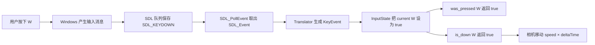
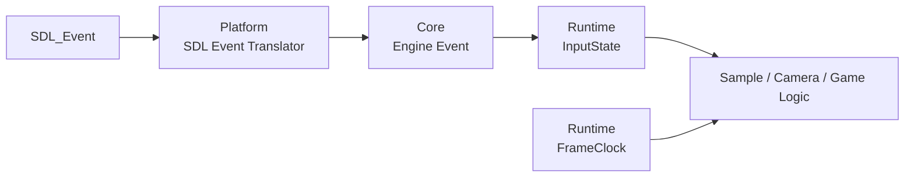

# B3：时间、输入状态与引擎事件完整学习指南（零基础版）

> 本文是 B3 的唯一学习入口。它包含概念、核心源码、运行实验、常见错误、面试回答和验收题。
>
> 当前代码阶段：Engine Event、SDL 翻译器、InputState、FrameClock 和独立 Sample 已实现；Camera/VulkanEngine 的迁移在理解这些基础后进行。

## 0. 先不要看类型：B3 运行时究竟发生了什么

B3 不是新的渲染算法。它解决的是：**窗口已经创建以后，程序怎样一遍又一遍地接收输入、更新时间，再进入下一次循环。**

### 0.1 这里的“一帧”首先指一次主循环

先看最小主循环：

```cpp
while (running) {
    // 处理一次输入
    // 更新一次逻辑
    // 将来渲染一次画面
}
```

`while` 循环体从开头执行到结尾，称为一帧。然后程序回到开头，开始下一帧。

在 B3 Sample 中还没有真正绘制 Vulkan 画面，但循环仍然一遍遍执行，因此仍然可以统计第几帧、每帧耗时，并维护“这一帧刚按下”的输入状态。

需要区分：

| 名称 | 在 B3 中的含义 |
|---|---|
| 一帧 | 主循环执行一次 |
| Framebuffer | A 阶段保存像素颜色和深度的数据，不是这里的 FrameTime |
| FPS | 一秒执行多少帧 |
| deltaTime | 相邻两帧之间经过多少秒 |

如果一秒执行 60 次循环：

```text
FPS ≈ 60
deltaTime ≈ 1 / 60 ≈ 0.0167 秒
```

### 0.2 先看运行结果，不要先背类名

运行目标：

```powershell
.\scripts\build-windows.ps1 -Config Release -Target emberframe_03_runtime_input
.\bin\Release\emberframe_03_runtime_input.exe
```

窗口打开后，程序一直执行主循环。你按下 W 时会看到：

```text
W pressed
```

松开 W 时会看到：

```text
W released
```

每隔约一秒还会看到：

```text
frame=812 dt_ms=1.231 held(WASD)=1000 mouse_delta=(0.000, 0.000)
```

此时先只读懂四件事：

```text
frame=812       ：主循环已经执行到第 812 次
dt_ms=1.231     ：上一帧到这一帧间隔约 1.231 毫秒
held=1000       ：W 按住；A、S、D 没按
mouse_delta=0,0 ：这一帧鼠标没有移动
```

B3 的全部代码，就是为了可靠地产生这些信息，并让后续相机使用这些信息移动。

### 0.3 B3 实际解决三个不同问题

假设用户按住 W。引擎需要回答三个问题：

| 问题 | 负责对象 | 返回或保存什么 |
|---|---|---|
| 操作系统刚刚通知了什么？ | SDL 与 Event Translator | 一条 `KeyEvent` |
| W 现在处于什么状态？ | `InputState` | 刚按下、持续按住或刚松开 |
| 这一帧应该移动多远？ | `FrameClock` | `delta_seconds` |

它们不能合成一个概念：

- Event 是一条刚发生的消息；
- InputState 是根据很多条消息维护出来的状态；
- FrameTime 是当前循环的时间信息。

### 0.4 一条 W KeyDown 在程序里怎样走完

先看完整路线，再学习每种类型：



按照实际执行顺序，一帧中的变量变化如下：

| 步骤 | 执行的代码 | `previous[W]` | `current[W]` | 说明 |
|---:|---|---:|---:|---|
| 1 | 进入本帧 | false | false | 上一帧 W 没按 |
| 2 | `input.begin_frame()` | false | false | 保存旧状态 |
| 3 | `SDL_PollEvent(...)` | false | false | 取到原始 W KeyDown |
| 4 | `translate_sdl_event(...)` | false | false | 得到 `KeyEvent{w,true,false}` |
| 5 | `input.apply(*event)` | false | true | 事件开始改变输入状态 |
| 6 | `was_pressed(W)` | false | true | `true && !false`，结果为 true |
| 7 | `is_down(W)` | false | true | current 为 true，结果为 true |

下一帧用户仍然按住 W，但操作系统不一定继续发送普通 KeyDown：

| 步骤 | 执行的代码 | `previous[W]` | `current[W]` | 查询结果 |
|---:|---|---:|---:|---|
| 1 | `input.begin_frame()` | true | true | 把上一帧 current 复制给 previous |
| 2 | 没有新的 W 事件 | true | true | 状态保持不变 |
| 3 | `was_pressed(W)` | true | true | false，不是这一帧刚按下 |
| 4 | `is_down(W)` | true | true | true，仍在持续按住 |

用户松开 W 的那一帧：

| 步骤 | 执行的代码 | `previous[W]` | `current[W]` | 查询结果 |
|---:|---|---:|---:|---|
| 1 | `input.begin_frame()` | true | true | 先保存上一帧状态 |
| 2 | 应用 W KeyUp | true | false | current 被改为 false |
| 3 | `was_released(W)` | true | false | `!false && true`，结果为 true |
| 4 | `is_down(W)` | true | false | false，已经不再按住 |

这三张表是 B3 的核心。后面的 `variant`、`optional`、数组和时钟，都是为了实现这条数据链。

### 0.5 如果直接在 Camera 里处理 SDL，会有什么问题

最直接的写法可能是：

```cpp
if (event.type == SDL_KEYDOWN && event.key.keysym.sym == SDLK_w) {
    camera.move_forward();
}
```

短期能运行，但会把三个问题混在一起：

1. Camera 必须认识 SDL 类型；
2. Camera 只看见一次 KeyDown，不容易统一查询持续按住；
3. `move_forward()` 如果每帧移动固定距离，速度会跟 FPS 变化。

B3 将它拆成：

```cpp
// Platform：只负责把 SDL 原始数据翻译成引擎认识的数据。
SDL_KEYDOWN + SDLK_w
    -> KeyEvent { KeyCode::w, true, false }

// Runtime：只负责保存当前输入状态。
input.apply(event);

// Camera：只查询引擎输入，并结合时间更新。
if (input.is_down(KeyCode::w)) {
    position += forward * speed * delta_seconds;
}
```

这样 Platform、Runtime、Camera 各自只解决一个问题。

### 0.6 推荐学习顺序

不要先从头到尾背代码，按下面顺序阅读并运行：

1. 运行 Sample，实际按一次 W、松一次 W、移动一次鼠标；
2. 看第 11 节主循环，确定每帧调用顺序；
3. 看第 4～5 节，理解 SDL Event 怎样翻译成 Engine Event；
4. 看第 6～8 节，手算 W 在三帧中的 current/previous；
5. 看第 9～10 节，手算 30 FPS 和 60 FPS 的移动距离；
6. 最后再回看第 1～3 节的模块分层和 C++ 类型。

学完后应能独立说出：

```text
一条 SDL 输入怎样变成 Engine Event；
Engine Event 怎样改变 InputState；
InputState 怎样区分刚按下、持续按住和刚松开；
FrameClock 怎样让相机速度不随 FPS 改变。
```

## 1. 模块结构



| 模块 | 知道 SDL 吗 | 责任 |
|---|---:|---|
| Core | 否 | 定义平台无关的事件和值类型 |
| Platform | 是 | 从 SDL 读取事件并翻译 |
| Runtime | 否 | 保存输入状态、计算帧时间 |
| Sample/Camera | 不应该 | 查询输入状态并使用帧时间更新 |

### 1.1 先把四层理解成四组源码责任

这里的“层”不是运行时生成的四个对象，而是把源码按责任分组：

```text
engine/core/event.h
    只定义引擎事件长什么样，不调用 SDL，也不执行输入逻辑。

engine/platform/sdl_event_translator.cpp
    认识 SDL，把 SDL 数据翻译成 Core 中定义的事件。

engine/runtime/input_state.cpp
    不认识 SDL，只根据 Core Event 维护按键和鼠标状态。

samples/03_runtime_input/main.cpp
    把 Window、InputState 和 FrameClock 组合成可运行程序。
```

数据只能沿这条方向向上交付：

```text
Platform 产生 Core Event
Runtime 消费 Core Event
Sample/Camera 查询 Runtime 状态
```

### 1.2 阅读 B3 源码必须认识的 C++ 符号

不需要先系统学完整个 C++，但下面这些符号必须能当场读出来。

| 写法 | 在 B3 中怎样读 |
|---|---|
| `std::optional<core::Event>` | 一个可能装有 `core::Event`、也可能为空的对象 |
| `std::variant<A, B>` | 一个当前装着 A 或 B 其中一种值的对象 |
| `const T& value` | `value` 是 T 的只读引用，不复制 T |
| `T* pointer` | `pointer` 保存一个 T 对象的地址，也可能为空 |
| `&value` | 在表达式里取得 `value` 的地址 |
| `*pointer` | 通过地址取得所指向的对象 |
| `pointer->member` | 通过指针访问对象成员 |
| `object.member` | 直接通过对象访问成员 |
| `auto` | 让编译器根据右侧表达式推断类型 |
| `T value { ... }` | 使用花括号初始化一个 T 对象 |
| `condition && other` | 两个条件都为 true，结果才为 true |
| `!condition` | 对布尔值取反 |

同一个 `&` 在声明和表达式中含义不同：

```cpp
void apply(const core::Event& event);
//                            ^ 声明中：event 是引用

SDL_PollEvent(&native_event);
//            ^ 表达式中：取得 native_event 的地址
```

同一个 `*` 也有两种常见位置：

```cpp
const auto* resized = ...;
//          ^ 声明中：resized 是指针

input.apply(*event);
//          ^ 表达式中：取出 optional 里面的 Event
```

### 1.3 `while (auto event = ...)` 到底做了什么

B3 中最容易卡住的是：

```cpp
while (auto event = window.poll_engine_event()) {
    input.apply(*event);
}
```

它可以先展开成更容易读的伪代码：

```cpp
for (;;) {
    std::optional<core::Event> event =
        window.poll_engine_event();

    if (!event.has_value()) {
        break;
    }

    input.apply(event.value());
}
```

原写法每轮都会重新调用一次 `poll_engine_event()`：

1. 返回装有 Event 的 optional：条件为 true，进入循环；
2. `*event` 取得里面真正的 Event；
3. 循环末尾再次调用 `poll_engine_event()`；
4. 返回 `nullopt`：条件为 false，结束循环。

所以这个 `while` 的含义就是：**把当前 SDL 队列里所有可以翻译的事件逐条处理完。**

## 2. Event 和 State 的根本区别

### 2.1 Event 是一次发生的记录

例如：

```text
W 在 10:00:00.100 被按下
鼠标在这一刻向右移动 4 个单位
窗口变成 1280×720
```

事件只描述发生的变化，处理完后可以丢弃。

### 2.2 InputState 是某一帧的状态快照

例如：

```text
当前帧 W 是否按住？
当前帧 W 是否刚按下？
当前帧 W 是否刚松开？
这一帧鼠标总共移动多少？
```

InputState 需要同时保存当前状态和上一帧状态，才能回答“刚刚发生”的问题。

### 2.3 二者关系

```text
KeyDown(W) Event
→ InputState 把 current[W] 设为 true
→ 逻辑查询 is_down(W) / was_pressed(W)
```

Event 是输入数据，InputState 是根据事件更新后的持久状态。

## 3. 平台无关的 Engine Event

文件：`engine/core/event.h`。

### 3.1 引擎按键编号

```cpp
enum class KeyCode : std::uint8_t {
    unknown = 0,
    w,
    a,
    s,
    d,
    escape,
    count,
};
```

为什么不直接保存 `SDLK_w`？

- `SDLK_w` 属于 SDL；
- Camera 和游戏逻辑不应该包含 SDL 头文件；
- 平台层可以把 SDL、Win32 或其他后端都翻译成统一 `KeyCode::w`；
- 测试可以直接构造 `KeyEvent`，不需要启动 SDL。

`enum class` 不会把枚举值隐式转换成普通整数，减少混用不同枚举的错误。

`count` 不是实际按键，而是用于确定数组长度。

### 3.2 具体事件值

```cpp
struct QuitRequestedEvent { };

struct WindowResizedEvent {
    std::uint32_t width { 0 };
    std::uint32_t height { 0 };
};

struct WindowMinimizedEvent { };
struct WindowRestoredEvent { };

struct KeyEvent {
    KeyCode key { KeyCode::unknown };
    bool pressed { false };
    bool repeated { false };
};

struct MouseMovedEvent {
    float x { 0.0F };
    float y { 0.0F };
    float delta_x { 0.0F };
    float delta_y { 0.0F };
};
```

这些都是纯数据值，不包含 SDL Handle，也不负责执行逻辑。

### 3.3 `std::variant` 是什么

```cpp
using Event = std::variant<
    QuitRequestedEvent,
    WindowResizedEvent,
    WindowMinimizedEvent,
    WindowRestoredEvent,
    KeyEvent,
    MouseMovedEvent>;
```

`std::variant` 表示“这些类型中的一个”。一个 `Event` 变量在任意时刻只保存一种具体事件。

```cpp
Event first = KeyEvent { KeyCode::w, true, false };
Event second = WindowResizedEvent { 1280, 720 };
```

它与 C 风格 union 的区别是：variant 会记录当前保存的具体类型，并正确执行该类型的构造和析构。

检查类型：

```cpp
if (std::holds_alternative<QuitRequestedEvent>(event)) {
    running = false;
}
```

尝试取值：

```cpp
if (const auto* resized = std::get_if<WindowResizedEvent>(&event)) {
    std::cout << resized->width << 'x' << resized->height;
}
```

类型不匹配时 `std::get_if` 返回 `nullptr`，因此先判断再使用。

### 3.4 `holds_alternative`、`get_if` 与 `optional` 不要混淆

先假设：

```cpp
core::Event event = WindowResizedEvent { 1280, 720 };
```

此时 `event` 是一个 `std::variant` 容器，里面当前保存的是 `WindowResizedEvent`。

```cpp
std::holds_alternative<WindowResizedEvent>(event); // true
std::holds_alternative<KeyEvent>(event);           // false
```

`std::holds_alternative<T>(event)` 只回答“当前是不是 `T`”，返回布尔值，并不取出数据。

```cpp
if (const auto* resized = std::get_if<WindowResizedEvent>(&event)) {
    std::cout << resized->width;
}
```

`std::get_if<T>(&event)` 会尝试取得内部的 `T`：

- 当前确实保存 `T`：返回指向内部对象的指针；
- 当前保存的不是 `T`：返回 `nullptr`；
- `&event` 只是取得这个 `variant` 对象的地址，不是在转换 SDL 事件。

Sample 中的变量通常是：

```cpp
std::optional<core::Event> event;
```

因此可能看到：

```cpp
std::get_if<WindowResizedEvent>(&*event)
```

它应当从里向外阅读：

```text
event   ：optional<Event>，可能没有事件
*event  ：取出其中的 Event，也就是 variant
&*event ：取得这个 variant 的地址
get_if  ：检查并尝试取得其中的 WindowResizedEvent
```

所以两种容器回答的是两个不同问题：

```text
optional<Event>：现在有没有一个可用事件？
variant<...>   ：这个事件具体是哪一种？
```

## 4. SDL 到 Engine Event 的翻译

接口：

```cpp
[[nodiscard]] std::optional<core::Event> translate_sdl_event(
    const SDL_Event& event) noexcept;
```

### 4.1 `std::optional` 是什么

不是每个 SDL 事件都需要进入引擎逻辑。例如 B3 暂时不处理手柄、触摸或文本输入。

返回值有两种情况：

```text
有可用 Engine Event → optional 内保存 Event
当前事件不关心      → std::nullopt
```

调用者可以写：

```cpp
if (auto event = translate_sdl_event(native_event)) {
    // *event 取得内部的 Engine Event
}
```

### 4.2 按键翻译

```cpp
core::KeyCode translate_key(const SDL_Keycode key) noexcept
{
    switch (key) {
    case SDLK_w:      return core::KeyCode::w;
    case SDLK_a:      return core::KeyCode::a;
    case SDLK_s:      return core::KeyCode::s;
    case SDLK_d:      return core::KeyCode::d;
    case SDLK_ESCAPE: return core::KeyCode::escape;
    default:          return core::KeyCode::unknown;
    }
}
```

这里是 SDL 与引擎输入编号的唯一转换边界。上层不再比较 `SDLK_w`。

### 4.3 主要事件映射

| SDL 输入 | Engine Event |
|---|---|
| `SDL_QUIT` | `QuitRequestedEvent` |
| `SDL_WINDOWEVENT_RESIZED` | `WindowResizedEvent` |
| `SDL_WINDOWEVENT_MINIMIZED` | `WindowMinimizedEvent` |
| `SDL_WINDOWEVENT_RESTORED` | `WindowRestoredEvent` |
| `SDL_KEYDOWN / SDL_KEYUP` | `KeyEvent` |
| `SDL_MOUSEMOTION` | `MouseMovedEvent` |

`KeyEvent` 同时保存：

- `key`：哪个引擎按键；
- `pressed`：按下为 true，松开为 false；
- `repeated`：是否为操作系统自动重复产生的 KeyDown。

### 4.4 用真实字段跟踪一次 W KeyDown

当用户第一次按下 W，SDL 提供的原始数据中，与 B3 有关的字段可以简化为：

```text
event.type            = SDL_KEYDOWN
event.key.keysym.sym  = SDLK_w
event.key.repeat      = 0
```

翻译器先进入这个分支：

```cpp
if (event.type == SDL_KEYDOWN || event.type == SDL_KEYUP) {
```

因为当前 `event.type == SDL_KEYDOWN`，条件为 true。

接着翻译按键编号：

```cpp
const core::KeyCode key = translate_key(event.key.keysym.sym);
```

代入当前值：

```text
translate_key(SDLK_w)
→ 命中 case SDLK_w
→ 返回 core::KeyCode::w
```

最后构造：

```cpp
return core::KeyEvent {
    key,
    event.type == SDL_KEYDOWN,
    event.key.repeat != 0,
};
```

逐项代入：

```text
key                         → KeyCode::w
event.type == SDL_KEYDOWN   → true
event.key.repeat != 0       → false
```

最终返回：

```cpp
core::KeyEvent {
    KeyCode::w,
    true,
    false,
}
```

这个 `KeyEvent` 又被放进 `core::Event` 的 variant，再被放进 optional 返回。因此完整类型嵌套是：

```text
optional
└── Event（variant）
    └── KeyEvent { w, true, false }
```

三层各有不同作用：

| 层 | 回答的问题 |
|---|---|
| `optional` | 这次有没有翻译出事件？ |
| `Event` variant | 翻译出的是哪一种引擎事件？ |
| `KeyEvent` | 哪个键、按下还是松开、是否自动重复？ |

## 5. `poll_engine_event()` 的职责

```cpp
std::optional<core::Event> SdlWindow::poll_engine_event() const noexcept
{
    SDL_Event native_event;
    while (SDL_PollEvent(&native_event) != 0) {
        if (auto event = translate_sdl_event(native_event)) {
            return event;
        }
    }

    return std::nullopt;
}
```

为什么内部也是 `while`？

假设队列内容是：

```text
[不处理的 SDL 事件, 不处理的 SDL 事件, W KeyDown]
```

如果只读取一次，函数会因为第一个事件无法翻译就返回空，后面的 W 事件要等下一次调用。内部循环会跳过未翻译项，直到：

- 找到一个可用 Engine Event；或
- SDL 队列已经为空。

调用者完全不需要声明 `SDL_Event`：

```cpp
while (auto event = window.poll_engine_event()) {
    input.apply(*event);
}
```

### 5.1 为什么函数内部仍然出现 `SDL_Event`

这里不是把 Engine Event 转回 `SDL_Event`，数据方向恰好相反：

```text
Windows 键盘、鼠标、窗口消息
→ SDL 内部事件队列
→ SDL_PollEvent 写入临时 SDL_Event
→ translate_sdl_event 翻译
→ optional<core::Event>
→ InputState / Runtime / 游戏逻辑
```

`SDL_PollEvent` 是 SDL 提供的 API，它规定调用者必须给它一个 `SDL_Event*`，所以 Platform 层需要一个临时的 `native_event` 接住原始数据：

```cpp
SDL_Event native_event;
SDL_PollEvent(&native_event);
```

这个 SDL 类型只在 `SdlWindow` 和翻译器内部短暂存在。就像从国外收到一封原文信件，翻译员必须先看见原文才能翻译，但阅读译文的人不需要懂原文。

逐行理解 `poll_engine_event()`：

```cpp
SDL_Event native_event;
```

创建一个临时容器，用于接收一条 SDL 原始事件。

```cpp
while (SDL_PollEvent(&native_event) != 0) {
```

尝试从 SDL 队列取一条事件。返回非零表示成功，事件内容被写进 `native_event`。

```cpp
if (auto event = translate_sdl_event(native_event)) {
    return event;
}
```

翻译成功时，`event` 是一个装有 `core::Event` 的 `optional`，条件为真，于是向上层返回它。翻译失败时它是 `nullopt`，循环继续跳过这条无关 SDL 事件。

```cpp
return std::nullopt;
```

SDL 队列中没有剩余的可翻译事件。这不是错误，只表示“现在没有事件”。每次调用最多返回一条 Engine Event，因此外层也用 `while` 反复调用，直到返回空。

## 6. InputState 如何得到按下、持续和释放

InputState 保存两个数组：

```cpp
std::array<bool, key_count> current_ {};
std::array<bool, key_count> previous_ {};
```

- `current_[key]`：处理完本帧事件后是否按住；
- `previous_[key]`：上一帧结束时是否按住。

三个查询：

```text
is_down         = current
was_pressed     = current && !previous
was_released    = !current && previous
```

| previous | current | 语义 |
|---:|---:|---|
| false | false | 两帧都没按 |
| false | true | 本帧刚按下 |
| true | true | 持续按住 |
| true | false | 本帧刚松开 |

对应代码：

```cpp
bool InputState::was_pressed(const KeyCode key) const noexcept
{
    return current_[index(key)] && !previous_[index(key)];
}

bool InputState::was_released(const KeyCode key) const noexcept
{
    return !current_[index(key)] && previous_[index(key)];
}
```

### 6.1 `current_` 和 `previous_` 实际装了什么

当前支持的按键枚举顺序是：

```cpp
unknown = 0,
w,
a,
s,
d,
escape,
count,
```

因此数组可以直观地看成：

| 下标 | 对应按键 | `current_` 示例 |
|---:|---|---:|
| 0 | unknown | false |
| 1 | W | true |
| 2 | A | false |
| 3 | S | false |
| 4 | D | false |
| 5 | Escape | false |

源码使用：

```cpp
index(KeyCode::w)
```

把强类型枚举转换成数组下标。假设 W 对应下标 1，那么：

```cpp
current_[index(KeyCode::w)]
```

最终就是读取：

```cpp
current_[1]
```

`count` 的值等于有效数组长度，它只用于确定容量，不代表真实按键。

### 6.2 `apply()` 怎样把 Event 变成状态

先看按键分支：

```cpp
if (const auto* key_event = std::get_if<core::KeyEvent>(&event)) {
    if (key_event->key != core::KeyCode::unknown) {
        current_[index(key_event->key)] = key_event->pressed;
    }
    return;
}
```

假设输入是：

```cpp
KeyEvent { KeyCode::w, true, false }
```

逐步执行：

1. `get_if<KeyEvent>(&event)` 发现 variant 当前确实装着 KeyEvent；
2. 返回指向内部 KeyEvent 的指针，保存到 `key_event`；
3. `key_event->key` 是 `KeyCode::w`，不是 unknown；
4. `index(KeyCode::w)` 得到 W 的数组下标；
5. `key_event->pressed` 是 true；
6. 执行结果为 `current_[W] = true`；
7. `return` 结束本次 `apply()`，不再检查鼠标分支。

如果输入是 W KeyUp：

```cpp
KeyEvent { KeyCode::w, false, false }
```

同一行会执行：

```cpp
current_[W] = false;
```

注意：Event 不负责自己修改状态。它只是数据；真正读取数据并修改数组的是 `InputState::apply()`。

### 6.3 三个查询函数逐项代入

刚按下 W 时：

```text
current[W]  = true
previous[W] = false
```

代入：

```cpp
was_pressed(W)
= current[W] && !previous[W]
= true       && !false
= true       && true
= true
```

持续按住时：

```text
current[W]  = true
previous[W] = true
```

因此：

```text
is_down(W)     = true
was_pressed(W) = true && !true = false
```

刚松开时：

```text
current[W]  = false
previous[W] = true
```

因此：

```cpp
was_released(W)
= !current[W] && previous[W]
= !false      && true
= true        && true
= true
```

你不需要死记三个函数。只要每次先写出 previous 和 current，再代入布尔表达式即可。

## 7. 为什么 `begin_frame()` 必须最先调用

```cpp
void InputState::begin_frame() noexcept
{
    previous_ = current_;
    mouse_delta_x_ = 0.0F;
    mouse_delta_y_ = 0.0F;
}
```

每帧正确顺序：

```text
1. previous = current，保存上一帧快照
2. 清空只属于单帧的鼠标增量
3. 读取本帧新事件，更新 current
4. 查询 pressed / held / released
```

如果在处理事件之后才调用 `begin_frame()`：

```text
KeyDown 把 current 设为 true
→ begin_frame 又把 previous 设为 true
→ current=true，previous=true
→ was_pressed 错误地变成 false
```

因此 begin_frame 的位置是输入边沿是否正确的关键。

### 7.1 用 W 键连续三帧理解 `begin_frame()`

`begin_frame()` 不是开始绘制画面，也不创建窗口。它更准确的意思是：“在处理新一帧输入前，保存旧状态并清空单帧量”。

假设开始时 W 没按下：

| 时刻 | `previous[W]` | `current[W]` | 查询结果 |
|---|---:|---:|---|
| 第 1 帧调用 `begin_frame()` 后 | false | false | 尚未处理新事件 |
| 第 1 帧处理 W KeyDown 后 | false | true | `was_pressed=true` |
| 第 2 帧调用 `begin_frame()` 后 | true | true | `is_down=true`，`was_pressed=false` |
| 第 3 帧调用 `begin_frame()` 后 | true | true | 尚未处理 KeyUp |
| 第 3 帧处理 W KeyUp 后 | true | false | `was_released=true` |

关键是 `previous_ = current_` 只复制上一帧最后留下的状态；之后本帧事件只改 `current_`，二者的差异就表示本帧刚发生的变化。

鼠标相对位移则只属于当前帧，所以每帧开始必须清零，再把本帧收到的所有 MouseMotion 累加起来。

## 8. 一帧内为什么要累计鼠标增量

操作系统可能在一帧中产生多个鼠标事件：

```text
事件 1：delta_x = 2
事件 2：delta_x = 3
事件 3：delta_x = -1
```

本帧真实总位移是：

```text
2 + 3 - 1 = 4
```

所以实现使用：

```cpp
mouse_delta_x_ += mouse_event->delta_x;
mouse_delta_y_ += mouse_event->delta_y;
```

不能简单赋值，否则只保留最后一个事件的位移。

## 9. FrameClock 和三种时间量

```cpp
struct FrameTime {
    double delta_seconds { 0.0 };
    double elapsed_seconds { 0.0 };
    std::uint64_t frame_index { 0 };
};
```

这是一个没有自定义构造函数的聚合 `struct`。每一行都在声明成员并给出默认值：

```cpp
double delta_seconds { 0.0 };
```

等价于“声明一个 `double` 成员；如果创建对象时没有提供这个值，就初始化为 `0.0`”。花括号是 C++ 的统一初始化语法。

```cpp
FrameTime empty;                       // 三个成员都使用默认值 0
FrameTime frame { 0.016, 2.5, 120 };   // 按声明顺序初始化三个成员
```

这里：

- `double` 用于保存带小数的秒数；
- `std::uint64_t` 是 64 位无符号整数，适合只递增、不为负的帧编号；
- `frame_index` 不是一段时间，而是“这是第几帧”的计数器。

| 字段 | 含义 | 典型用途 |
|---|---|---|
| `delta_seconds` | 本次 tick 与上次 tick 的间隔 | 移动、动画和模拟 |
| `elapsed_seconds` | reset 以来经过的总时间 | 周期效果、统计和日志 |
| `frame_index` | 已产生的逻辑帧编号 | 调试、帧资源索引 |

### 9.1 为什么使用 `steady_clock`

```cpp
using Clock = std::chrono::steady_clock;
```

`system_clock` 表示日历时间，可能因为用户校时、网络同步或夏令时发生跳变。帧间隔需要一个单调递增的时钟。

`steady_clock` 的用途是测量持续时间，不要求对应现实世界日期，但不会倒退，适合计算 deltaTime。

### 9.2 `tick()` 的完整计算

```cpp
FrameTime FrameClock::tick() noexcept
{
    const Clock::time_point now = Clock::now();
    const std::chrono::duration<double> delta = now - previous_;
    const std::chrono::duration<double> elapsed = now - start_;

    previous_ = now;

    const FrameTime result {
        delta.count(),
        elapsed.count(),
        frame_index_,
    };
    ++frame_index_;
    return result;
}
```

`duration<double>::count()` 返回以秒为单位的浮点数。

### 9.3 用一组数字逐行执行 `tick()`

假设当前保存的是：

```text
start_       = 100.000 秒
previous_    = 102.000 秒
frame_index_ = 120
当前 now     = 102.016 秒
```

那么：

```cpp
const Clock::time_point now = Clock::now();
```

记录当前时刻。`time_point` 表示时间线上的一个点。

```cpp
const std::chrono::duration<double> delta = now - previous_;
```

两个时刻相减得到时间段：`102.016 - 102.000 = 0.016` 秒。这是上一帧到当前帧的间隔。

```cpp
const std::chrono::duration<double> elapsed = now - start_;
```

得到时钟启动后的总时间：`102.016 - 100.000 = 2.016` 秒。

```cpp
previous_ = now;
```

把当前时刻保存为下一次 `tick()` 的“上一次时刻”。如果不更新，下一帧算出的就不是单帧间隔，而是越来越大的累计时间。

```cpp
const FrameTime result {
    delta.count(),
    elapsed.count(),
    frame_index_,
};
```

聚合初始化得到 `FrameTime { 0.016, 2.016, 120 }`。`.count()` 把 chrono 的 duration 对象取成普通秒数。

```cpp
++frame_index_;
return result;
```

内部计数器变成 121，但本次返回值仍记录第 120 帧。下一次 `tick()` 才返回 121。

三个量不要混淆：

```text
delta_seconds   = 这一帧花了多久
elapsed_seconds = 程序总共运行了多久
frame_index     = 已经走到第几帧
```

## 10. 与帧率无关的移动

旧写法每帧固定移动：

```cpp
position += velocity * 0.5F;
```

60 FPS 一秒执行 60 次，30 FPS 一秒执行 30 次，所以速度相差两倍。

正确关系：

```text
本帧位移 = 每秒速度 × 本帧秒数
```

```cpp
position += direction * speed * static_cast<float>(time.delta_seconds);
```

数值验证：

```text
速度 = 6 单位/秒

60 FPS：每帧约 0.0167 秒
单帧位移 = 6 × 0.0167 ≈ 0.1
一秒 60 帧：0.1 × 60 ≈ 6

30 FPS：每帧约 0.0333 秒
单帧位移 = 6 × 0.0333 ≈ 0.2
一秒 30 帧：0.2 × 30 ≈ 6
```

帧数不同，但一秒总位移相同。

这里的单位关系最重要：

```text
speed         ：单位 / 秒
delta_seconds ：秒 / 帧
二者相乘      ：单位 / 帧
```

所以每一帧都按照这一帧实际经过的时间决定移动距离。低帧率时单帧走得多，高帧率时单帧走得少，但相同现实时间内的总位移接近一致。这就是“与帧率无关”，不是完全消除所有浮点误差或模拟差异。

如果程序断点暂停或窗口卡住，`delta_seconds` 可能突然很大。正式引擎通常还会限制最大 delta，或采用固定时间步长；B3 先掌握 `速度 × deltaTime` 这条基本关系。

## 11. B3 Sample 的完整流程

目标：`emberframe_03_runtime_input`。

核心循环：

```cpp
while (running) {
    input.begin_frame();

    while (auto event = window.poll_engine_event()) {
        input.apply(*event);

        if (std::holds_alternative<QuitRequestedEvent>(*event)) {
            running = false;
        }
    }

    const FrameTime time = clock.tick();

    if (input.was_pressed(KeyCode::escape)) {
        running = false;
    }

    // 查询 was_pressed、was_released、is_down 和鼠标增量
}
```

数据顺序必须保持：

```text
begin_frame
→ poll Engine Events
→ apply Events
→ tick Clock
→ 查询输入并执行逻辑
```

### 11.1 从启动到一帧结束逐步理解

Sample 启动阶段创建三个主要对象：

```text
SdlWindow  ：拥有原生窗口，并负责从 SDL 边界取事件
InputState ：保存 current / previous 和鼠标单帧增量
FrameClock ：保存 start / previous / frame_index
```

进入每一帧后依次发生：

1. `input.begin_frame()`：把上一帧的 current 复制到 previous，并清空鼠标增量。
2. `window.poll_engine_event()`：从 SDL 队列读取原始事件，在 Platform 内翻译成 Engine Event。
3. `input.apply(*event)`：按事件修改本帧的 current 状态或累加鼠标增量。
4. 检查 `QuitRequestedEvent`、窗口 Resize 等一次性事件，执行对应 Runtime 行为。
5. `clock.tick()`：计算本帧 delta、总运行时间和帧编号。
6. 查询 `was_pressed`、`is_down`、`was_released`，据此更新相机或游戏逻辑。
7. 当前 Sample 输出状态并短暂等待；以后这里会接 `update()` 和 `render()`。
8. 回到循环顶部，开始下一帧。

以“按下 W 并保持”为例，完整数据流是：

```text
Windows 产生 W KeyDown
→ SDL 队列保存 SDL_KEYDOWN
→ Platform 翻译成 KeyEvent { w, pressed=true }
→ InputState 把 current[W] 设为 true
→ was_pressed(W) 在第一帧为 true
→ is_down(W) 在持续按住期间每帧为 true
→ 相机每帧移动 speed × delta_seconds
```

B3 Sample 当前重点是验证“事件、输入状态、时间”这条 Runtime 数据链，还没有接入 Vulkan 绘制。后续把相机和渲染器接入时，仍然复用这里的输入与时间接口。

### 11.2 把主循环逐行翻译成中文

下面只保留与理解流程有关的代码：

```cpp
while (running) {
```

只要 `running` 还是 true，就继续执行下一帧。关闭窗口或按 Escape 会把它改成 false。

```cpp
    input.begin_frame();
```

在新事件改变 current 之前，先执行：

```text
previous = current
鼠标单帧位移 = 0
```

```cpp
    while (auto event = window.poll_engine_event()) {
```

尝试取得一条 Engine Event：

- 有事件：optional 非空，进入循环；
- 没事件：optional 为空，结束内层循环；
- 循环每执行一次，只处理一条事件。

```cpp
        input.apply(*event);
```

`event` 本身是 optional；`*event` 取得里面的 `core::Event`。`apply()` 根据事件内容更新 current 数组或鼠标增量。

```cpp
        if (std::holds_alternative<QuitRequestedEvent>(*event)) {
            running = false;
        }
```

如果这条 Event 实际保存的是退出请求，就让外层主循环在本帧结束后停止。

```cpp
        if (const auto* resized =
                std::get_if<WindowResizedEvent>(&*event)) {
```

从里向外读：

```text
event      ：optional<Event>
*event     ：取出 Event variant
&*event    ：得到 variant 的地址
get_if     ：尝试取得 WindowResizedEvent
resized    ：成功时是指针，失败时是 nullptr
```

只有成功取得 Resize Event 时，`if` 条件才为 true，才可以读取：

```cpp
resized->width
resized->height
```

内层事件循环结束后执行：

```cpp
    const FrameTime time = clock.tick();
```

调用时钟，生成本帧的三个时间值。`time` 是一个真正的 `FrameTime` 对象，不是指针，也不是 optional，所以用点号访问：

```cpp
time.delta_seconds
time.elapsed_seconds
time.frame_index
```

接下来：

```cpp
    if (input.was_pressed(KeyCode::escape)) {
        running = false;
    }
```

这里没有直接检查 `SDLK_ESCAPE`，只查询引擎自己的 InputState。

当前 Sample 最后会短暂等待：

```cpp
    std::this_thread::sleep_for(std::chrono::milliseconds(1));
```

它只是避免这个教学 Sample 在没有渲染和垂直同步时疯狂空转，不是精确控制 FPS 的正式帧率限制器。

执行到右花括号后：

```cpp
}
```

程序回到 `while (running)`，开始下一帧。下一帧首先又会调用 `begin_frame()`。

### 11.3 一帧中“对象”和“数据”分别在哪里

以一条 W KeyDown 为例：

| 名称 | 类型 | 当前装着什么 | 何时消失或改变 |
|---|---|---|---|
| `native_event` | `SDL_Event` | SDL 原始 W KeyDown | `poll_engine_event()` 返回后销毁 |
| Translator 返回值 | `optional<Event>` | 非空，里面装着 Event | 本次循环结束后销毁 |
| `Event` | `variant<...>` | 当前替代类型是 KeyEvent | 事件变量销毁时一起销毁 |
| `KeyEvent` | 普通 struct | `{w, true, false}` | 包含它的 Event 销毁时一起销毁 |
| `input.current_[W]` | bool 状态 | true | 一直保存，直到收到 W KeyUp |
| `time.delta_seconds` | double | 例如 0.016 | 只代表当前 tick 结果 |

这张表揭示 Event 和 State 的真正差别：

```text
KeyEvent 可以在这一帧结束后销毁；
InputState 中的 current[W] 必须跨帧保留。
```

### 11.4 读完本节后做一次手动跟踪

不要只看文字。运行程序并按以下顺序操作：

1. 不按任何键，观察 `held(WASD)=0000`；
2. 按下 W，确认只出现一次 `W pressed`；
3. 持续按住 W，确认 held 中 W 一直是 1，但不会每帧输出 pressed；
4. 松开 W，确认出现一次 `W released`；
5. 移动鼠标，观察有移动的帧才出现非零 delta；
6. 拖动窗口边缘，观察 resize 输出；
7. 按 Escape，确认主循环退出。

如果这七项现象都能用本章的数据流解释，才算真正理解 B3，而不是只认识代码里的词。

## 12. 构建与运行

```powershell
.\scripts\build-windows.ps1 -Config Release -Target emberframe_03_runtime_input
.\bin\Release\emberframe_03_runtime_input.exe
```

操作：

- 按下并松开 W/A/S/D，观察 pressed 和 released；
- 持续按住按键，观察每秒报告的 held 状态；
- 移动鼠标，观察单帧相对位移；
- 改变窗口尺寸，观察 Engine Resize Event；
- 按 Escape 或关闭窗口退出。

每秒日志示例：

```text
frame=812 dt_ms=1.231 held(WASD)=1000 mouse_delta=(0.000, 0.000)
```

含义：

- 当前是第 812 帧；
- 上一帧到本帧经过约 1.231 ms；
- W 按住，A/S/D 未按；
- 输出这一刻所在帧没有鼠标移动。

## 13. CMake 模块依赖

```text
emberframe_core       只含平台无关事件类型
       ↑
emberframe_platform   SDL 翻译和窗口
       ↑
emberframe_runtime    InputState 和 FrameClock
       ↑
B3 Sample             组合并验证
```

Core 使用 `INTERFACE` Library，因为当前只有头文件，没有需要单独编译的 `.cpp`。

## 14. B3 后半段：迁移正式 Renderer

独立 Sample 先证明事件、状态和时间模型正确。随后正式代码需要完成：

1. `Camera::processSDLEvent` 改为查询 `InputState`；
2. `Camera::update()` 接收 `delta_seconds`；
3. `VulkanEngine::process_event` 接收 Engine Event，不再接收 `SDL_Event`；
4. 窗口 Resize/Minimize/Restore 使用对应 Engine Event；
5. ImGui 的原生 SDL 事件桥接保留在组合根或平台适配位置，不进入 Camera 和 Renderer 业务输入；
6. Runtime 统一创建 FrameTime 和 InputState，再传给每帧逻辑。

为什么分两阶段：先验证基础数据模型，再迁移大型 Renderer，可以把“输入模型错误”和“Vulkan/ImGui 集成错误”分开排查。

## 15. 常见错误

### 15.1 把事件和状态当成一回事

KeyDown 是一次变化记录；`is_down(W)` 是根据历史事件维护出的当前状态。

### 15.2 每帧结束时才保存 previous

这样会破坏按下边沿。必须在处理新事件前执行 `previous = current`。

### 15.3 鼠标增量使用赋值

一帧可能有多个 MouseMoved，必须累加。

### 15.4 逻辑层继续比较 `SDLK_w`

这表示平台翻译边界失效。逻辑层只应看到 `KeyCode::w`。

### 15.5 使用 `system_clock` 测帧间隔

系统时间可能跳变。持续时间应使用 `steady_clock`。

### 15.6 每帧固定移动距离

运动会依赖帧率。移动量必须乘以 deltaTime。

### 15.7 把 deltaTime 当 FPS

deltaTime 是一帧经过多少秒；FPS 近似是 `1 / deltaTime`，二者互为倒数而不是同一个量。

## 16. 面试回答

### 为什么需要引擎事件层？

> 平台层把 SDL 事件翻译成平台无关的值类型，上层只处理 Engine Event。这样 Camera、Renderer 和测试不需要包含 SDL 类型，也能把其他平台后端映射到同一套输入语义。

### 为什么 Event 和 InputState 分开？

> Event 表示瞬时变化，InputState 保存跨帧状态。InputState 同时记录 current 和 previous，才能提供 held、pressed-this-frame 和 released-this-frame 三类查询。

### 为什么使用 steady_clock？

> 帧时间测量要求时钟单调递增。system_clock 可能受校时影响，steady_clock 适合计算持续时间和 deltaTime。

### 如何做到与帧率无关的移动？

> 把速度定义为每秒单位，再用 `位移 = 速度 × deltaTime` 计算每帧位移。帧率下降时单帧时间变长，单帧位移也相应增大，因此一秒总位移保持一致。

## 17. 自测题

1. `SDL_Event` 应在哪一层消失？
2. 为什么 Engine Event 不能直接保存 `SDLK_w`？
3. `std::variant` 在这里保存几个事件？
4. `std::optional<Event>` 返回空表示什么？
5. Event 和 InputState 有什么区别？
6. previous=false、current=true 表示什么？
7. 为什么 begin_frame 必须在事件处理前？
8. 为什么鼠标增量需要累加？
9. delta、elapsed 和 frameIndex 分别是什么？
10. 为什么使用 steady_clock？
11. 30 FPS 与 60 FPS 如何保持相同移动速度？
12. 为什么先做独立 Sample，再迁移 VulkanEngine？

## 18. 自测答案

1. 在 Platform 翻译边界消失，上层只看到 Engine Event。
2. `SDLK_w` 会把 Core/Runtime 与 SDL 耦合。
3. 任意时刻只保存 variant 列表中的一种具体事件。
4. 当前 SDL 事件没有对应的 B3 引擎语义，或事件队列已空。
5. Event 是变化记录；InputState 是由事件维护出的跨帧状态。
6. 本帧刚按下。
7. 需要先保存上一帧快照，再用本帧事件修改 current。
8. 一帧可能收到多个鼠标事件，真实位移是它们的和。
9. 单帧间隔、累计运行时间和帧序号。
10. 它单调递增，不受系统时间调整影响。
11. 使用 `位移 = 每秒速度 × deltaTime`。
12. 分离输入模型问题和 Vulkan/ImGui 集成问题，降低调试复杂度。

## 19. B3 验收

- [ ] 能解释 Event 与 InputState 的层级差异；
- [ ] 能画出 SDL Event 到 Engine Event 的翻译链；
- [ ] 能解释 `variant`、`optional` 和 `get_if`；
- [ ] 能用 current/previous 推导 pressed、held、released；
- [ ] 能解释 begin_frame 的正确位置；
- [ ] 能解释鼠标增量累加；
- [ ] 能说明 steady_clock、delta、elapsed 和 frameIndex；
- [ ] 能用数字证明移动乘 deltaTime 后不依赖 FPS；
- [ ] 能构建并操作 B3 Sample；
- [ ] 能完成 Camera/VulkanEngine 的 Engine Event 和 deltaTime 迁移；
- [ ] 能用第 16 节答案完成三分钟复述。

## 20. 最终总结

> B3 在 Platform 中把 SDL Event 翻译为平台无关的 Engine Event，Runtime 用 InputState 将瞬时事件整理为 pressed、held、released 和鼠标增量，并用基于 steady_clock 的 FrameClock 提供 deltaTime、累计时间和帧编号。逻辑和相机只消费引擎事件、输入状态和帧时间，不再依赖 SDL 按键编号；运动使用速度乘 deltaTime，从而保持跨帧率一致。

## 21. 源码入口

1. [`engine/core/event.h`](../../engine/core/event.h)
2. [`engine/platform/sdl_event_translator.h`](../../engine/platform/sdl_event_translator.h)
3. [`engine/platform/sdl_event_translator.cpp`](../../engine/platform/sdl_event_translator.cpp)
4. [`engine/platform/sdl_window.h`](../../engine/platform/sdl_window.h)
5. [`engine/platform/sdl_window.cpp`](../../engine/platform/sdl_window.cpp)
6. [`engine/runtime/input_state.h`](../../engine/runtime/input_state.h)
7. [`engine/runtime/input_state.cpp`](../../engine/runtime/input_state.cpp)
8. [`engine/runtime/frame_clock.h`](../../engine/runtime/frame_clock.h)
9. [`engine/runtime/frame_clock.cpp`](../../engine/runtime/frame_clock.cpp)
10. [`samples/03_runtime_input/main.cpp`](../../samples/03_runtime_input/main.cpp)
