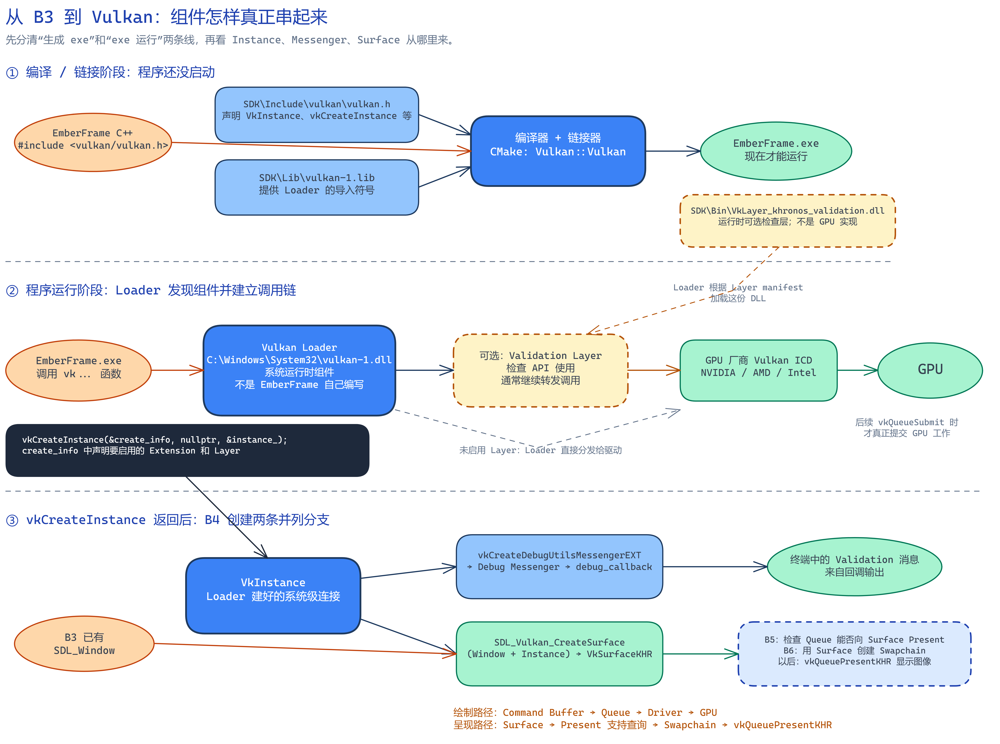

# B4：Vulkan 入口、调试层与窗口表面

> 对应目标：`emberframe_04_vulkan_bootstrap`  
> 阅读方式：在 VS Code 中按 `Ctrl+Shift+V` 打开 Markdown 预览。

## 0. 先用一页看懂 B4

### 0.1 这一章只完成什么

B3 已经管理好 SDL 窗口、事件、输入状态和逐帧循环。B4 要做的不是重新写窗口系统，而是让这套 Runtime 获得 Vulkan 的系统连接、调试消息通道和窗口呈现目标。



> 读图顺序：先看“编译/链接阶段”，再看“程序运行阶段”，最后看 `vkCreateInstance()` 返回后的两条分支。  
> [打开可编辑的 Excalidraw 源图](./assets/b4/b4-system-chain.excalidraw)

完整因果链如下：

1. 编译时，源码使用 SDK 的 `vulkan.h` 获得声明，并通过 `vulkan-1.lib` 链接到 Loader 的入口符号，最终生成 `EmberFrame.exe`；
2. 运行时，Windows 为 exe 加载系统中的 `vulkan-1.dll`，这就是 Vulkan Loader，不是 EmberFrame 自己编写的代码；
3. `vkCreateInstance()` 的 `create_info` 声明要启用的 Extension 和 Layer；
4. Loader 根据这些声明加载 Validation Layer，并找到显卡厂商提供的 Vulkan ICD 驱动，建立后续 Vulkan 调用的分发链；
5. `vkCreateInstance()` 成功后返回 `VkInstance`；
6. B4 再通过 Instance 创建 Debug Messenger，并用 `SDL_Window + VkInstance` 创建 `VkSurfaceKHR`；
7. B5/B6 才会根据 Surface 选择可 Present 的 Queue、创建 Swapchain；更后面的绘制命令通过 Command Buffer 和 Queue 提交。

学完后，你应该能用一句话概括：

> 程序通过 Vulkan Loader 创建 `VkInstance`，启用 Validation Layer 并用 Debug Messenger 接收检查消息，再把 `SDL_Window` 与 `VkInstance` 组合成 `VkSurfaceKHR`，为下一章选择 GPU 和队列做准备。

### 0.2 本章完整执行顺序

| 顺序 | 输入 | 本步动作 | 输出 |
|---:|---|---|---|
| 1 | 窗口配置 | 创建带 Vulkan 标志的 SDL 窗口 | `SDL_Window*` |
| 2 | Loader | 查询版本、Extension、Layer | 可用能力列表 |
| 3 | 应用信息与启用列表 | `vkCreateInstance()` | `VkInstance` |
| 4 | Instance + 回调配置 | 创建 Debug Messenger | 调试消息回调 |
| 5 | Window + Instance | `SDL_Vulkan_CreateSurface()` | `VkSurfaceKHR` |
| 6 | Instance | 枚举物理设备 | `VkPhysicalDevice` 列表 |
| 7 | 已创建对象 | 进入事件循环 | 空窗口保持响应 |
| 8 | 退出事件 | 按依赖逆序销毁 | 资源安全释放 |

### 0.3 这些文件在当前电脑上怎样接起来

| 文件或组件 | 当前来源 | 在链中的位置 |
|---|---|---|
| `vulkan.h` | `D:\develop\VulkanSDK\1.4.357.0\Include` | 编译时提供 Vulkan 类型和函数声明 |
| `vulkan-1.lib` | SDK 的 `Lib` 目录 | 链接时把 `vk...` 符号连接到 Loader |
| `vulkan-1.dll` | `C:\Windows\System32` | 运行时的 Vulkan Loader 入口 |
| `VkLayer_khronos_validation.dll` | SDK 的 `Bin` 目录 | Loader 按请求加载的可选检查层 |
| Vulkan ICD 驱动 | NVIDIA / AMD / Intel 驱动安装 | Loader 最终分发到的厂商实现 |

这里最重要的修正是：**SDK 的 `Bin` 目录不是 Vulkan 的 GPU 实现。** 当前 `Bin` 中主要有 Validation Layer、Shader 工具和诊断程序；实际 Vulkan 驱动由显卡厂商安装。

### 0.4 B4 完成后为什么仍没有画面

B4 只有 Vulkan 入口和窗口连接，还没有：

```text
Logical Device → Queue → Swapchain → Command Buffer → Pipeline → Draw Call
```

因此看到空窗口是正确结果，不是渲染失败。

---

## 1. 先运行并读懂输出

在项目根目录执行：

```powershell
.\scripts\build-windows.ps1 -Config Release -Target emberframe_04_vulkan_bootstrap -Run
```

参数只有构建含义，不是 Vulkan 语法：

| 参数 | 作用 |
|---|---|
| `-Config Release` | 构建 Release 版本 |
| `-Target ...` | 只构建 B4 Sample |
| `-Run` | 构建完成后在同一环境中运行 |

脚本还会临时设置：

```text
VULKAN_SDK    → SDK 路径
PATH          → 查找 SDK 工具和动态库
VK_LAYER_PATH → 查找 Validation Layer 的描述文件
```

推荐使用 `-Run`，因为程序能够继承这些临时环境变量。

正常输出重点看下面几行：

```text
[B4] VK_LAYER_KHRONOS_validation: enabled
[B4] VkInstance created for Vulkan 1.3.
[B4] Debug messenger created.
[B4] VkSurfaceKHR created from the SDL window.
[B4] Visible physical device count: ...
```

它们依次证明：检查层可用、Instance 成功、消息回调接通、窗口连接成功、Loader 能发现 GPU。

---

## 2. SDK、头文件、库、Loader 和驱动

### 2.1 `.h`、`.lib`、`.dll`分别做什么

Vulkan 头文件主要包含类型、常量、结构体和函数声明：

```cpp
VKAPI_ATTR VkResult VKAPI_CALL vkCreateInstance(
    const VkInstanceCreateInfo* pCreateInfo,
    const VkAllocationCallbacks* pAllocator,
    VkInstance* pInstance);
```

它让编译器知道函数如何调用，但不包含显卡厂商如何创建 Instance 的完整实现。

`.lib` 在 Windows 上可能是静态库，也可能是 DLL 导入库：

| 类型 | 是否包含实现 | 作用 |
|---|---:|---|
| 静态库 | 是 | 把所需机器代码链接进 exe |
| DLL 导入库 | 通常不包含完整实现 | 让链接器知道运行时从哪个 DLL 导入符号 |

B4 使用的 `vulkan-1.lib` 主要是导入库；运行时真正进入的是 `vulkan-1.dll`，也就是 Vulkan Loader。

```text
vulkan.h     → 编译器认识接口
vulkan-1.lib → 链接器解析函数符号
vulkan-1.dll → 运行时接收 Vulkan 调用
显卡驱动      → 针对具体 GPU 实现 Vulkan
```

> 补充：头文件并非永远只有声明。模板、`inline` 和 `constexpr` 函数常把实现写在头文件中；这里只是在说 Vulkan C API 的主要情况。

### 2.2 Loader 是统一入口

Loader 本身当然也是别人编写并编译好的代码，但它不是 EmberFrame 项目源码的一部分。Windows 上当前实际加载的是：

```text
C:\Windows\System32\vulkan-1.dll
```

编译时链接的 `vulkan-1.lib` 只是让 exe 能找到这份 DLL 导出的 `vk...` 入口。程序运行后，调用链才真正形成：

```text
EmberFrame.exe
→ vulkan-1.dll（Loader）
→ 可选的 VK_LAYER_KHRONOS_validation
→ GPU 厂商 Vulkan ICD 驱动
```

创建 Instance 时，Loader 负责：

1. 找到系统中的 Vulkan 驱动；
2. 根据 `VkInstanceCreateInfo` 中的名称找到并加载启用的 Layer；
3. 为当前 Instance 建立 `Loader → Layer → ICD` 分发链；
4. 返回代表这条系统级连接的 `VkInstance` Handle。

之后再调用 Vulkan API 时，Loader 按这条链分发。启用 Validation Layer 时调用先经过检查层再到驱动；不启用时 Loader 直接分发给驱动。检查层发现问题时会产生消息并通常继续转发，而不是进行一次“通过/不通过认证”。

---

## 3. 第一步：创建可用于 Vulkan 的 SDL 窗口

源码入口：`samples/04_vulkan_bootstrap/main.cpp`。

```cpp
emberframe::platform::SdlWindow window({
    .title = "EmberFrame - B4 Vulkan Instance and Surface",
    .width = 1280,
    .height = 720,
    .resizable = true,
});
```

这个类由 B2/B3 建立，内部创建带 `SDL_WINDOW_VULKAN` 标志的窗口。B4 借用它的原生句柄：

```cpp
VulkanBootstrapProbe vulkan(window.native_handle());
```

`VulkanBootstrapProbe`不拥有这个窗口，只在创建 Surface 时使用它。因此 Window 必须活得比 Probe 更久。

---

## 4. 第二步：查询能力并创建 `VkInstance`

源码入口：`VulkanBootstrapProbe::create_instance()`。

### 4.1 查询 Loader 版本

```cpp
std::uint32_t loader_version = VK_API_VERSION_1_0;
vkEnumerateInstanceVersion(&loader_version);
```

输入是输出变量地址，函数把 Loader 支持的最高 Instance API 版本写进去。当前项目要求至少 Vulkan 1.3。

SDK 版本、Loader 版本、应用请求版本、GPU 驱动版本是四个不同的值，不能互相替代。

### 4.2 Vulkan 常见的“两次枚举”

Vulkan 是 C API，通常由调用者准备内存：

```cpp
std::uint32_t count = 0;
vkEnumerateInstanceLayerProperties(&count, nullptr);

std::vector<VkLayerProperties> layers(count);
vkEnumerateInstanceLayerProperties(&count, layers.data());
```

流程只有两步：

```text
第一次：只问数量 → count
第二次：分配数组并传首地址 → Vulkan 写入数据
```

Extension 和 Physical Device 的枚举也采用同一模式。

### 4.3 询问 SDL 需要哪些 Instance Extension

```cpp
SDL_Vulkan_GetInstanceExtensions(window, &count, nullptr);
SDL_Vulkan_GetInstanceExtensions(window, &count, extensions.data());
```

Windows 通常需要：

```text
VK_KHR_surface
VK_KHR_win32_surface
```

第一个提供通用 Surface 能力，第二个负责连接 Win32 窗口。由 SDL 查询而不是硬编码，代码才能跨平台。

程序还会检查：

```text
VK_EXT_debug_utils
VK_LAYER_KHRONOS_validation
```

前者是 Extension，增加调试消息 API；后者是 Layer，插入调用链进行规范检查。

### 4.4 填写创建信息

```cpp
VkApplicationInfo application_info {
    VK_STRUCTURE_TYPE_APPLICATION_INFO,
};
application_info.pApplicationName = "EmberFrame B4 Bootstrap Probe";
application_info.pEngineName = "EmberFrame";
application_info.apiVersion = VK_API_VERSION_1_3;
```

`VkApplicationInfo`描述应用名称、引擎名称和请求的 API 版本。

```cpp
VkInstanceCreateInfo create_info {
    VK_STRUCTURE_TYPE_INSTANCE_CREATE_INFO,
};
create_info.pApplicationInfo = &application_info;
create_info.enabledExtensionCount = ...;
create_info.ppEnabledExtensionNames = ...;
create_info.enabledLayerCount = ...;
create_info.ppEnabledLayerNames = ...;
```

`VkInstanceCreateInfo`汇总真正用于创建 Instance 的输入。

#### `sType`

```cpp
VK_STRUCTURE_TYPE_INSTANCE_CREATE_INFO
```

它告诉 Vulkan：当前内存块应按哪一种结构体解释。

#### `pNext`

```cpp
create_info.pNext = &debug_create_info;
```

`pNext`把扩展结构体挂到核心结构体后面。本例借此提供临时调试回调配置，使 `vkCreateInstance()` 执行期间产生的消息也能被接收。

### 4.5 创建 Instance

```cpp
vkCreateInstance(&create_info, nullptr, &instance_);
```

| 参数 | 方向 | 含义 |
|---|---|---|
| `&create_info` | 输入 | 创建配置地址 |
| `nullptr` | 输入 | 不使用自定义内存分配器 |
| `&instance_` | 输出 | 写入创建出的 Handle |

成功后，应用只是建立了 Vulkan 系统级连接，还没有选定 GPU 或创建渲染资源。

---

## 5. 第三步：接通 Validation 消息

### 5.1 谁检查，谁输出

| 组件 | 工作 |
|---|---|
| Validation Layer | 检查 API 参数、对象生命周期、同步等用法并产生消息 |
| `VK_EXT_debug_utils` | 提供调试消息相关 API |
| Debug Messenger | 过滤消息并调用应用注册的回调 |
| `debug_callback()` | 把消息写入终端 |

Debug Messenger 不使用 Surface。它与 Surface 都依赖 Instance，但属于两条不同分支。

### 5.2 为什么看起来创建了两次

实际并没有创建两个持久对象：

```text
创建 Instance 前
→ 只准备 Debug Messenger CreateInfo
→ 挂到 VkInstanceCreateInfo.pNext

创建 Instance 后
→ vkCreateDebugUtilsMessengerEXT(...)
→ 创建一个持久的 Debug Messenger
```

前者解决“Instance 创建期间也可能报错”，后者负责 Instance 生命周期内的后续消息。

### 5.3 为什么通过函数指针调用

```cpp
const auto create_messenger =
    reinterpret_cast<PFN_vkCreateDebugUtilsMessengerEXT>(
        vkGetInstanceProcAddr(instance_, "vkCreateDebugUtilsMessengerEXT"));
```

`vkCreateDebugUtilsMessengerEXT`属于扩展函数。程序通过函数名向 Loader 查询当前 Instance 对应的地址，再转换成 Vulkan 定义的函数指针类型。

必须检查地址是否为 `nullptr`，然后才能调用：

```cpp
create_messenger(instance_, &create_info, nullptr, &debug_messenger_);
```

### 5.4 回调为什么返回 `VK_FALSE`

```cpp
return VK_FALSE;
```

含义是：消息已经记录，但不要求因为这个回调而中止当前 Vulkan 调用。

项目中的 `EMBERFRAME_B4_PROBE` 是程序主动发送的测试 Warning，只用于证明整条回调链已接通，不代表驱动发现了真实错误。

---

## 6. 第四步：从 SDL Window 创建 `VkSurfaceKHR`

```cpp
SDL_Vulkan_CreateSurface(window, instance_, &surface_);
```

```text
SDL_Window + VkInstance → VkSurfaceKHR
```

Surface 的准确含义是：

> Vulkan 对“将来可以向这个平台窗口呈现”的统一引用。

它解决的是平台差异：

```text
Windows → Win32 Surface
Linux   → Wayland/XCB Surface
上层    → 统一使用 VkSurfaceKHR
```

创建动作仍然与平台相关，只是 SDL 帮我们隐藏了差异。创建完成后，后续 Vulkan 代码可以使用统一的 Surface Handle 和查询接口。

Surface 会在后续流程中进入两个关键步骤：

```text
B5：Physical Device + Queue Family + Surface
→ 查询这组 Queue 能否向该窗口 Present

B6：Device + Surface
→ 查询 Surface 格式、尺寸和 Present Mode
→ 创建绑定该 Surface 的 Swapchain
```

因此后面的完整关系是两条相接但不同的路径：

```text
绘制路径：Command Buffer → Queue → Driver → GPU → 写入 Swapchain Image
呈现路径：Swapchain Image → vkQueuePresentKHR → Surface 对应的 SDL Window
```

所以并不是“拿着 Surface 去调用驱动绘图”。Surface 提供窗口呈现条件，真正的绘制命令由 Command Buffer 记录并通过 Queue 提交；绘制好的 Swapchain Image 再被呈现到 Surface 所对应的窗口。

---

## 7. 第五步：枚举物理设备，但暂不选择

```cpp
vkEnumeratePhysicalDevices(instance_, &device_count, nullptr);
vkEnumeratePhysicalDevices(instance_, &device_count, devices.data());
```

B4 只证明 Instance 能发现系统中的 GPU，并打印名称和 API 版本。

B5 才会结合以下条件选择设备：

- Graphics Queue；
- 对当前 Surface 的 Present 支持；
- Device Extension；
- Vulkan Feature；
- 显卡类型和能力评分。

`VkPhysicalDevice`由 Vulkan 枚举提供，不是应用创建的资源，因此不需要手动销毁。

---

## 8. 第六步：保持窗口响应，然后按依赖逆序销毁

B4 没有渲染循环，但仍运行 B3 的事件循环：

```cpp
while (running) {
    input.begin_frame();
    while (auto event = window.poll_engine_event()) {
        input.apply(*event);
        // 处理退出事件
    }
}
```

### 8.1 为什么声明顺序重要

```cpp
SdlWindow window(...);
VulkanBootstrapProbe vulkan(window.native_handle());
```

C++ 局部对象按声明顺序构造，按相反顺序析构：

```text
构造：Window → Vulkan Probe
析构：Vulkan Probe → Window
```

Probe 内部继续按依赖逆序销毁：

```text
VkSurfaceKHR
→ Debug Messenger
→ VkInstance
→ 最后才轮到 SDL_Window
```

### 8.2 为什么构造函数还要 `try/catch`

如果 Instance 已创建，但 Surface 创建失败，`VulkanBootstrapProbe`整体尚未完成构造，它的析构函数不会执行。

因此构造函数显式回滚：

```cpp
try {
    create_instance(window);
    create_debug_messenger();
    create_surface(window);
} catch (...) {
    cleanup();
    throw;
}
```

`cleanup()`逐个检查 Handle 是否为 `VK_NULL_HANDLE`，因此既能处理正常退出，也能处理只创建到一半的情况。

---

## 9. 阅读源码时必须认识的 C++ 写法

| 写法 | 这里的意义 |
|---|---|
| `const char*` | 指向不可通过该指针修改的 C 字符串，Vulkan 名称常用它 |
| `vector.data()` | 返回连续数组首地址，供 C API 读写 |
| `static_cast<uint32_t>` | 显式把 `size_t` 转成 Vulkan 字段要求的类型 |
| `PFN_vk...` | Vulkan 定义的函数指针类型 |
| `reinterpret_cast` | 把通用函数地址解释成指定扩展函数类型 |
| `pfnUserCallback` | 保存回调函数地址，以后由 Vulkan 反向调用 |
| `VK_NULL_HANDLE` | Vulkan Handle 的空值 |
| `VkResult` | Vulkan API 的结果码，`VK_SUCCESS`表示成功 |

---

## 10. 两个安全实验

### 实验一：修改测试消息

找到：

```cpp
callback_data.pMessage =
    "This controlled warning proves that the B4 debug callback is connected.";
```

修改文字，重新运行。预期只有对应 Warning 文本变化。

### 实验二：观察消息过滤

把主动提交的严重程度临时改成：

```cpp
VK_DEBUG_UTILS_MESSAGE_SEVERITY_INFO_BIT_EXT
```

当前 Messenger 只订阅 Warning 和 Error，因此这条 Info 消息应该消失。实验后恢复。

不要通过伪造 Handle、重复销毁或传入非法指针制造错误。这些行为可能超出 Validation 能安全报告的范围。

---

## 11. 面试时怎样回答

### `VkInstance` 的作用是什么

> `VkInstance` 是应用与 Vulkan Loader 建立的最外层连接，记录应用请求的 API 版本、Instance Extension 和 Layer。它用于枚举 Physical Device、创建 Surface 和 Debug Messenger，但不代表已经选择 GPU，也不能直接提交绘制命令。

### Validation Layer 和 Debug Messenger 有什么区别

> Validation Layer 插入 Vulkan 调用链，根据规范检查 API 用法并产生消息；Debug Messenger 属于 `VK_EXT_debug_utils`，负责按严重程度和类型过滤消息，再交给应用回调输出。

### Loader、Layer、驱动是什么关系

> 应用首先进入 Vulkan Loader。Loader 发现 Layer 和显卡驱动并建立分发链；开发阶段启用的 Validation Layer 会检查调用并通常继续转发；驱动再把 Vulkan 工作落实到具体 GPU。

### `VkSurfaceKHR` 是什么

> `VkSurfaceKHR` 是 Vulkan 对平台窗口呈现目标的统一抽象。它由 `SDL_Window` 和 `VkInstance`共同创建，但不是窗口本身，也不包含可呈现图像；图像由后续的 Swapchain 管理。

### 为什么销毁顺序必须反过来

> Surface 和 Debug Messenger 都依赖 Instance，Surface 还关联 Window。因此先销毁 Surface 和 Messenger，再销毁 Instance，最后销毁 SDL Window。项目利用 C++ 局部对象逆序析构和 RAII 固定这条顺序。

---

## 12. B4 验收

学完后，应能不看文档回答：

- [ ] `.h`、`vulkan-1.lib`、`vulkan-1.dll`和显卡驱动分别做什么；
- [ ] Loader、Validation Layer、Debug Messenger 的关系；
- [ ] `VkInstance`的输入、输出和能力边界；
- [ ] Extension 与 Layer 的区别；
- [ ] `sType`和`pNext`的作用；
- [ ] 为什么枚举 API 经常调用两次；
- [ ] `SDL_Window + VkInstance`为什么能得到`VkSurfaceKHR`；
- [ ] Surface 为什么不是 Swapchain Image；
- [ ] B4 为什么仍然不能显示三角形；
- [ ] 完整创建顺序和销毁顺序。

源码阅读顺序：

1. `samples/04_vulkan_bootstrap/main.cpp`
2. `samples/04_vulkan_bootstrap/vulkan_bootstrap_probe.h`
3. `samples/04_vulkan_bootstrap/vulkan_bootstrap_probe.cpp`
4. `engine/platform/sdl_window.h`
5. `engine/platform/sdl_window.cpp`
