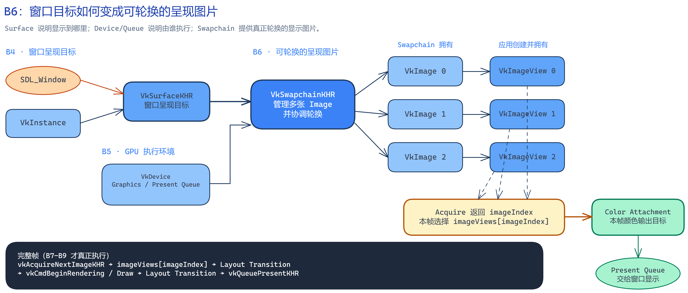

# B6：Swapchain、Image View 与重建

> 本章目标：把 B4 的窗口呈现目标和 B5 的 GPU 执行环境连接起来，创建一组可以交给窗口系统显示的图像，并正确处理窗口尺寸变化。

## 0. 先把 B6 放回完整渲染链

B4 已经创建了：

```text
SDL_Window + VkInstance
            ↓
       VkSurfaceKHR
```

`VkSurfaceKHR` 只代表“这个窗口区域可以接收 Vulkan 呈现结果”，它不是图片，也不保存颜色像素。

B5 又创建了：

```text
VkPhysicalDevice
      ↓ 选择 Queue Family、Extension 和 Feature
VkDevice
      ↓
Graphics Queue + Present Queue
```

这说明我们已经知道由哪张显卡执行命令，也取得了图形提交和窗口呈现所需的 Queue。但是此时仍没有可供 GPU 写入、再交给窗口系统显示的图片。

B6 补上的正是中间这一组图片：



图的可编辑源文件：[swapchain_relationship.excalidraw](assets/b6/swapchain_relationship.excalidraw)

在当前 Sample 中，一条 `Surface` 对应一个正在使用的 `Swapchain`；一个 `Swapchain` 管理多张 `VkImage`；应用再为每张 Image 创建一个 `VkImageView`。因此这里是“一对多，再逐张一对一”的关系。

Vulkan 本身允许一张 Image 创建多个不同用途的 View，但 Swapchain 的基础颜色输出只需要每张图一个 View。后面的 Dynamic Rendering 会在每一帧选中其中一个 View，把它作为 Color Attachment。

一句话概括 B6：

> 根据 Surface 和 GPU 共同支持的条件创建 Swapchain，取得它管理的多张 Image，为每张 Image 创建访问视图，并在窗口变化时安全地整组替换。

## 1. 本章真正实现到哪里

本章已经实现：

```text
查询 Surface 支持能力
→ 选择格式、Present Mode、尺寸和图片数量
→ 创建 Swapchain
→ 取得 Swapchain Images
→ 为每张 Image 创建 ImageView
→ 响应 Resize/最小化/恢复
→ 重建整组 Swapchain 资源
```

本章还没有执行真正的一帧：

```text
Acquire Image
→ 录制布局转换与绘制命令
→ Graphics Queue Submit
→ Present Queue Present
```

这不是少写了一步，而是依赖关系还没准备好。取得一张 Swapchain Image 后，必须用 Command Buffer 记录操作，用 Semaphore/Fence 协调 CPU、GPU 和呈现系统，还要用 Barrier 改变 Image Layout。它们分别属于 B7 和 B8。现在强行调用 Acquire/Present，会得到一条不完整甚至可能卡住的帧循环。

## 2. 为什么叫 Swapchain

如果窗口只有一张显示图片，GPU 写这张图时，显示器可能也正在读取它，于是双方会争用同一资源。Swapchain 用多张图片轮换解决这个问题。

假设实际创建了三张图：

```text
Image 0：可能正在被屏幕显示
Image 1：可能已经完成，等待显示
Image 2：可能被应用取得，正在渲染
```

每帧不是固定写 Image 0，而是向 Swapchain 请求一张当前可用的图片。Swapchain 返回的是 `imageIndex`：

```cpp
imageIndex = vkAcquireNextImageKHR(...);
```

之后所有针对“本帧显示目标”的操作都通过这个索引找到同一组资源：

```text
images[imageIndex]
imageViews[imageIndex]
未来还会有 framebuffers 或 attachment 信息
```

绘制完成后，应用把同一个 `imageIndex` 提交给 `vkQueuePresentKHR()`。因此 Swapchain 不是一个普通数组，而是应用、GPU 和窗口系统共同协调的一组呈现图片。

## 3. 创建前为什么必须重新查询 Surface

Swapchain 不是只按应用愿望创建。它必须同时满足：

```text
窗口系统/Surface 能提供什么
∩
选中 GPU 对这个 Surface 支持什么
∩
应用希望怎样显示
```

所以 `query_support()` 会围绕“当前 Physical Device + 当前 Surface”查询三类信息。

### 3.1 Surface Capabilities：允许的边界

`VkSurfaceCapabilitiesKHR` 告诉应用：

- 最少和最多允许多少张 Swapchain Image；
- 当前或允许的像素尺寸范围；
- 是否允许把 Image 用作 Color Attachment；
- Surface 当前旋转方式；
- 窗口合成系统支持哪些 Alpha 模式。

它描述的是约束，不是最终选择。

### 3.2 Surface Format：像素格式和颜色空间的组合

`VkSurfaceFormatKHR` 包含两个必须一起考虑的字段：

```text
format     = 每个像素的通道排列、位数和数值解释
colorSpace = 窗口系统如何解释最终颜色
```

当前代码优先选择：

```cpp
VK_FORMAT_B8G8R8A8_SRGB
+
VK_COLOR_SPACE_SRGB_NONLINEAR_KHR
```

这里不是做“图片格式转换”。它是在创建呈现图片之前，约定以后这些像素按什么格式保存、交给窗口系统时按什么颜色空间解释。B14 会再系统学习线性空间、sRGB 和 Tone Mapping。

### 3.3 Present Mode：已经画好的图片如何排队显示

Present Mode 不改变 Shader，也不改变图片内容。它决定 Swapchain 中已经完成的图片怎样交给显示系统。

```text
FIFO
完成图片进入先进先出队列，跟随垂直刷新；规范保证支持，不撕裂。

MAILBOX
队列中只保留最新的待显示图片；旧的等待图片可被替换，通常低延迟且不撕裂。

IMMEDIATE
完成后立即交给显示系统，延迟低，但可能产生画面撕裂。
```

当前策略是优先 `MAILBOX`，不可用时回退到规范保证存在的 `FIFO`。

## 4. 最终创建参数怎样从查询结果得到

`create_or_replace_swapchain()` 先查询，再作选择，最后才填 `VkSwapchainCreateInfoKHR`。这条顺序不能颠倒，因为创建参数必须落在 Surface 报告的范围内。

### 4.1 图片数量

当前代码请求：

```cpp
imageCount = minImageCount + 1;
```

多申请一张通常能减少“显示系统占着图片，GPU 无图可画”的等待。如果 `maxImageCount` 不为 0，还要把请求值限制在最大值以内；`maxImageCount == 0` 在这里表示没有明确上限，不是最多只能创建 0 张。

`minImageCount` 只是请求的最低数量，驱动最终返回的实际数量可能更多，所以创建后还必须再调用 `vkGetSwapchainImagesKHR()` 查询实际 Image 数量。

### 4.2 Extent

`VkExtent2D` 是每张 Swapchain Image 的真实像素宽高。

某些平台直接通过 `currentExtent` 指定尺寸；若平台允许应用选择，代码就读取 SDL 的 drawable 像素尺寸，再限制到 Surface 允许的最小值和最大值之间。

这里使用 drawable size，而不是只看窗口逻辑尺寸，是因为高 DPI 环境中一个逻辑窗口单位不一定等于一个真实像素。

### 4.3 Image Usage

当前指定：

```cpp
VK_IMAGE_USAGE_COLOR_ATTACHMENT_BIT
```

这表示未来允许图形管线把片元颜色写进这些图片。它不是现在已经把图片变成 Attachment，而是声明这些 Image 将来允许承担这种用途。

### 4.4 Queue Sharing Mode

如果 Graphics Queue 和 Present Queue 来自同一个 Queue Family，图片使用：

```cpp
VK_SHARING_MODE_EXCLUSIVE
```

因为只有一个 Queue Family 访问它，不需要跨族共享。

如果两者来自不同 Queue Family，B6 暂时使用：

```cpp
VK_SHARING_MODE_CONCURRENT
```

并把两个 Family Index 都交给 Swapchain。这样两个 Queue Family 都能访问这些图片，不必在本章提前引入 Queue Family Ownership Transfer。它更容易理解，但性能控制不如 Exclusive 精细，后续可再优化。

### 4.5 其余与窗口系统相关的设置

```text
preTransform
沿用 Surface 当前变换，例如某些设备的屏幕旋转。

compositeAlpha
告诉窗口合成器如何解释窗口 Alpha；当前优先 OPAQUE。

clipped = VK_TRUE
允许系统不保留已经被其他窗口遮挡的像素内容。
```

## 5. Swapchain Image 与 ImageView 到底是什么关系

创建 `VkSwapchainKHR` 后，Swapchain 已经拥有多张 `VkImage`。应用调用 `vkGetSwapchainImagesKHR()` 只是取得它们的 Handle：

```text
Swapchain 创建并拥有 Image
应用借用 Image Handle
销毁 Swapchain 时由实现处理这些 Image
```

因此不能对这些 Image 单独调用 `vkDestroyImage()`。

但是 `VkImage` 本身更像一块带格式、尺寸和用途的图像资源。后续 Vulkan 命令通常还需要明确“以什么方式看其中哪一部分”，这就是 `VkImageView`：

```text
Image
  ↓ 选择 view type、format、aspect、mip 范围、array layer 范围
ImageView
```

当前 Swapchain 图片是普通 2D 颜色图片，所以每个 View 指定：

```text
viewType = 2D
format = Swapchain 选中的格式
aspectMask = COLOR
mip = 第 0 级，共 1 级
array layer = 第 0 层，共 1 层
```

ImageView 不复制像素，也不是另一张图片。它是访问一张 Image 的解释入口。

ImageView 由应用调用 `vkCreateImageView()` 创建，所以所有权关系变成：

```text
Swapchain Image：Swapchain 拥有，应用不单独销毁
ImageView：应用拥有，应用必须逐个销毁
```

以后开始 Dynamic Rendering 时，会把“本帧选中的 `imageViews[imageIndex]`”放进 `VkRenderingAttachmentInfo`。Attachment 再补充本次渲染如何使用它，例如开始时清除还是保留、结束后是否保存以及当前 Layout。于是关系是：

```text
Image 保存像素
→ ImageView 说明访问 Image 的哪部分、怎样解释
→ Attachment 说明本次 Rendering 如何使用这个 View
```

## 6. 一帧最终会怎样使用这些对象

B6 只创建资源，但要先知道这些资源未来处于哪一环。完整帧流程将是：

```text
1. vkAcquireNextImageKHR()
   Swapchain 返回一张当前可用图片的 imageIndex

2. imageViews[imageIndex]
   找到与这张图片对应的访问视图

3. Image Layout Transition
   PRESENT_SRC_KHR → COLOR_ATTACHMENT_OPTIMAL

4. vkCmdBeginRendering()
   把这个 ImageView 作为本次 Color Attachment

5. Draw Call
   顶点经过图形管线，Fragment Shader 产生颜色，写入 Attachment

6. Image Layout Transition
   COLOR_ATTACHMENT_OPTIMAL → PRESENT_SRC_KHR

7. Graphics Queue Submit
   让 GPU 真正执行前面录制的命令

8. vkQueuePresentKHR()
   Present Queue 把同一个 imageIndex 交还给 Swapchain/窗口系统显示
```

这里的 Layout 不是图片在内存中的简单旋转或尺寸变化，而是 GPU 对图片当前用途和访问方式的约定。呈现系统读取图片和颜色输出写入图片需要不同 Layout，所以两边要转换。B8 会结合 Pipeline Barrier 详细学习。

## 7. 为什么 Resize 必须重建整条相关资源链

窗口从 1280×720 改成 1600×900 后，旧 Swapchain Image 的尺寸通常还是 1280×720。它们不会自动跟随窗口变化，因此需要重新查询 Surface，再创建匹配新条件的一整组资源：

```text
新 Surface 条件
→ 新 Swapchain
→ 新 Images
→ 新 ImageViews
→ 以后还要重建依赖尺寸/格式的 Attachment 等资源
```

当前事件循环收到 Resize 时只设置 `swapchain_dirty = true`，不在每条事件里立即重建。离开事件收集阶段后，一帧最多重建一次，避免用户拖动窗口时同一轮事件触发多次昂贵创建。

### 7.1 最小化为什么暂不重建

窗口最小化时 drawable size 可能是 `0 × 0`，而 Swapchain 不能用零尺寸图片。此时 `recreate()` 返回 `false`，保留 dirty 状态；窗口恢复后再用有效尺寸重试。这不是错误，而是暂时没有可创建的呈现区域。

### 7.2 为什么先等待 Device 空闲

旧 Image 或 ImageView 可能仍被 GPU 使用，不能直接销毁。B6 尚未引入每帧 Fence，所以采用最容易验证的基线：

```cpp
vkDeviceWaitIdle(device);
```

它等待整个 Device 上的工作完成，正确但粒度较粗。B8 学完同步后，再逐步减少这种全局等待。

### 7.3 `oldSwapchain` 和替换顺序

创建新 Swapchain 时把旧 Handle 写进：

```cpp
createInfo.oldSwapchain = oldSwapchain;
```

这让 Vulkan 实现知道本次创建是在替换旧呈现链，并有机会复用内部资源。

代码不会先销毁旧资源再尝试创建新资源，而是：

```text
保留旧资源
→ 创建新 Swapchain
→ 取得新 Images
→ 创建全部新 ImageViews
→ 全部成功
→ 销毁旧 ImageViews
→ 销毁旧 Swapchain
→ 保存新 Handle
```

这样如果新 ImageView 创建到一半失败，函数可以清理新资源并抛出异常，不会先把旧状态无条件清空。

### 7.4 `OUT_OF_DATE` 与 `SUBOPTIMAL`

加入真正的 Acquire/Present 后，窗口变化还可能通过 Vulkan 返回值暴露：

```text
VK_ERROR_OUT_OF_DATE_KHR
当前 Swapchain 已经不能继续匹配 Surface，需要重建。

VK_SUBOPTIMAL_KHR
仍然可以使用，但已经不是最合适的配置，通常安排重建。
```

B6 目前没有调用 Acquire/Present，所以暂时由 SDL Resize/Restore 事件触发重建。B8 建立完整帧同步后，要同时处理事件和这两个 Vulkan 返回值。

## 8. 生命周期为什么必须按这个方向销毁

构造关系是：

```text
Window
→ Instance / Surface
→ Physical Device / Device / Queue
→ Swapchain
→ ImageViews
```

清理要反过来：

```text
等待 Device 不再使用资源
→ 销毁 ImageViews
→ 销毁 Swapchain
→ 销毁 Device
→ 销毁 Surface
→ 销毁 Instance
→ 销毁 Window
```

ImageView 引用了 Swapchain Image，所以必须先销毁 View；Swapchain 又由 `VkDevice` 创建，所以必须在 Device 之前销毁。`main()` 中按依赖顺序声明局部对象，C++ 离开作用域时会自动按声明的相反顺序调用析构函数。

## 9. 构建、运行与观察

在项目根目录 `D:\games\Emberframe-Engine` 打开 PowerShell。

构建：

```powershell
.\scripts\build-windows.ps1 -Config Release -Target emberframe_06_swapchain
```

只做初始化和清理自检：

```powershell
.\bin\Release\emberframe_06_swapchain.exe --exit-after-init
```

打开可交互窗口：

```powershell
.\bin\Release\emberframe_06_swapchain.exe
```

运行后拖动窗口边缘改变尺寸，终端应再次出现类似日志：

```text
[B6] Swapchain ready: 1600x900, requested images=3, actual images=3, views=3
     format=B8G8R8A8_SRGB, present mode=mailbox
     queue sharing=exclusive (same family)
```

最小化时程序不应尝试创建 `0 × 0` 的 Swapchain；恢复后才重建。按 `Esc` 或关闭窗口退出。

本机初始化验证结果为：

```text
GPU: NVIDIA GeForce RTX 4060 Laptop GPU
Extent: 1280x720
Requested Images: 3
Actual Images: 3
ImageViews: 3
Format: B8G8R8A8_SRGB
Present Mode: mailbox
Queue Sharing: exclusive
```

窗口目前保持空白是正常结果：B6 只准备显示目标，还没有录制清屏、Draw Call 或 Present 命令。

## 10. 源码阅读顺序

先不要从工具函数零散阅读。按对象依赖和数据流追踪：

1. [`main.cpp`：从 Window 一直构造到 Swapchain](../../samples/06_swapchain/main.cpp#L16)
2. [`SwapchainProbe` 的借用/拥有关系](../../samples/06_swapchain/swapchain_probe.h#L13)
3. [`query_support()`：查询当前 Device + Surface 的限制](../../samples/06_swapchain/swapchain_probe.cpp#L137)
4. [`choose_surface_format()`](../../samples/06_swapchain/swapchain_probe.cpp#L198)
5. [`choose_present_mode()`](../../samples/06_swapchain/swapchain_probe.cpp#L213)
6. [`choose_extent()`](../../samples/06_swapchain/swapchain_probe.cpp#L227)
7. [`create_or_replace_swapchain()`：创建和替换主流程](../../samples/06_swapchain/swapchain_probe.cpp#L316)
8. [`create_image_views()`：一张 Image 建一个 View](../../samples/06_swapchain/swapchain_probe.cpp#L273)
9. [`recreate()`：零尺寸判断和等待 Device 空闲](../../samples/06_swapchain/swapchain_probe.cpp#L95)
10. [`cleanup()`：逆序清理](../../samples/06_swapchain/swapchain_probe.cpp#L418)

阅读时始终追踪下面四组值，不要陷入每个英文枚举：

```text
输入：Window、Physical Device、Device、Surface、两个 Queue Family Index
选择：Format、Present Mode、Extent、Image Count
产物：Swapchain、Images、ImageViews
变化：Resize → 整组重建
```

## 11. 三个修改实验

### 实验一：强制 FIFO

把 `choose_present_mode()` 临时改成始终返回：

```cpp
return VK_PRESENT_MODE_FIFO_KHR;
```

运行前预测：日志中的 `present mode` 会从 `mailbox` 变成 `fifo`；窗口内容仍为空，因为 Present Mode 不负责绘制。

### 实验二：请求最小图片数

把：

```cpp
minImageCount + 1
```

临时改成：

```cpp
minImageCount
```

运行前预测：`requested images` 可能减少，但 `actual images` 不保证与请求值完全相同，因为实现可以返回更多图片。

### 实验三：连续 Resize

运行可交互版本，连续拖动窗口并观察日志。

预测：每次实际重建后，`Extent` 变成新的 drawable 像素尺寸；每次仍保持 `actual images == views`；程序不会因旧 View 引用已经销毁的 Image 而报错。

完成实验后恢复代码，避免把教学修改留进主线。

## 12. B6 验收

当你能不看文档回答下面问题，B6 理论部分才算完成：

1. Surface、Swapchain、Swapchain Image、ImageView 分别解决什么问题？
2. 为什么 Swapchain 要有多张 Image，而不是只用一张？
3. Surface Format 与 Present Mode 的区别是什么？
4. 为什么请求的 Image 数量和实际返回数量可能不同？
5. 为什么 Swapchain Image 不能由应用逐张销毁，而 ImageView 必须由应用销毁？
6. `imageIndex` 怎样把 Acquire、Attachment 和 Present 串成同一帧？
7. 为什么 Resize 后不能只修改一个宽高变量？
8. 最小化时为什么延迟重建？
9. 为什么销毁顺序必须是 ImageView → Swapchain → Device？
10. 为什么本章不直接调用 Acquire/Present？B7、B8 还要补什么？

实践验收还需要：独立构建运行、完成至少一个修改实验，并能解释一个错误路径。完成后再把路线图中的 B6 标为已掌握。
