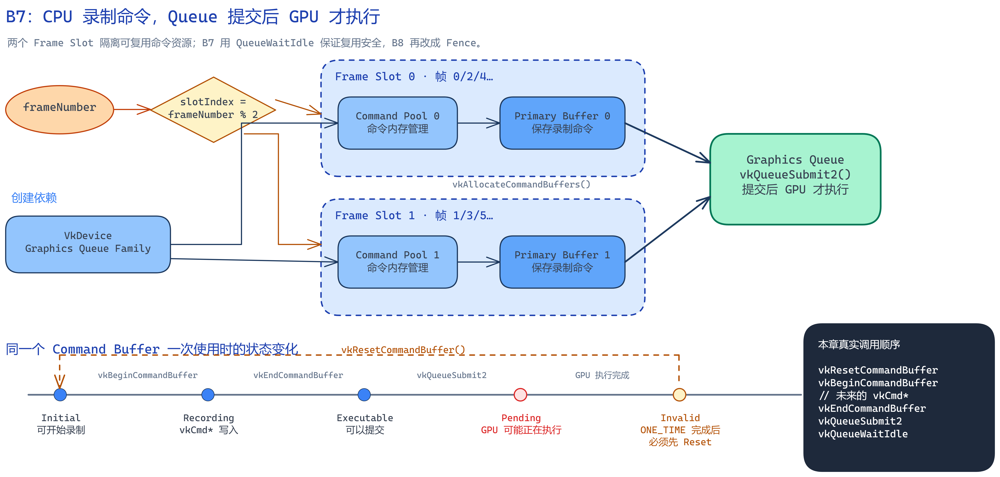

# B7：Command Pool、Command Buffer 与 Frame Resources

> 本章目标：理解 CPU 如何把准备让 GPU 执行的操作录制进 Command Buffer，再通过 Graphics Queue 提交；同时建立可扩展为多帧并行的 Frame Slot 资源结构。

## 0. B6 已经准备了图片，但 GPU 还不知道要做什么

B6 结束时已经存在：

```text
VkDevice + Graphics Queue
VkSwapchainKHR
多张 Swapchain Image
每张 Image 对应的 ImageView
```

这些对象只回答了：

```text
在哪张 GPU 上运行？
最终画面可以写进哪些 Image？
```

它们没有告诉 GPU：

```text
把哪张 Image 切换成颜色输出用途？
是否先清除图片？
绑定哪个 Pipeline？
绘制哪些顶点？
什么时候把 Image 交给窗口显示？
```

Vulkan 不允许应用直接在 CPU 函数调用过程中同步控制 GPU 完成每个动作。应用先在 CPU 上把一组 GPU 操作录制进 `VkCommandBuffer`，录制结束后再把它提交给 `VkQueue`。Queue 接收到提交后，GPU 才可能开始执行其中的命令。

因此 B7 补上的链路是：

```text
CPU 选择本帧资源
→ 重置 Command Buffer
→ 开始录制
→ 写入 vkCmd* 命令
→ 结束录制
→ 提交给 Graphics Queue
→ GPU 执行
```



图的可编辑源文件：[command_frame_flow.excalidraw](assets/b7/command_frame_flow.excalidraw)

## 1. 先区分录制与执行

这是 B7 最重要的分界。

调用下面这些函数发生在 CPU 上：

```cpp
vkBeginCommandBuffer(commandBuffer, &beginInfo);
vkCmd...(...);
vkEndCommandBuffer(commandBuffer);
```

它们的作用是把命令编码进 Command Buffer。调用 `vkCmdDraw()` 时，GPU 不一定已经开始画；该函数主要是在当前正在录制的 Command Buffer 中追加一条 Draw 命令。

直到调用：

```cpp
vkQueueSubmit2(graphicsQueue, 1, &submitInfo, fence);
```

应用才把已经录制完成的 Command Buffer 交给 Queue。GPU 何时真正开始、何时结束，是异步的；CPU 不能因为 `vkQueueSubmit2()` 返回就假设 GPU 已经完成。

可以准确地记成：

```text
vkCmd*：CPU 记录未来的 GPU 工作
vkQueueSubmit2：把记录好的工作交给 Queue
GPU：异步执行 Queue 收到的工作
同步对象：让 CPU 或其他 GPU 工作知道何时可以继续
```

B7 暂时用 `vkQueueWaitIdle()` 等待整个 Graphics Queue 完成。B8 再引入 Fence 和 Semaphore。

## 2. Command Pool 在整条关系中的位置

`VkCommandPool` 是一个持久 Vulkan 对象，由应用通过 `VkDevice` 创建。它为 Command Buffer 提供和管理底层命令内存，使实现可以批量分配、回收和重置这部分内存。

关系是：

```text
VkDevice
→ 创建 VkCommandPool
→ Command Pool 分配一个或多个 VkCommandBuffer
→ Command Buffer 被录制
→ Command Buffer 提交给兼容的 Queue
```

一个 Command Pool 可以分配多个 Command Buffer；一个 Command Buffer 只从一个 Pool 分配，并受这个 Pool 的生命周期管理。销毁 Pool 时，由它分配且尚未单独释放的 Command Buffer 会一并释放。

### 2.1 为什么创建 Pool 时指定 Queue Family

创建信息包含：

```cpp
poolInfo.queueFamilyIndex = graphicsQueueFamily;
```

这不是说 Pool 自己会执行图形命令，而是规定：

> 从这个 Pool 分配的 Command Buffer，将为该 Queue Family 支持的命令类型进行录制，并只能提交给属于兼容 Queue Family 的 Queue。

当前 Pool 使用 Graphics Queue Family，所以其中的 Command Buffer 可以录制图形命令，并提交给 B5 取得的 Graphics Queue。

如果 Command Buffer 来自 Family 0 的 Pool，却提交给一个不兼容的其他 Family Queue，Validation Layer 会报告错误。

### 2.2 `RESET_COMMAND_BUFFER_BIT`

当前创建 Pool 时启用：

```cpp
VK_COMMAND_POOL_CREATE_RESET_COMMAND_BUFFER_BIT
```

它允许应用单独调用：

```cpp
vkResetCommandBuffer(commandBuffer, 0);
```

把某一个 Buffer 重置回 Initial 状态，而不必一次重置整个 Pool 中的所有 Buffer。

Command Pool 不是 C++ 内存池的通用替代品，也不保存顶点、纹理或像素；它只管理 Command Buffer 使用的命令记录内存。

### 2.3 Command Pool 的线程要求

Vulkan 规定 Command Pool 需要外部同步。简单说，同一个 Pool 不能同时被多个 CPU 线程无保护地用于分配、重置或录制其 Buffer。

以后如果多个线程并行录制命令，常见设计是：

```text
每个工作线程拥有自己的 Command Pool
```

这样能避免多个线程争用同一个 Pool。本章仍是单线程主循环。

## 3. Command Buffer 保存的到底是什么

`VkCommandBuffer` 是一个 Vulkan Handle，代表一段可以被录制、结束并提交的 GPU 命令序列。

它不是普通数据 Buffer：

```text
Vertex Buffer：保存顶点数据
Index Buffer：保存索引数据
Uniform/Storage Buffer：保存 Shader 数据
Command Buffer：保存要让 GPU 执行的命令描述
```

以后它会记录：

```cpp
vkCmdPipelineBarrier2(...);   // Image Layout 和访问同步
vkCmdBeginRendering(...);    // 开始一次 Rendering
vkCmdBindPipeline(...);      // 绑定图形管线
vkCmdSetViewport(...);       // 设置 Viewport
vkCmdDraw(...);              // 记录 Draw Call
vkCmdEndRendering(...);      // 结束 Rendering
```

这些 `vkCmd*` 调用都要求 Command Buffer 当前处于 Recording 状态。

### 3.1 Primary 与 Secondary

当前分配：

```cpp
VK_COMMAND_BUFFER_LEVEL_PRIMARY
```

Primary Command Buffer 可以直接提交给 Queue。

Secondary Command Buffer 通常用于把部分命令分开录制，再通过 `vkCmdExecuteCommands()` 被 Primary 引用；它不能像当前 Primary 一样直接组成普通 Queue Submit 的顶层提交内容。

B7 每个 Frame Slot 只需要一个 Primary Command Buffer。

## 4. Frame Slot 为什么出现

CPU 和 GPU 是异步工作的。未来正常运行时可能出现：

```text
GPU 仍在执行帧 0
CPU 已经开始准备帧 1
```

如果两个帧共用同一个 Command Buffer，CPU 准备帧 1 时可能重置一个 GPU 仍在执行的 Buffer，这是非法的。

所以引擎预先准备两组命令资源：

```text
Frame Slot 0
├── Command Pool 0
└── Primary Command Buffer 0

Frame Slot 1
├── Command Pool 1
└── Primary Command Buffer 1
```

帧号通过：

```cpp
slotIndex = frameNumber % 2;
```

选择 Slot：

```text
帧 0 → Slot 0
帧 1 → Slot 1
帧 2 → Slot 0
帧 3 → Slot 1
```

这里的 Slot 不是一帧画面，也不是 Swapchain Image。它是一组可重复轮换使用的 CPU/GPU 协作资源。

必须区分两个索引：

```text
frameSlotIndex
→ 根据 frameNumber % framesInFlight 得到
→ 选择本帧的 Command Pool、Command Buffer、未来的 Fence/Semaphore

swapchainImageIndex
→ 以后由 vkAcquireNextImageKHR() 返回
→ 选择本帧实际写入的 Swapchain Image/ImageView
```

两者数量可能不同。例如可以有两个 Frame Slot，却由 Swapchain 管理三张 Image。不能假设 `frameSlotIndex == swapchainImageIndex`。

## 5. Command Buffer 的状态变化

Command Buffer 不是任何时候都能修改或提交。当前代码使用 `VK_COMMAND_BUFFER_USAGE_ONE_TIME_SUBMIT_BIT`，一次循环的状态是：

### 5.1 Initial

刚分配或成功 Reset 后处于 Initial 状态。此时可以开始录制。

```cpp
vkResetCommandBuffer(commandBuffer, 0);
```

Reset 会丢弃之前录制的内容，让 Buffer 回到 Initial。

### 5.2 Recording

调用：

```cpp
vkBeginCommandBuffer(commandBuffer, &beginInfo);
```

后进入 Recording。只有此时才能调用 `vkCmd*` 写入命令。

B7 当前没有录制具体 `vkCmd*`，所以这是一个空 Command Buffer。空 Buffer 仍然可以正常结束和提交，它用来单独验证命令基础设施；B8 会加入 Layout Barrier，B9 再加入 Rendering 和 Draw。

### 5.3 Executable

调用：

```cpp
vkEndCommandBuffer(commandBuffer);
```

后结束录制，Buffer 进入 Executable 状态。它已经可以提交，但 GPU 仍未因此自动执行。

### 5.4 Pending

调用：

```cpp
vkQueueSubmit2(...);
```

后，提交的 Buffer 进入 Pending 状态，代表 Queue/GPU 可能正在读取和执行它。

Pending 状态下应用不能重置、重新录制、释放这个 Buffer，也不能销毁仍被其中命令引用的资源。

### 5.5 Invalid 与下一次 Reset

当前录制时指定：

```cpp
VK_COMMAND_BUFFER_USAGE_ONE_TIME_SUBMIT_BIT
```

它表示这次录制内容只打算提交一次。GPU 完成后，该 Buffer 进入 Invalid 状态；它不能直接再次提交，但可以 Reset 回 Initial，再录制下一次内容。

因此当前完整循环是：

```text
Initial
→ Begin
Recording
→ End
Executable
→ Queue Submit
Pending
→ GPU 完成
Invalid
→ Reset
Initial
```

如果没有使用 `ONE_TIME_SUBMIT_BIT`，普通 Command Buffer 在执行完成后通常回到 Executable，可以在满足规则时再次提交。但实时渲染一般每帧内容会变化，所以重置并重新录制很常见。

## 6. `vkQueueSubmit2()` 的输入怎样组成

Command Buffer 结束后，代码先填写：

```cpp
VkCommandBufferSubmitInfo commandBufferInfo {
    VK_STRUCTURE_TYPE_COMMAND_BUFFER_SUBMIT_INFO,
};
commandBufferInfo.commandBuffer = slot.commandBuffer;
```

它表达：

> 这次 Submit 要包含哪一个 Command Buffer。

然后把它放进：

```cpp
VkSubmitInfo2 submitInfo {
    VK_STRUCTURE_TYPE_SUBMIT_INFO_2,
};
submitInfo.commandBufferInfoCount = 1;
submitInfo.pCommandBufferInfos = &commandBufferInfo;
```

`VkSubmitInfo2` 是一次 Queue Submit 的临时配置数据。完整情况下它可以同时描述：

```text
提交前要等待哪些 Semaphore
要执行哪些 Command Buffer
完成后要通知哪些 Semaphore
```

B7 还没有 Semaphore，所以只填写 Command Buffer 部分。

最终调用：

```cpp
vkQueueSubmit2(
    graphicsQueue,
    1,
    &submitInfo,
    VK_NULL_HANDLE);
```

最后一个参数以后是 Fence。B7 传入空 Handle，因此不能通过 Fence 查询本次提交是否完成。

## 7. 为什么 B7 使用 `vkQueueWaitIdle()`

CPU 在 `vkQueueSubmit2()` 返回后，不能立刻假设 Command Buffer 已经执行完。如果下一帧直接 Reset，可能重置 Pending 状态的 Buffer。

B7 尚未创建 Fence，所以采用最简单的正确基线：

```cpp
vkQueueWaitIdle(graphicsQueue);
```

它阻塞 CPU，直到 Graphics Queue 中此前提交的工作全部完成。返回后，本次 Buffer 已经不再处于 Pending，下一次轮到这个 Slot 时可以 Reset。

但它让流程完全串行：

```text
CPU 录制帧 0
→ GPU 执行帧 0
→ CPU 原地等待
→ GPU 完成
→ CPU 才开始帧 1
```

所以当前虽然创建了两个 Frame Slot，却还没有真正 Frame Overlap。两个 Slot 是正确的资源布局；真正并行要等 B8：

```text
CPU 只等待“即将复用的这个 Slot”的 Fence
而不是等待整个 Queue 空闲
```

## 8. B7 Sample 的完整运行流程

初始化阶段：

```text
1. B4 创建 Instance 和 Surface
2. B5 选择 Device，取得 Graphics Queue
3. B6 创建 Swapchain、Images 和 ImageViews
4. B7 创建 Frame Slot 0 的 Pool 与 Primary Buffer
5. B7 创建 Frame Slot 1 的 Pool 与 Primary Buffer
```

每一帧：

```text
1. 根据 frameNumber % 2 选择 Slot
2. Reset 该 Slot 的 Command Buffer
3. Begin，进入 Recording
4. 暂时不写入 vkCmd*，保留空命令
5. End，进入 Executable
6. VkCommandBufferSubmitInfo 引用该 Buffer
7. VkSubmitInfo2 描述本次提交
8. vkQueueSubmit2() 交给 Graphics Queue
9. vkQueueWaitIdle() 等待 GPU 完成
10. frameNumber 加一，下一帧选择另一个 Slot
```

关闭程序时：

```text
等待 Device 空闲
→ 销毁两个 Command Pool
→ Pool 自动释放各自分配的 Command Buffer
→ 销毁 Swapchain/ImageViews
→ 销毁 Device
```

## 9. 构建与运行

在 `D:\games\Emberframe-Engine` 打开 PowerShell。

构建：

```powershell
.\scripts\build-windows.ps1 -Config Release -Target emberframe_07_command_frames
```

运行 6 帧自动测试：

```powershell
.\bin\Release\emberframe_07_command_frames.exe --smoke-test
```

正常日志应包含：

```text
[B7] Frame 0 -> Slot 0 | Reset -> Begin/Record -> End -> Submit -> Queue Idle
[B7] Frame 1 -> Slot 1 | Reset -> Begin/Record -> End -> Submit -> Queue Idle
[B7] Frame 2 -> Slot 0 | Reset -> Begin/Record -> End -> Submit -> Queue Idle
[B7] Frame 3 -> Slot 1 | Reset -> Begin/Record -> End -> Submit -> Queue Idle
```

可交互运行：

```powershell
.\bin\Release\emberframe_07_command_frames.exe
```

当前窗口仍然是空白，这是正确结果：Command Buffer 虽然已经被真实提交，但其中还没有清屏、Rendering 或 Draw 命令。

## 10. 源码阅读顺序

按依赖和状态变化阅读，不要先钻进所有 `CreateInfo` 字段：

1. [`CommandFrameProbe` 的借用与拥有关系](../../samples/07_command_frames/command_frame_probe.h#L13)
2. [`main.cpp`：把 B4—B7 对象串起来](../../samples/07_command_frames/main.cpp#L45)
3. [`create_frame_slots()`：创建两个 Pool 并分配 Buffer](../../samples/07_command_frames/command_frame_probe.cpp#L47)
4. [`record_and_submit()`：一帧的完整命令状态循环](../../samples/07_command_frames/command_frame_probe.cpp#L78)
5. [`vkResetCommandBuffer()`](../../samples/07_command_frames/command_frame_probe.cpp#L87)
6. [`vkBeginCommandBuffer()` 与 `vkEndCommandBuffer()`](../../samples/07_command_frames/command_frame_probe.cpp#L96)
7. [`vkQueueSubmit2()`：CPU 录制与 GPU 执行的边界](../../samples/07_command_frames/command_frame_probe.cpp#L119)
8. [`vkQueueWaitIdle()`：B7 的串行基线](../../samples/07_command_frames/command_frame_probe.cpp#L124)
9. [`cleanup()`：销毁 Pool 并自动释放 Buffer](../../samples/07_command_frames/command_frame_probe.cpp#L136)

阅读时持续追踪四件事：

```text
谁拥有命令内存：Command Pool
谁保存录制结果：Command Buffer
谁接收提交：Graphics Queue
谁真正执行：GPU
```

## 11. 修改实验

### 实验一：把 Frame Slot 改成三个

把：

```cpp
static constexpr std::size_t frame_overlap = 2;
```

改成：

```cpp
static constexpr std::size_t frame_overlap = 3;
```

运行前预测：

```text
帧 0 → Slot 0
帧 1 → Slot 1
帧 2 → Slot 2
帧 3 → Slot 0
帧 4 → Slot 1
帧 5 → Slot 2
```

这能验证 Slot 选择来自取模，而不是和 Swapchain 的三张 Image 固定绑定。

### 实验二：观察串行等待

在 `vkQueueWaitIdle()` 前后分别打印日志。你会看到每帧都必须等这次 Queue 提交完成，下一帧才开始。

不要只删除 `vkQueueWaitIdle()` 后继续 Reset。没有 Fence 时，这可能导致 CPU 重置 GPU 仍在执行的 Command Buffer；是否立刻复现取决于时序，不是一个稳定、安全的实验。

## 12. 常见错误与原因

### Reset 一个 Pending Buffer

原因：GPU 可能仍在读取其中的命令，CPU 却要清除和重写它。

解决：先通过 Queue Idle 或 Fence 确认执行完成。

### Pool 的 Queue Family 与提交 Queue 不兼容

原因：Command Buffer 的能力来源于创建其 Pool 时指定的 Queue Family。

解决：Graphics Command Buffer 从 Graphics Queue Family 对应的 Pool 分配。

### 把录制完成当成 GPU 完成

`vkEndCommandBuffer()` 只结束 CPU 录制；`vkQueueSubmit2()` 才提交；提交返回后仍要通过同步判断 GPU 完成。

### GPU 使用期间销毁 Pool

销毁 Pool 会释放其 Command Buffer。如果 GPU 仍在执行这些 Buffer，就会形成无效生命周期。

解决：销毁前等待相关 GPU 工作完成。

## 13. B7 验收

当你能不看文档回答下面问题，B7 理论部分才算完成：

1. 为什么 B6 有了 Swapchain Image，GPU 仍然不会自动画图？
2. Command Pool 与 Command Buffer 的拥有关系是什么？
3. 为什么 Pool 要绑定 Queue Family？
4. `vkCmd*`、`vkEndCommandBuffer()` 和 `vkQueueSubmit2()` 分别发生在哪个阶段？
5. Command Buffer 的 Initial、Recording、Executable、Pending、Invalid 各表示什么？
6. 为什么 Pending 状态不能 Reset？
7. Frame Slot Index 和 Swapchain Image Index 为什么不是同一个索引？
8. 当前有两个 Frame Slot，为什么仍没有真正实现 Frame Overlap？
9. `vkQueueWaitIdle()` 为什么正确但低效？
10. B8 的 Fence 和 Semaphore 分别要补上哪类等待关系？

实践验收还包括：独立构建运行、把 Frame Slot 改成三个并预测日志，以及解释一次错误重置或错误 Queue Family 的 Validation 问题。

## 14. 官方参考

- [Vulkan Specification：Command Buffers](https://docs.vulkan.org/spec/latest/chapters/cmdbuffers.html)
- [`vkResetCommandBuffer` Reference](https://docs.vulkan.org/refpages/latest/refpages/source/vkResetCommandBuffer.html)
- [`vkQueueSubmit2` Reference](https://docs.vulkan.org/refpages/latest/refpages/source/vkQueueSubmit2.html)
- [`VkCommandPool` Reference](https://docs.vulkan.org/refpages/latest/refpages/source/VkCommandPool.html)

