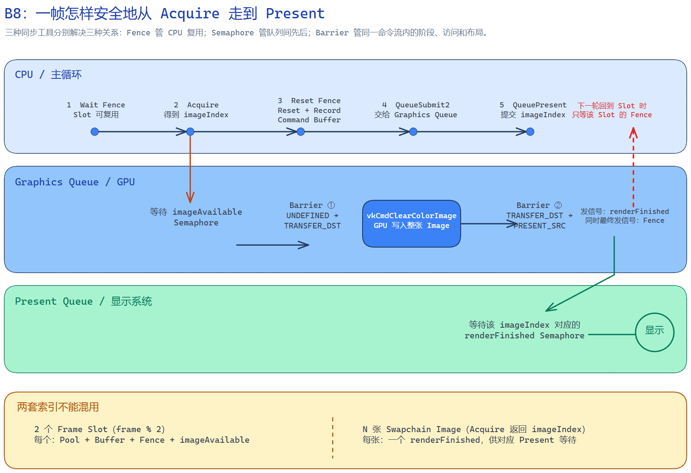

# B8：Fence、Semaphore、Pipeline Barrier 与完整呈现循环

> 本章目标：把 B7 的“空 Command Buffer 提交”推进为一条真正能显示画面的 Vulkan 帧循环，并理解三种同步工具为什么缺一不可。
>
> 对应程序：`emberframe_08_sync_present`

## 0. 这一课完成后，你应该得到什么

运行 B8 后，窗口会显示缓慢变化的蓝色背景。这个颜色不是 SDL 绘制的，也不是窗口系统的默认颜色，而是 GPU 执行下面这条 Vulkan 命令写进 Swapchain Image 的：

```cpp
vkCmdClearColorImage(...);
```

每一帧都走完：

```text
取得一张可用的 Swapchain Image
→ 等待这张 Image 真正可写
→ 录制布局转换和清屏命令
→ 提交给 Graphics Queue
→ 等待 GPU 写完
→ 交给 Present Queue 显示
```

本章暂时不创建 Shader、Graphics Pipeline 和 Draw Call。这样你可以先只关注“命令怎样安全地执行并显示”，B9 再把清屏命令替换为 Dynamic Rendering 和三角形绘制。

---

## 1. 先看整体：B8 在当前渲染流程中的位置

B4—B8 的关系是逐层向下建立的：

```text
B4
Instance + Surface
Vulkan 可以连接当前窗口

↓

B5
Physical Device + Logical Device + Queue
找到 GPU，并取得提交工作的入口

↓

B6
Swapchain → 多张 Image → 每张 Image 的 ImageView
准备可轮换显示的画面

↓

B7
Frame Slot → Command Pool → Command Buffer
CPU 可以录制并提交 GPU 命令

↓

B8
Acquire + Fence + Semaphore + Barrier + Present
命令真正写入 Swapchain Image，并安全显示到窗口
```

B7 虽然已经会 `vkQueueSubmit2()`，但每次提交后只能调用：

```cpp
vkQueueWaitIdle(graphicsQueue);
```

这会让 CPU 每帧等待整个 Graphics Queue 完全空闲。流程正确，但相当于：

```text
CPU 提交第 0 帧 → CPU 停住 → GPU 完成第 0 帧
CPU 提交第 1 帧 → CPU 停住 → GPU 完成第 1 帧
```

B8 去掉每帧 `vkQueueWaitIdle()`，改为只在复用某个 Frame Slot 时等待这个 Slot 自己的 Fence。CPU 与 GPU 因此具备重叠工作的基础。

---

## 2. 一张图看懂完整关系



先只记住三句话：

```text
Fence：CPU 等 GPU，决定 Frame Slot 何时能复用。

Semaphore：GPU/Queue 之间传递先后关系，不让 CPU 忙等。

Pipeline Barrier：同一条 GPU 命令流内部，规定前后阶段、内存访问和 Image Layout。
```

它们不是三个可以随意替换的“等待工具”，而是在三个不同边界解决不同问题。

---

## 3. B8 里有哪些对象，它们是什么关系

### 3.1 两个 Frame Slot

本项目允许最多两帧处于轮换状态：

```text
Frame Slot 0
├── Command Pool 0
├── Command Buffer 0
├── Fence 0
└── imageAvailable Semaphore 0

Frame Slot 1
├── Command Pool 1
├── Command Buffer 1
├── Fence 1
└── imageAvailable Semaphore 1
```

选择方式是：

```cpp
slotIndex = frameNumber % 2;
```

因此 Frame Slot 是“CPU 第几套可复用帧资源”，它跟逻辑帧号有关。

### 3.2 N 张 Swapchain Image

当前机器通常会创建三张 Swapchain Image：

```text
Swapchain
├── Image 0 → renderFinished Semaphore 0
├── Image 1 → renderFinished Semaphore 1
└── Image 2 → renderFinished Semaphore 2
```

这里的 `imageIndex` 不是我们自己递增的，而是 `vkAcquireNextImageKHR()` 返回的：

```cpp
std::uint32_t imageIndex = 0;
vkAcquireNextImageKHR(..., &imageIndex);
```

因此它表示“显示系统这一次把哪张图交给了应用”。其顺序由 Vulkan 实现决定，应用不能假定永远是 `0 → 1 → 2`。

### 3.3 两套索引为什么不能混在一起

假设当前日志是：

```text
Frame 0 → Slot 0 → Image 0
Frame 1 → Slot 1 → Image 1
Frame 2 → Slot 0 → Image 2
Frame 3 → Slot 1 → Image 0
```

可以看到：

```text
Slot 索引：  0, 1, 0, 1 ...
Image 索引： 0, 1, 2, 0 ...
```

它们的数量和轮转原因不同：

- Frame Slot 由引擎决定，本课固定为 2；
- Swapchain Image 数量由 Surface 能力和 Swapchain 配置决定，本机当前为 3；
- Fence、Command Buffer 和 `imageAvailable` 跟随 Frame Slot；
- 被 Present 等待的 `renderFinished` 跟随 Swapchain Image。

这不是单纯的编码风格。等待某个 Submit Fence，只能证明这次 Graphics Submit 已经结束，不能单独证明 Present 系统已经消费了它等待的 Semaphore。把 `renderFinished` 按 `imageIndex` 管理，可以在再次 Acquire 同一张 Image 后安全复用与它对应的 Semaphore。

### 3.4 从 Image 出发理解 Transfer Destination 与 Layout

先不要把 `TRANSFER_DST_OPTIMAL` 当成一个孤立术语。B8 真正要做的事情只有一句：

```text
把一种颜色写入某张 Swapchain Image，然后显示这张 Image。
```

这里依次涉及四个不同层级：

```text
VkImage
实际保存像素数据的 GPU 图像资源

VK_IMAGE_USAGE_TRANSFER_DST_BIT
创建 Image 时声明：将来允许把它作为 Transfer 操作的写入目标

VK_IMAGE_LAYOUT_TRANSFER_DST_OPTIMAL
执行这一次 Transfer 写入前，把 Image 切换到适合该用途的当前 Layout

vkCmdClearColorImage
真正被录进 Command Buffer、之后由 GPU 执行的写入命令
```

#### Transfer Destination 是什么

Vulkan 把复制、清除、Blit 等数据搬运类操作归入 **Transfer 操作**。一次普通复制包含：

```text
Transfer Source       Transfer Destination
被读取的来源     →     被写入的目标
```

例如把 Image A 复制到 Image B：

```text
Image A 是 Transfer Source
Image B 是 Transfer Destination
```

B8 没有从另一张 Image 复制，而是执行 `vkCmdClearColorImage()`，把给定颜色写满目标 Image。对这个命令来说，Swapchain Image 是被写入的一方，因此承担 **Transfer Destination，传输目标** 的角色。

#### Usage 与 Layout 不是一回事

`VK_IMAGE_USAGE_TRANSFER_DST_BIT` 是创建 Swapchain 时的长期能力声明：

```text
这张 Image 在整个生命周期中“允许被怎样使用”
```

`VK_IMAGE_LAYOUT_TRANSFER_DST_OPTIMAL` 是每一帧执行命令时的当前状态：

```text
这张 Image “现在正准备以哪种方式被访问”
```

因此只有 Usage，没有正确 Layout 仍然不能执行 Clear；反过来，创建时没有声明 Transfer Destination Usage，也不能靠 Barrier 临时获得这种用途。

`OPTIMAL` 的意思也不是“这张图片质量最好”，而是“当前布局适合 Transfer Destination 访问”。

#### B8 为什么不使用 ImageView

`vkCmdClearColorImage()` 直接接收 `VkImage`，所以 B8 的清屏路径是：

```text
Command Buffer
→ 记录 vkCmdClearColorImage
→ 命令直接引用本次取得的 VkImage
```

B6 创建的 ImageView 仍然存在，但这一课暂时没有用它。到 B9 开始 Dynamic Rendering 时，Color Attachment 会通过 ImageView 指定“怎样访问和解释这张 Image”。

所以当前对象关系是：

```text
一个 Swapchain 管理多张 VkImage
→ Acquire 返回其中一张的 imageIndex
→ 应用用 imageIndex 取到对应 VkImage Handle
→ Barrier 把该 Image 改为 TRANSFER_DST_OPTIMAL
→ Clear 命令直接写该 Image
→ Barrier 再把它改为 PRESENT_SRC_KHR
→ Present 使用相同 imageIndex 显示该 Image
```

---

## 4. 先纠正一个容易误解的前提：B8 不是一条完全串行的时间线

为了方便阅读，下面会按 Acquire、录制、提交、Present 的顺序讲解一帧，但这不代表所有工作严格按一条时间线依次发生。

实际上至少有两条相互独立的推进过程：

```text
CPU 线程：
Acquire 返回 imageIndex
→ 录制 Command Buffer
→ 将 Command Buffer 提交给 Graphics Queue

显示系统 / WSI：
上一轮 Present 不再占用这张 Swapchain Image
→ 该 Image 真正可以再次被渲染
→ imageAvailable Semaphore 变为 Signaled
```

这两条线最终在 Graphics Queue 的等待条件处会合。GPU 开始执行本帧绘制命令，需要同时满足：

1. CPU 已经录制并提交了对应的 Command Buffer；
2. `imageAvailable` 已经获得信号，表示目标 Swapchain Image 可以被 GPU 修改。

二者没有固定的先后关系：命令可能先提交，然后在 Queue 中等待图像；图像也可能先可用，然后等待 CPU 提交命令。`imageAvailable` 只证明图像可写，不证明命令已经准备好。

因此，不能把下面这段简写：

```text
Acquire 完成
→ imageAvailable Signaled
→ GPU 开始执行
```

理解为无条件的直接调用链。更准确的关系是：

```text
Command Buffer 已提交
+
imageAvailable 等待已满足
→ Graphics Queue 才能越过等待点并执行相关命令
```

## 5. 一帧从头到尾究竟发生什么

下面是 [SyncPresentProbe::draw_frame()](../../samples/08_sync_present/sync_present_probe.cpp#L220) 的真实顺序。

### 第 1 步：选择本帧 Frame Slot

```cpp
slotIndex = frameNumber % frameOverlap;
FrameSlot& slot = frameSlots[slotIndex];
```

本帧之后录制命令、提交命令以及 CPU 等待，都使用这一个 Slot 里的资源。

### 第 2 步：CPU 等待当前 Slot 的 Fence

```cpp
vkWaitForFences(
    device,
    1,
    &slot.inFlightFence,
    VK_TRUE,
    UINT64_MAX);
```

含义是：

```text
CPU 想重新使用 Slot 0
→ 先检查上一次使用 Slot 0 的 GPU 工作是否完成
→ Fence 有信号后，Command Buffer 等资源才能安全重置
```

这里只等待一个 Slot，不等待整个 Graphics Queue。Slot 1 对应的工作仍可以处于执行状态。

### 第 3 步：Acquire 一张 Swapchain Image

```cpp
VkResult result = vkAcquireNextImageKHR(
    device,
    swapchain,
    UINT64_MAX,
    slot.imageAvailable,
    VK_NULL_HANDLE,
    &imageIndex);
```

它完成两件事：

1. 返回本次可使用的 `imageIndex`；
2. 安排一次对 `imageAvailable` Semaphore 的 Signal 操作，用它表示取得的 Image 可以被后续 Queue 工作安全使用。

`imageAvailable` 不是 Acquire 等待的输入信号。应用把一个当前未发信号的 Semaphore Handle 传给 Acquire，Acquire/WSI 负责在图像真正可安全使用时给它发信号。

参数 `UINT64_MAX` 才是 Acquire 在 CPU 调用侧等待“有一张 Image 可以取得”的超时时间。即便函数成功返回了 `imageIndex`，应用仍然必须在第一次使用该 Image 的 Queue Submit 中等待 `imageAvailable`，不能把“CPU 已经知道索引”和“GPU 已经可以修改图像”混为一件事。

整个过程没有把 Image 像素发送给 CPU：CPU 只得到一个整数 `imageIndex`；Swapchain Image 仍然是 GPU/呈现系统使用的图像资源。

### 第 4 步：Acquire 成功后再 Reset Fence

```cpp
if (result == VK_ERROR_OUT_OF_DATE_KHR) {
    return NeedsSwapchainRecreation;
}

vkResetFences(device, 1, &slot.inFlightFence);
```

顺序不能随便交换。

如果先 Reset Fence，再发现 Acquire 返回 `VK_ERROR_OUT_OF_DATE_KHR`，这一帧就不会 Submit；没有新的 Submit，自然也没有 GPU 工作会重新给 Fence 发信号。下一次再等待这个 Fence 就可能永远卡住。

因此本项目使用：

```text
Wait Fence
→ Acquire
→ 确认这一帧可以继续
→ Reset Fence
→ Submit，并让 Submit 最终重新 Signal Fence
```

### 第 5 步：重置并录制 Command Buffer

```text
Reset Command Buffer
→ Begin Command Buffer
→ Barrier ①
→ Clear Color Image
→ Barrier ②
→ End Command Buffer
```

真正的 GPU 工作在 [record_clear_commands()](../../samples/08_sync_present/sync_present_probe.cpp#L141) 中录制。

这里仍然只是 CPU 把命令写进 Command Buffer；直到后面的 `vkQueueSubmit2()`，GPU 才可能开始执行。

因此紧接着的 Barrier ①、`vkCmdClearColorImage()` 和 Barrier ②，在这一阶段全部都只是按顺序录制。以 `vkCmd...` 开头的这三个调用不会在 CPU 调用当场完成清屏或 Layout Transition；它们在 `vkEndCommandBuffer()` 后被整体提交，等 `imageAvailable` 的 Wait 满足后，才由 GPU 按相同顺序执行。

### 第 6 步：Barrier ①，把 Image 变成可清屏的布局

```text
oldLayout = UNDEFINED
newLayout = TRANSFER_DST_OPTIMAL
```

然后：

```cpp
vkCmdClearColorImage(...);
```

把整张 Swapchain Image 当作 Transfer Destination 写入颜色。

### 第 7 步：Barrier ②，把 Image 变成可显示布局

```text
oldLayout = TRANSFER_DST_OPTIMAL
newLayout = PRESENT_SRC_KHR
```

清屏写完的 Image 还不能直接交给呈现系统，必须先转换到 `PRESENT_SRC_KHR`。

### 第 8 步：Queue Submit 建立等待和完成信号

一次 `vkQueueSubmit2()` 中包含三部分：

```text
等待：slot.imageAvailable
    ↓
执行：slot.commandBuffer
    ↓
发信号：renderFinished[imageIndex]
```

同时，本次 Submit 还关联：

```text
slot.inFlightFence
```

当这次提交的 GPU 工作完成后：

- `renderFinished[imageIndex]` 供 Present Queue 等待；
- `slot.inFlightFence` 供未来 CPU 再次使用这个 Slot 时等待。

Queue 不会自动寻找彼此。应用把同一个 Semaphore Handle 显式填进两个操作：

```text
Acquire 被传入 imageAvailable
Graphics Submit 的 Wait 列表也写入同一个 imageAvailable

Graphics Submit 的 Signal 列表写入 renderFinished[imageIndex]
Present 的 Wait 列表也写入同一个 renderFinished[imageIndex]
```

Vulkan Runtime/驱动看到相同的同步对象，便建立对应的 Signal → Wait 依赖。

### 第 9 步：Present 等待 renderFinished

```cpp
VkPresentInfoKHR presentInfo{};
presentInfo.pWaitSemaphores = &renderFinished[imageIndex];
presentInfo.pSwapchains = &swapchain;
presentInfo.pImageIndices = &imageIndex;

vkQueuePresentKHR(presentQueue, &presentInfo);
```

它表达的是：

```text
Present Queue 想显示 Image 2
→ 先等待 renderFinished[2]
→ Graphics Queue 写完并转换到 PRESENT_SRC_KHR
→ 才能交给窗口系统显示
```

至此一帧闭环完成。

---

## 5. Fence 到底是什么

### 5.1 Fence 连接的是 CPU 和 GPU 完成状态

```text
GPU Queue Submit 完成
→ Fence 变为 Signaled
→ CPU 的 vkWaitForFences() 返回
```

Fence 的主要用途不是控制 GPU 内部两个阶段，而是让 CPU 知道：“这次提交已经结束，绑定到它的 CPU 侧资源可以复用了。”

### 5.2 为什么初始 Fence 要带 `VK_FENCE_CREATE_SIGNALED_BIT`

第一次使用 Slot 0 时，还没有任何旧 Submit 会给它发信号，但代码一开始就会等待它：

```cpp
vkWaitForFences(...);
```

所以创建时使用：

```cpp
fenceInfo.flags = VK_FENCE_CREATE_SIGNALED_BIT;
```

第一次等待会立即通过。第一次真正提交前，再把它 Reset 成 Unsignaled。

### 5.3 Fence 的循环

```text
创建：Signaled
→ CPU Wait：立即通过
→ CPU Reset：Unsignaled
→ Queue Submit 关联 Fence
→ GPU 完成：Signaled
→ 下一次复用 Slot 时 CPU Wait
```

### 5.4 B7 与 B8 的关键差异

```text
B7：vkQueueWaitIdle()
等待整条 Queue，所有工作都停下来再继续

B8：vkWaitForFences(slotFence)
只等待当前要复用的 Frame Slot
```

这就是 Frame Overlap 真正成立的同步基础。

---

## 6. Semaphore 到底是什么

B8 使用的是 Binary Semaphore，它只有“未收到信号”和“已建立可等待信号”这类同步语义，不是让 CPU 读取的普通布尔变量。

### 6.0 Queue 和 Semaphore 分别位于哪一层

应用在 CPU 代码中持有 `VkQueue` Handle，并在 CPU 上调用 `vkQueueSubmit2()`、`vkQueuePresentKHR()`。但 `VkQueue` 不是一条普通 CPU 线程队列，也不是某个固定 GPU 核心；它是 Logical Device 对外提供的工作提交入口。驱动接收提交，维护它们的顺序和依赖，再把命令调度到 GPU 或呈现系统执行。

Binary `VkSemaphore` 是 Device 侧同步对象。这里的 Signal/Wait 不是把一条消息或 Image 像素发送给 CPU，而是让驱动建立：

```text
某个设备操作完成 Signal
→ 另一个设备/Queue 操作的 Wait 条件得到满足
→ 后者可以继续执行
```

CPU 只负责创建 Semaphore Handle，并把同一个 Handle 填进负责 Signal 和 Wait 的 API 结构中。本课的 CPU 不直接等待或读取 Binary Semaphore；CPU 需要知道 Queue Submit 完成时使用 Fence。

### 6.1 `imageAvailable`

```text
应用在 CPU 调用 Acquire，并把一个未发信号的 imageAvailable 传进去
→ Vulkan WSI/实现取得某张 Swapchain Image
→ 对 imageAvailable 安排并完成 Signal 操作
→ Graphics Queue Submit 等待
→ GPU 才能修改这张 Image
```

它防止 GPU 在显示系统仍使用 Image 时就开始覆盖画面。

Acquire 自己并不 Wait `imageAvailable`。如果当前没有 Image 可取得，`vkAcquireNextImageKHR()` 这个 Host API 会按照 `timeout` 阻塞；实现内部根据 Swapchain Image 的状态、以前的 Present 操作以及窗口系统进度判断何时可以取得一张 Image。这个内部等待条件没有以应用可见 Semaphore 的形式暴露出来。

Acquire 成功返回后，CPU 得到的是 `imageIndex`；传入的 `imageAvailable` 用于约束后续 Graphics Queue 工作。可以准确区分为：

```text
Acquire 的内部 Host Wait：等待实现找到可取得的 Image

imageAvailable 的 Device Wait：Graphics Submit 等待 Acquire 安排的 Signal
```

### 6.2 `renderFinished`

```text
Graphics Queue 完成清屏与布局转换
→ Signal renderFinished[imageIndex]
→ Present Queue 等待
→ 才显示这张 Image
```

它防止窗口系统在 GPU 还没写完时就显示半成品。

应用通过同一个 Handle 把两个 Queue 操作接起来：

```text
Graphics Submit 的 Signal 列表：renderFinished[imageIndex]
Present 的 Wait 列表：renderFinished[imageIndex]
```

Queue 不会主动查找或直接调用另一个 Queue。驱动看到这两个操作引用同一个 Semaphore，便知道 Present 必须排在对应 Graphics 工作完成之后。Graphics Queue 与 Present Queue 即便在某台机器上返回的是同一个 Queue Handle，这个依赖仍需被正确表达；在它们属于不同 Queue Handle 时，同一套同步关系也成立。

### 6.3 为什么不用 Fence 代替 Semaphore

如果每一步都让 CPU 等 Fence，再由 CPU 发起下一步，就会变成：

```text
GPU 工作
→ CPU 被唤醒
→ CPU 再提交 Present
```

Semaphore 允许依赖留在 GPU/Queue 时间线上：

```text
Graphics Queue Signal
→ Present Queue Wait
```

CPU 只负责提前描述关系，不必停在中间反复参与。

---

## 7. Pipeline Barrier 到底是什么

Pipeline Barrier 不是 CPU 的等待函数。调用：

```cpp
vkCmdPipelineBarrier2(commandBuffer, &dependencyInfo);
```

只是把一条同步命令录进 Command Buffer。等 GPU 执行到这里时，它才真正约束前后工作。

一个 Image Barrier 主要回答三个问题：

```text
Stage：前后分别是 GPU 管线的哪个阶段？
Access：前面进行了什么读写，后面要进行什么读写？
Layout：Image 前后应该采用什么用途对应的布局？
```

### 7.1 Barrier ①

真实代码位于 [第一次 Image Barrier](../../samples/08_sync_present/sync_present_probe.cpp#L158)：

```text
srcStage  = NONE
srcAccess = NONE

dstStage  = TRANSFER
dstAccess = TRANSFER_WRITE

oldLayout = UNDEFINED
newLayout = TRANSFER_DST_OPTIMAL
```

含义：

```text
不保留这张图的旧内容
→ 接下来 Transfer Stage 要写它
→ 把它转换成最适合 Transfer Destination 的布局
```

### 7.2 为什么可以从 `UNDEFINED` 开始

这张 Image 上一轮通常处于 `PRESENT_SRC_KHR`，但本课每一帧都会清除整张图，不需要读取或保留旧画面。

把 `oldLayout` 写成 `UNDEFINED` 表示：

```text
我主动放弃旧内容
```

这不代表 Vulkan 不知道 Image 当前用途，而是应用明确告诉驱动“不用为旧内容建立保留关系”。如果后续要局部更新并保留未覆盖区域，就不能这样做。

### 7.3 Barrier ②

真实代码位于 [第二次 Image Barrier](../../samples/08_sync_present/sync_present_probe.cpp#L196)：

```text
srcStage  = TRANSFER
srcAccess = TRANSFER_WRITE

dstStage  = NONE
dstAccess = NONE

oldLayout = TRANSFER_DST_OPTIMAL
newLayout = PRESENT_SRC_KHR
```

含义：

```text
等 Transfer 写入完成
→ 不再由后续 GPU Pipeline Stage 读取或写入
→ 转成呈现系统要求的布局
```

后续跨到 Present Queue 的先后关系，由 `renderFinished` Semaphore 继续表达。

### 7.4 Layout 不是图片格式转换

下面几项不要混淆：

```text
VkFormat
例如 B8G8R8A8_SRGB：像素数据各通道怎样解释

VkImageLayout
例如 TRANSFER_DST_OPTIMAL：当前用途下的访问组织和约束

VkImageView
应用通过什么格式和子资源范围访问某个 VkImage
```

所以 Barrier 中的 Layout Transition 不是把 BGRA 转成 RGBA，也不是图片编码转换。

---

## 8. 为什么 B8 的 Swapchain 要新增 Transfer Destination 用途

B6 创建 Swapchain 时只要求：

```cpp
VK_IMAGE_USAGE_COLOR_ATTACHMENT_BIT
```

这表示以后可以把 Image 当作颜色 Attachment。

B8 使用 `vkCmdClearColorImage()`，该命令把目标 Image 当作 Transfer Destination，所以创建 Swapchain 时额外要求：

```cpp
VK_IMAGE_USAGE_COLOR_ATTACHMENT_BIT
| VK_IMAGE_USAGE_TRANSFER_DST_BIT
```

入口位于 [B8 main.cpp](../../samples/08_sync_present/main.cpp#L45)。

`SwapchainProbe` 也不再把用途写死，而是：

1. 接收调用方需要的 `imageUsage`；
2. 检查 Surface 是否支持全部请求位；
3. 把相同位写入 `VkSwapchainCreateInfoKHR::imageUsage`。

检查和使用分别位于：

- [Surface Usage 支持检查](../../samples/06_swapchain/swapchain_probe.cpp#L194)
- [Swapchain imageUsage](../../samples/06_swapchain/swapchain_probe.cpp#L341)

这体现了 Vulkan 的显式性：创建资源时必须声明未来用途，不能创建完之后随意把它当作任何目标使用。

---

## 9. Resize 为什么还要重建同步资源

Resize 或 Surface 状态变化后，Acquire/Present 可能返回：

```text
VK_ERROR_OUT_OF_DATE_KHR
Swapchain 已经不兼容当前 Surface，必须重建

VK_SUBOPTIMAL_KHR
仍可使用，但不再是最匹配配置，应安排重建
```

Swapchain 重建后，Image 数量可能从 3 变成 2，也可能仍然是 3。因此按 Image 索引保存的 `renderFinished` 数组必须跟着重建：

```text
等待 Device 空闲
→ 重建 Swapchain 及 Image/ImageView
→ 按新 Image 数量重建 renderFinished Semaphores
```

对应代码：

- [主循环处理重建](../../samples/08_sync_present/main.cpp#L86)
- [重建 per-image Semaphores](../../samples/08_sync_present/sync_present_probe.cpp#L336)

正常逐帧渲染不再调用 `vkQueueWaitIdle()`；`vkDeviceWaitIdle()` 只保留在低频的重建和销毁路径中。

---

## 10. 源码阅读顺序

不要从文件第一行开始机械地往下读。按一帧的因果关系追踪：

1. [main.cpp：对象构造和 Swapchain Usage](../../samples/08_sync_present/main.cpp#L22)
2. [SyncPresentProbe 构造函数](../../samples/08_sync_present/sync_present_probe.cpp#L34)
3. [创建两个 Frame Slot](../../samples/08_sync_present/sync_present_probe.cpp#L71)
4. [draw_frame() 总入口](../../samples/08_sync_present/sync_present_probe.cpp#L220)
5. [CPU 等待 Slot Fence](../../samples/08_sync_present/sync_present_probe.cpp#L236)
6. [Acquire Image](../../samples/08_sync_present/sync_present_probe.cpp#L245)
7. [Acquire 成功后 Reset Fence](../../samples/08_sync_present/sync_present_probe.cpp#L263)
8. [录制 Barrier/Clear/Barrier](../../samples/08_sync_present/sync_present_probe.cpp#L141)
9. [Queue Submit](../../samples/08_sync_present/sync_present_probe.cpp#L300)
10. [Queue Present](../../samples/08_sync_present/sync_present_probe.cpp#L312)
11. [Resize 后重建 per-image Semaphore](../../samples/08_sync_present/sync_present_probe.cpp#L336)

阅读时始终追踪下面四个变量：

```text
slotIndex
imageIndex
slot.inFlightFence
renderFinished[imageIndex]
```

只要能说清这四个量的来源、归属和使用者，B8 的主体就不会乱。

---

## 11. 构建和运行

在 PowerShell 中进入项目目录：

```powershell
cd D:\games\Emberframe-Engine
```

只构建 B8：

```powershell
.\scripts\build-windows.ps1 -Config Release -Target emberframe_08_sync_present
```

运行：

```powershell
.\bin\Release\emberframe_08_sync_present.exe
```

自动运行 12 帧后退出：

```powershell
.\bin\Release\emberframe_08_sync_present.exe --smoke-test
```

预期看到：

```text
[B8] Sync resources ready: 2 Frame Slots, 3 per-image render-finished Semaphores.
[B8] Frame 0 | Slot 0 | Swapchain Image 0 | ...
[B8] Frame 1 | Slot 1 | Swapchain Image 1 | ...
[B8] Frame 2 | Slot 0 | Swapchain Image 2 | ...
```

窗口中应看到缓慢变化的蓝色背景。按 `Esc` 或关闭窗口即可退出。

`[Vulkan][warning][validation][EMBERFRAME_B4_PROBE]` 是 B4 主动发送的受控测试消息，用来证明 Debug Messenger 已连接，不是 B8 同步错误。

---

## 12. 三个学习实验

### 实验 1：观察两套索引

运行 12 帧测试并记录：

```text
Slot 顺序
Image 顺序
```

在本机日志中通常能看到 Slot 只有 `0/1`，Image 有 `0/1/2`。解释为什么这两组值不能互相替代。

### 实验 2：预测颜色变化

在 `record_clear_commands()` 中找到：

```cpp
clearColor.float32[0]
clearColor.float32[1]
clearColor.float32[2]
```

先预测把蓝色通道固定成 `0.05F` 后画面会怎样，再修改、构建和验证。

### 实验 3：观察 Frame Overlap 的影响

暂时把：

```cpp
static constexpr std::size_t frame_overlap = 2;
```

改成 `1`。预测日志中的 Slot 索引，然后运行验证。这个实验不会自动让画面出错，只是让 CPU 更频繁地等待同一套帧资源。

---

## 13. 常见错误与排查

### 错误 1：先 Reset Fence，Acquire 却失败

现象：Resize 后程序卡在 `vkWaitForFences()`。

原因：Fence 被 Reset，但这一帧没有 Submit，永远没人重新 Signal。

修复：Acquire 成功、确定要 Submit 后再 Reset Fence。

### 错误 2：把 `renderFinished` 按 Frame Slot 复用

现象：新版本 Validation Layer 可能报告 Semaphore 仍被 Present 使用，却又将被新的 Submit Signal。

原因：Submit Fence 完成不等于 Present 已经消费等待 Semaphore。

修复：本课按 `imageIndex` 保存和选择 `renderFinished`。

### 错误 3：忘记 `VK_IMAGE_USAGE_TRANSFER_DST_BIT`

现象：`vkCmdClearColorImage()` 的 Validation 报错。

原因：创建 Swapchain Image 时没有声明 Transfer Destination 用途。

修复：创建时声明 Usage，并先检查 Surface 的 `supportedUsageFlags`。

### 错误 4：缺少第一道 Layout Transition

现象：在非 `TRANSFER_DST_OPTIMAL` 布局调用 Clear，Validation 报布局不匹配。

修复：Clear 前录制 `UNDEFINED → TRANSFER_DST_OPTIMAL`。

### 错误 5：缺少第二道 Layout Transition

现象：Present 时 Image 不在 `PRESENT_SRC_KHR`，Validation 报错或画面异常。

修复：Clear 后录制 `TRANSFER_DST_OPTIMAL → PRESENT_SRC_KHR`。

---

## 14. 面试时怎样回答 B8

### 问：Fence 和 Semaphore 有什么区别？

可以回答：

> Fence 主要让 Host 判断某次 Queue Submit 是否完成，用于安全复用 Command Buffer 等帧资源；Semaphore 主要在 Queue 操作之间建立依赖，例如 Acquire 发信号后 Graphics Submit 才能写 Swapchain Image，Graphics Submit 完成后 Present 再等待 renderFinished。我的实现按 Frame Slot 管理 Fence 和 acquire Semaphore，并按 Swapchain Image 管理 Present 等待的 Semaphore，避免过早复用。

### 问：Pipeline Barrier 做了什么？

可以回答：

> Barrier 是录进 Command Buffer 的 GPU 同步命令，它用 Stage Mask 指定前后执行阶段，用 Access Mask 描述需要完成和可见的读写，再配合 Image Layout Transition 改变 Image 的用途状态。B8 清屏前把 Swapchain Image 从 UNDEFINED 转为 TRANSFER_DST_OPTIMAL，清屏后再转为 PRESENT_SRC_KHR。

### 问：为什么不用 `vkQueueWaitIdle()`？

可以回答：

> `vkQueueWaitIdle()` 会把整条 Queue 串行化。我使用两个 Frame Slot，每个 Slot 有独立 Command Buffer 和 Fence；CPU 只在轮回到当前 Slot 时等待对应 Fence，因此另一 Slot 的 GPU 工作可以继续，建立 CPU/GPU Frame Overlap 的基础。Device Idle 只保留在 Swapchain 重建和销毁等低频路径。

---

## 15. B8 的边界与 B9 的入口

B8 已经具备：

```text
Swapchain Acquire
Frame Slot 轮换
CPU/GPU Fence
Acquire/Present Semaphores
Synchronization2 Image Barriers
GPU Clear
Queue Present
Resize 重建同步资源
```

B8 还没有：

```text
Shader Module
Graphics Pipeline
Dynamic Rendering
Color Attachment
vkCmdDraw()
```

B9 会保留 B8 的外层帧循环，只替换 Command Buffer 中间的“工作内容”：

```text
B8
Barrier → ClearColorImage → Barrier

B9
Barrier → BeginRendering → Bind Pipeline → Draw → EndRendering → Barrier
```

也就是说，B8 学的是“什么时候能安全画、画完什么时候能显示”；B9 才开始学习“GPU 具体怎样把三角形画进去”。

---

## 16. B8 完成验收

只有全部做到，才把 B8 标记为完成：

- [ ] 能画出 `Acquire → Submit → Present` 的完整顺序；
- [ ] 能分别说明 Fence、Semaphore、Barrier 解决哪一层问题；
- [ ] 能解释 `slotIndex` 与 `imageIndex` 为什么不同；
- [ ] 能解释两个 Semaphore 的 Signal 方和 Wait 方；
- [ ] 能解释为什么 Fence 初始为 Signaled；
- [ ] 能解释为什么 Acquire 成功后才 Reset Fence；
- [ ] 能解释两次 Layout Transition 的前后用途；
- [ ] 能独立构建、运行并看到 GPU 动态清屏；
- [ ] 能完成颜色或 Frame Overlap 小实验并预测结果；
- [ ] 能根据 Validation 信息定位一种同步或布局错误。

---

## 官方资料

- [Khronos Vulkan Guide：Swapchain Semaphore Reuse](https://docs.vulkan.org/guide/latest/swapchain_semaphore_reuse.html)
- [Khronos Vulkan Guide：Synchronization Examples](https://docs.vulkan.org/guide/latest/synchronization_examples.html)
- [Vulkan Specification：vkAcquireNextImageKHR](https://registry.khronos.org/vulkan/specs/latest/man/html/vkAcquireNextImageKHR.html)
- [Vulkan Specification：vkQueueSubmit2](https://registry.khronos.org/vulkan/specs/latest/man/html/vkQueueSubmit2.html)
- [Vulkan Specification：vkQueuePresentKHR](https://registry.khronos.org/vulkan/specs/latest/man/html/vkQueuePresentKHR.html)
