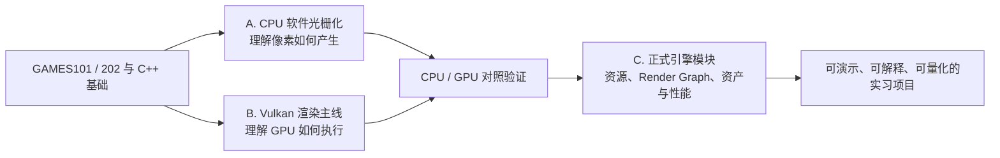

# EmberFrame 学习与项目进度路线图

> 最后更新：2026-09-10
>
> 当前关口：A2 Bresenham 直线光栅化

这份文件是 EmberFrame 的学习总控表。它分别记录“代码是否存在”和“知识是否掌握”：提前搭好的源码不算学习完成，只有通过本页的验收标准才会标记为完成。

## 当前进度快照

| 项目 | 数量 | 说明 |
|---|---:|---|
| 已掌握 | 2 / 20 | A1 CPU Framebuffer、B1 SDL 窗口与事件循环 |
| 当前学习 | 1 / 20 | A2 Bresenham 直线 |
| 代码已准备、尚未学习 | 6 / 20 | A3—A7、B2 Platform 与 Runtime 初版 |
| 尚未开始 | 11 / 20 | 后续算法和 Vulkan 课程 |

当前粗略掌握进度为 **10%**。这个百分比只统计 20 个知识单元，不代表整个引擎项目已经完成 10%，也不包含已经学过的 GAMES101/202 课程本身。

## 状态含义

| 标记 | 含义 |
|---|---|
| ✅ 已掌握 | 已通过本页的五项验收 |
| 🟡 当前 | 现在只集中学习这一课 |
| 🧱 已准备 | 代码或讲义已经搭好，但不能算掌握 |
| ⬜ 未开始 | 等前置知识完成后再实现 |

## 一课何时才算掌握

每一课必须同时满足以下五项，才可以从 🟡 改为 ✅：

- [ ] 能说清这节课解决的问题，以及输入和输出；
- [ ] 能从命令行独立构建、运行并找到输出结果；
- [ ] 不看源码也能复述核心计算或 API 调用顺序；
- [ ] 能完成一次小改动，并在运行前预测结果；
- [ ] 能解释至少一个故障现象、产生原因和排查方法。

判断标准不是“看过”“运行过”或“抄过”，而是能解释、能修改、能排错。

## 总体依赖路线



三条线路不是三个互不相关的项目：A 线解释算法，B 线解释 GPU API，C 线把已经理解且稳定的职责沉淀到 EmberFrame 正式代码中。

## A 线：Software Renderer 图形算法

| ID | 状态 | 主题 | 必须得到的产物 | 掌握验收重点 |
|---|---|---|---|---|
| A1 | ✅ | [CPU Framebuffer](software_renderer/01_CPU_FRAMEBUFFER.md) | `framebuffer.ppm` | RGB、二维坐标到一维内存、边界检查、PPM 输出 |
| A2 | 🟡 | [Bresenham 直线](software_renderer/02_BRESENHAM_LINES.md) | `lines.ppm` | 陡峭轴交换、端点排序、整数误差累计、八个方向连续画线 |
| A3 | 🧱 | [三角形与重心坐标](software_renderer/03_TRIANGLE_RASTERIZATION.md) | `triangle.ppm` | 包围盒、边函数、像素中心采样、重心权重和属性插值 |
| A4 | 🧱 | [深度缓冲](software_renderer/04_DEPTH_BUFFER.md) | `depth.ppm` | 深度插值、逐像素比较、绘制顺序与遮挡结果解耦 |
| A5 | 🧱 | [坐标变换与背面剔除](software_renderer/05_TRANSFORMS_AND_CULLING.md) | 旋转的实体立方体 | Model、View、Projection、Viewport 各自输入输出，背面剔除 |
| A6 | 🧱 | [透视正确插值与纹理](software_renderer/06_PERSPECTIVE_CORRECT_TEXTURE.md) | 仿射/透视插值对照图 | 为什么屏幕空间线性插值会错、`1/w` 修正、UV 采样 |
| A7 | 🧱 | [基础光照与 Shadow Map](software_renderer/07_LIGHTING_AND_SHADOW.md) | 光照场景和光源深度图 | 法线空间、Lambert/Blinn-Phong、Shadow Map 的深度比较 |
| A8 | ⬜ | CPU Renderer 收尾项目 | 可交互模型查看器和性能记录 | 整合管线、拆分模块、固定场景回归、帧耗时分析 |

详细构建目标和逐课入口见 [Software Renderer 学习索引](software_renderer/README.md)。

## B 线：Vulkan 与 GPU 渲染

| ID | 状态 | 主题 | 必须得到的产物 | 掌握验收重点 |
|---|---|---|---|---|
| B1 | ✅ | [SDL 窗口与事件循环](01_WINDOW_AND_EVENT_LOOP.md) | 可关闭的空窗口 | 初始化、事件轮询、退出条件、清理顺序 |
| B2 | 🧱 | RAII、Platform 与 Runtime | 独立窗口层和应用主循环 | 所有权、构造/析构、依赖方向、Composition Root |
| B3 | ⬜ | 时间、输入与引擎事件 | 输入状态 Sample | 平台事件到引擎事件的转换，Renderer 不依赖 SDL 输入 |
| B4 | ⬜ | Vulkan Instance、Surface 与校验层 | 可报告验证信息的初始化 Sample | 扩展、校验层、Surface 的作用与生命周期 |
| B5 | ⬜ | Physical/Logical Device 与 Queue | 设备选择报告 | 队列族、功能检查、逻辑设备和队列职责 |
| B6 | ⬜ | Swapchain 与 Image View | 可响应缩放的交换链 | 图像获取、呈现、格式选择、窗口尺寸变化重建 |
| B7 | ⬜ | Command Buffer 与同步 | 稳定多帧循环 | Fence、Semaphore、每帧资源和 CPU/GPU 先后关系 |
| B8 | ⬜ | Dynamic Rendering 清屏 | 每帧变色窗口 | Image Layout、Barrier、命令录制与提交 |
| B9 | ⬜ | Shader、Pipeline 与三角形 | Vulkan 彩色三角形 | 顶点到片元的数据流、Pipeline State、Shader 编译 |
| B10 | ⬜ | Buffer、Image、Descriptor | GPU 资源 Sample | 上传路径、内存所有权、Descriptor 绑定和资源销毁 |
| B11 | ⬜ | Mesh、纹理与 glTF 场景 | 可观察的模型查看器 | 顶点/索引、纹理、材质、相机和场景资产链路 |
| B12 | ⬜ | 调试、性能与 CPU/GPU 对照 | RenderDoc 截帧和计时报告 | 验证层、对象命名、Timestamp、同一算法两种实现的对应关系 |

## C 线：从学习代码沉淀为正式引擎

C 线不计入上面的 20 个知识单元，因为它以工程里程碑而不是单课统计。

| ID | 状态 | 工程里程碑 | 完成证据 |
|---|---|---|---|
| C0 | ✅ | 固定 Vulkan Guide 上游基线 | 上游 commit、License、Windows Release 构建和冒烟测试 |
| C1 | 🧱 | 拆出 Launcher、Platform、Runtime 与 Vulkan Backend | 模块依赖图、独立 Sample、生命周期说明、回归运行结果 |
| C2 | ⬜ | 代际 Handle、Resource Registry 与延迟销毁 | 无效句柄/重复释放测试、跨帧回收演示 |
| C3 | ⬜ | Render Graph | Pass DAG、循环检测、自动 Barrier、Graphviz/调试视图 |
| C4 | ⬜ | 异步资产上传与热重载 | Staging Ring、失败占位资源、加载耗时对比 |
| C5 | ⬜ | CPU/GPU Profiler 与固定 Benchmark | 可复现场景、帧时间/显存数据、优化前后报告 |

正式工程目标和个人贡献边界见 [PROJECT_PLAN.md](../../PROJECT_PLAN.md) 与 [UPSTREAM.md](../../UPSTREAM.md)。

## 推荐实际推进顺序

不要同时打开所有章节。按下面六个关口推进：

1. **离散光栅化基础：** A2 → A3 → A4；
2. **完整 CPU 管线：** A5 → A6，完成能加载模型和纹理的最小软件渲染器；
3. **引擎外壳：** B2 → B3，把平台、主循环、时间和输入真正讲明白；
4. **Vulkan 最小渲染闭环：** B4 → B9，从初始化走到 GPU 三角形；
5. **算法/API 对照：** B10 → B12，同时回看 A5 → A7，解释数据在 CPU 与 GPU 路径中的对应位置；
6. **简历工程亮点：** C1 → C3 优先，之后根据时间选择 C4/C5，并用 A8 收束演示。

当前只执行第 1 个关口中的 **A2**。A3、A4 虽然已有代码，也先不标完成。

## 面向实习的阶段检查点

### R1：EmberFrame 可以作为核心项目投递

- A1—A6 和 B1—B9 达到“已掌握”；
- 能现场解释 CPU 三角形如何变成像素，以及同一过程如何映射到 Vulkan Pipeline；
- 至少有一个由自己独立修改、调试并记录结果的可运行 Demo；
- 能明确区分上游教程代码和自己的贡献。

达到 R1 后，EmberFrame 已经适合作为简历中的核心图形项目；实际投递和简历准备可以更早开始，不需要等待 R1。

### R2：形成有辨识度的简历项目

- 完成 B10—B12；
- C2 或 C3 至少有一个达到可测试、可演示、可解释；
- 有设计文档、失败案例、测试或 Benchmark，而不只是功能截图；
- 能用三分钟讲清问题、选择、实现、验证结果和下一步限制。

## 当前下一步：A2

构建并运行：

```powershell
.\scripts\build-windows.ps1 -Config Release -Target emberframe_sr_02_lines
.\bin\Release\emberframe_sr_02_lines.exe
```

完成 A2 前需要依次回答：

1. 为什么斜率绝对值大于 1 时要交换 x、y？
2. 为什么先保证起点的 x 不大于终点的 x？
3. 误差累计量在什么时候让 y 前进一步？
4. 把一条端点改掉后，你能否在运行前判断线会落在哪个象限？

通过后，本页会将 A2 更新为 ✅，A3 更新为 🟡，并重新计算进度快照。
