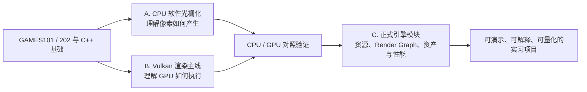

# EmberFrame 学习与项目进度路线图

> 最后更新：2026-10-05
>
> 当前关口：B/C 概念首轮已讨论；统一渲染实验室已接入，继续逐专题做源码理解、修改与故障实验

这份文件是 EmberFrame 的学习总控表。它分别记录“代码是否存在”和“知识是否掌握”：提前搭好的源码不算学习完成，只有通过本页的验收标准才会标记为完成。

A1—A8 已完成学习；原始逐项记录保留在 [2026-09-10 TinyRenderer 学习冲刺](software_renderer/2026-09-10_SPRINT.md)。后续不再扩张 A 线，必要时只作为 Vulkan 和 GPU 算法的对照材料回看。

## 当前进度：学习与实现分开

| 路线 | 当前确认 | 下一步 |
|---|---|---|
| A1—A8 | 已完成；原记录不动 | 作为参考，缺失基础另建 D 专题 |
| B1—B20 | 概念首轮在会话已讨论；B5 之后的源码/修改/故障实验不因此完成 | 保留各课实践验收 |
| C1—C12 | 概念首轮已讨论；统一 Workbench 主链路、诊断、报告和演示产物已实现 | 源码理解/故障实验仍逐项验收，不等同于生产级引擎 |
| D01—D32 | 全部纳入专题学习与独立实验，尚未完成专题化验收 | 第一批 D01—D03 |

D 系列完整内容、输入输出、前置、实验与验收见 [高级渲染与图形基础深化专题](ADVANCED_RENDERING_TRACK.md)。2026-10-05 已新增 `engine/lab` 的算法实现、GPU/CPU 入口和测试，详见 [当前运行说明](../../README.md#运行渲染实验室)。这里的学习勾选不因代码生成而自动完成。不得把理论讲解、上游源码、独立 Sample 和正式引擎集成混成同一完成状态。

### 历史进度快照：2026-09-19（保留，不代表当前）

以下数量和百分比是当时的学习记录，不再作为当前进度：

| 项目 | 数量 | 说明 |
|---|---:|---|
| 已掌握 | 12 / 28 | A1—A8、B1—B4 |
| 理论已掌握、实践待回看 | 5 / 28 | B5—B9：整体逻辑已理解，部分源码阅读、修改与故障实验延后 |
| 当前学习 | 1 / 28 | B10 GPU Buffer、VMA 与 Staging Upload |
| 代码已准备、尚未学习 | 2 / 28 | B11—B12 的 Vulkan Guide 基线能力 |
| 尚未开始 | 8 / 28 | B13—B20 的个人学习与实现 |

当时按五项严格验收统计，掌握进度为 **43%**；如果只统计理论理解，则为 **61%**。这两个百分比都只统计 A/B 两条线的 28 个知识单元，不等于正式引擎完成度；C 线继续按工程里程碑单独验收。

## 状态含义

| 标记 | 含义 |
|---|---|
| ✅ 已掌握 | 已通过本页的五项验收 |
| 🟠 理论完成 | 已能解释完整逻辑，但源码阅读、修改或故障实验尚未验收 |
| 🟡 当前 | 现在只集中学习这一课 |
| 🧱 已准备 | 代码或讲义已经搭好，但不能算掌握 |
| ⬜ 未开始 | 等前置知识完成后再实现 |

## 一课何时才算掌握

每一课必须同时满足以下五项，才可以从 🟡 改为 ✅：

- [ ] 能说清这节课解决的问题，以及输入和输出；
- [ ] 能从命令行独立构建、运行并找到输出结果；
- [ ] 不看源码也能复述核心计算或 API 调用顺序；
- [ ] 能完成一次小改动，并在运行前预测结果；
- [ ] 能解释至少一个故障现象、产生原因和排查方法。

判断标准不是“看过”“运行过”或“抄过”，而是能解释、能修改、能排错。

## 总体依赖路线

```mermaid
flowchart LR
    Foundation["GAMES101 / 202 与 C++ 基础"]
    CPU["A. CPU 软件光栅化<br/>理解像素如何产生"]
    Vulkan["B. Vulkan 渲染主线<br/>理解 GPU 如何执行"]
    Compare["CPU / GPU 对照验证"]
    Engine["C. 正式引擎模块<br/>资源、Render Graph、资产与性能"]
    Portfolio["可演示、可解释、可量化的实习项目"]

    Foundation --> CPU
    Foundation --> Vulkan
    CPU --> Compare
    Vulkan --> Compare
    Compare --> Engine
    Engine --> Portfolio
```

A/B/C/D 不是互不相关的项目：A 线解释基础像素生成，B 线解释 GPU API，C 线沉淀正式模块，D 线补充算法深度、独立实验和参考验证。D 不要求改写已完成的 A 章，也不把新增计划计入历史百分比。

## A 线：Software Renderer 图形算法

| ID | 状态 | 主题 | 必须得到的产物 | 掌握验收重点 |
|---|---|---|---|---|
| A1 | ✅ | [CPU Framebuffer](software_renderer/01_CPU_FRAMEBUFFER.md) | `framebuffer.ppm` | RGB、二维坐标到一维内存、边界检查、PPM 输出 |
| A2 | ✅ | [Bresenham 直线](software_renderer/02_BRESENHAM_LINES.md) | `lines.ppm` | 陡峭轴交换、端点排序、整数误差累计、八个方向连续画线 |
| A3 | ✅ | [三角形与重心坐标](software_renderer/03_TRIANGLE_RASTERIZATION.md) | `triangle.ppm` | 包围盒、边函数、像素中心采样、重心权重和属性插值 |
| A4 | ✅ | [深度缓冲](software_renderer/04_DEPTH_BUFFER.md) | `depth.ppm` | 深度插值、逐像素比较、绘制顺序与遮挡结果解耦 |
| A5 | ✅ | [坐标变换与背面剔除](software_renderer/05_TRANSFORMS_AND_CULLING.md) | 旋转的实体立方体 | Model、View、Projection、Viewport 各自输入输出，背面剔除 |
| A6 | ✅ | [透视正确插值与纹理](software_renderer/06_PERSPECTIVE_CORRECT_TEXTURE.md) | 仿射/透视插值对照图 | 为什么屏幕空间线性插值会错、`1/w` 修正、UV 采样 |
| A7 | ✅ | [基础光照与 Shadow Map](software_renderer/07_LIGHTING_AND_SHADOW.md) | 光照场景和光源深度图 | 法线空间、Lambert/Blinn-Phong、Shadow Map 的深度比较 |
| A8 | ✅ | [CPU Renderer 收尾项目](software_renderer/08_CPU_RENDERER_CAPSTONE.md) | 可交互 OBJ 查看器和单帧统计 | 整合管线、职责拆分、固定场景回归、帧耗时分析 |

详细构建目标和逐课入口见 [Software Renderer 学习索引](software_renderer/README.md)。

## B 线：Vulkan 与 GPU 渲染

| ID | 状态 | 主题 | 必须得到的产物 | 掌握验收重点 |
|---|---|---|---|---|
| B1 | ✅ | [SDL 窗口与事件循环](01_WINDOW_AND_EVENT_LOOP.md) | 可关闭的空窗口 | 初始化、事件轮询、退出条件、清理顺序 |
| B2 | ✅ | [RAII、Platform 与 Runtime](02_RAII_PLATFORM_RUNTIME_COMPLETE.md) | 独立窗口层和应用主循环 | 所有权、构造/析构、依赖方向、Composition Root、异常清理 |
| B3 | ✅ | [时间、输入与引擎事件](03_TIME_INPUT_ENGINE_EVENTS.md) | 输入状态 Sample | 平台事件到引擎事件的转换，Renderer 不依赖 SDL 输入 |
| B4 | ✅ | [Vulkan Instance、Surface 与 Validation](04_VULKAN_INSTANCE_SURFACE_VALIDATION.md) | 初始化报告与受控 Debug 回调 | 扩展、校验层、Debug Messenger、Surface 的作用与生命周期 |
| B5 | 🟠 | [Physical/Logical Device 与 Queue](05_PHYSICAL_LOGICAL_DEVICE_QUEUES.md) | 带打分和拒绝原因的设备选择报告 | 理论逻辑已掌握；中文注释、源码追踪、修改与故障实验待回看 |
| B6 | 🟠 | [Swapchain、Image View 与重建](06_SWAPCHAIN_IMAGE_VIEW_RECREATION.md) | 支持 Resize/最小化恢复的 Swapchain/ImageView 报告 | 理论逻辑已掌握；源码追踪、修改实验与错误路径验证待回看 |
| B7 | 🟠 | [Command Pool/Buffer 与帧资源](07_COMMAND_POOL_BUFFER_FRAME_RESOURCES.md) | 两个 Frame Slot 轮换的命令提交报告 | 理论逻辑已掌握；源码回看、小修改和故障实验待验收 |
| B8 | 🟠 | [Fence、Semaphore 与 Pipeline Barrier](08_FENCE_SEMAPHORE_PIPELINE_BARRIER.md) | GPU 动态清屏、完整 Acquire/Submit/Present 循环和同步时序日志 | 理论逻辑已掌握；源码回看、小修改和故障实验待验收 |
| B9 | 🟠 | [Dynamic Rendering、Shader 与 Graphics Pipeline](09_DYNAMIC_RENDERING_SHADER_PIPELINE.md) | Vulkan 彩色三角形和 Pipeline 配置报告 | 理论逻辑已掌握；源码回看、Shader 修改和故障实验待验收 |
| B10 | 🟠 | [GPU Buffer、VMA 与 Staging Upload](10_GPU_BUFFER_VMA_STAGING_UPLOAD.md) | 顶点/索引上传与显存统计 Sample | Host/Device Memory、映射、复制、对齐、所有权和销毁顺序 |
| B11 | 🟠 | Image、Sampler 与 Descriptor | 可切换纹理和采样器的模型 Sample | Layout Transition、Mip、过滤、Descriptor Set/Layout/Pool 与绑定频率 |
| B12 | 🟠 | glTF Mesh、材质与场景链路 | 可观察节点层级和材质数据的 glTF Viewer | 顶点/索引、Node Transform、纹理、材质、透明队列与资产失败路径 |
| B13 | 🟠 | Validation、RenderDoc 与 CPU/GPU Profiler 基线 | 固定场景 Capture、Timestamp 和基准报告 | Debug Name、Query Pool、测量区间、CPU/GPU 瓶颈与可复现条件 |
| B14 | 🟠 | 线性颜色空间、sRGB、HDR 与 Tone Mapping | 颜色空间错误对照和 HDR 输出 Sample | 纹理解码、线性光照、曝光、Gamma、Reinhard/ACES 取舍 |
| B15 | 🟠 | Cook–Torrance 直接光 PBR | Metallic/Roughness 材质球矩阵 | GGX NDF、Smith Geometry、Schlick Fresnel、能量守恒、点光衰减 |
| B16 | 🟠 | 完整 glTF Metallic-Roughness 材质 | 支持 BaseColor/MR/Normal/AO/Emissive 的 Viewer | TBN、法线贴图、F0、金属/非金属工作流、材质缺省值和调试视图 |
| B17 | 🟠 | IBL 与 Split-Sum | Irradiance、Prefiltered Cubemap、BRDF LUT | 渲染方程近似、Diffuse/Specular IBL、粗糙度 Mip、预计算验证 |
| B18 | 🟠 | 实时阴影系统 | Bias/PCF/CSM/PCSS 对照；统计阴影见 D19—D21 | Shadow Acne、Peter Panning、级联稳定化；VSM/SAT/VSSM/MSM 全部建立独立实验 |
| B19 | 🟠 | 多 Pass HDR 后处理 | Scene Color→Bloom→Tone Map 的可视管线 | 中间 Render Target、Pass 依赖、分辨率链、带宽与 GPU 时间 |
| B20 | 🟠 | 差异化扩展与综合优化 | SSAO/GTAO/TAA 深入；GPU Driven 与 QEM LOD 基本概念 | 五个方向都保留；新增光照、阴影、降噪等按 D 系列分专题实现与对照 |

B10—B20 的 🟠 只确认概念首轮已讨论；表中的产物仍是实践目标，不表示已经在正式入口运行。B5—B20 最终都需要源码理解、预测性修改和失败实验，再升级为 ✅。

## C 线：从学习代码沉淀为正式引擎

C 线不计入上面的 28 个知识单元，因为它以工程里程碑而不是单课统计。B 线负责把概念做成可独立验证的 Sample，C 线负责把已经理解的能力沉淀成可复用、可测试、可观测的正式引擎模块。

| ID | 状态 | 工程里程碑 | 完成证据 |
|---|---|---|---|
| C0 | ✅ | 固定 Vulkan Guide 上游基线 | 上游 commit、License、Windows Release 构建和冒烟测试 |
| C1 | 🧱 | Launcher、Platform、Runtime 与 Vulkan Backend | 模块依赖图、独立 Sample、生命周期说明、异常退出回归结果 |
| C2 | 🧱 | Vulkan Context、Swapchain 与 Frame Context 模块化 | Resize/最小化/重建设备回归，帧资源所有权和提交时序图 |
| C3 | 🧱 | 代际 Handle、Resource Registry 与延迟销毁 | 无效句柄、重复释放和过期句柄测试，跨帧安全回收演示 |
| C4 | 🧱 | Shader、Pipeline 与 Material 系统 | Pipeline Cache、材质参数反射或声明、Shader 热重载与失败回退 |
| C5 | 🧱 | PBR Render Feature 与材质调试器 | glTF PBR 场景、材质球矩阵、法线/粗糙度/金属度等调试视图 |
| C6 | 🧱 | Render Graph | Pass DAG、循环检测、资源生命周期、自动 Barrier、Pass Culling 和 Graphviz 视图 |
| C7 | 🧱 | 异步资产流水线 | 后台解析、Staging Ring、单帧上传预算、缓存、占位资源和热重载 |
| C8 | 🧱 | Render Scene 与可见性系统 | Frustum Culling、批次统计，并按方向选择 Hi-Z、Instancing 或 Indirect Draw |
| C9 | 🧱 | Job System 与 Task Graph | 依赖调度、Work Stealing、可控退出、单线程/多线程扩展性报告 |
| C10 | 🧱 | CPU/GPU Profiler 与固定 Benchmark | CPU Scope、GPU Timestamp、显存/Draw Call 数据和优化前后报告 |
| C11 | 🧱 | 版本化场景序列化与最小 Inspector | Schema Migration、未知字段保留、资源引用修复、Undo/Redo 演示 |
| C12 | 🧱 | 综合 Demo、回归与作品集收口 | 一键构建运行、图像回归、性能报告、架构文档、演示视频和三分钟讲稿 |

正式工程目标和个人贡献边界见 [PROJECT_PLAN.md](../../PROJECT_PLAN.md) 与 [UPSTREAM.md](../../UPSTREAM.md)。

### 2026-10-05 当前工程验收

统一 Workbench 已有真实材质场景、前向/延迟、高级 GPU 阴影/GI/时间过滤、多 Pass 执行、间接绘制、Staging Ring、整批 Shader/驱动缓存与回退、后台工作和版本化场景。SH/PRT、网格距离场、持久 LOD、BVH/八叉树场景查询和 GPU 稀疏体素也进入正常使用路径。**193 项算法检查、135 项 GPU 集成检查与 64 组整体回归通过**（集合重叠），包括新版编辑器逐页与窄窗口呈现。C6 的真实 JSON/DOT 图、C9 的 13 配置系统扩展性报告、C10 的六组 GPU 完成帧分布、C12 的可解码 MP4 与三分钟稿也已生成；历史报告绑定生成版本，不把旧计时当作新功能组合的性能。入口与限制见 [README](../../README.md#当前实现和执行位置) 和 [演示指南](../WORKBENCH_DEMO.md)。这些证据让章节进入“代码已准备”，不自动把个人学习验收改为“已掌握”。

### 2026-09-29 工程验收核对历史记录

当时 C1/C2/C10 的基础实现、C3/C4 的最小绘制与资源生命周期路径已有可运行证据，但 🧱 仍表示**部分实现，不是整章完成**。C3 新增正式模块 `GpuResources`：VMA Buffer/Image、引擎代际 Handle、跨类型句柄拒绝、延迟回收和活跃分配统计；`--resource-smoke-test` 已通过。当时测试资源还未参与真实 GPU Copy/Draw，C5—C9、C11—C12 尚待实现。本段保留历史，不代表上方最新 Workbench 状态。

## D 线：高级渲染与图形基础深化

全部范围和 13 批学习顺序见 [D01—D32 专题总纲](ADVANCED_RENDERING_TRACK.md)。下表区分个人知识验收与当前工程执行位置；“接入”指统一 Workbench，不表示把全部实验复制进原上游章节，也不表示所有算法都在 GPU 上执行。

| ID | 专题 | 概念 | 独立实验 | 正式接入 |
|---|---|---|---|---|
| D01 | 齐次裁剪：先裁三角形，再除以 w | 待验收 | 已实现/测试 | CPU 参考；GPU 固定功能裁剪 |
| D02 | 共享边覆盖与 Top-left rule（顶边/左边规则） | 待验收 | 已实现/测试 | CPU 参考；GPU 光栅化 |
| D03 | 纹理足迹、缩小与过滤 | 待验收 | 已实现/测试 | CPU 导数/Mip；GPU 梯度/多 tap |
| D04 | 深度精度、Z-fighting 与 Reversed-Z | 待验收 | 已实现/测试 | CPU/GPU |
| D05 | CPU/GPU 管线差分验证 | 待验收 | 已实现/测试 | 线性 BaseColor 差分；HDR 路径一致性 |
| D06 | 包围体与基础相交测试 | 待验收 | 已实现/测试 | CPU 相交与 GPU 剔除 |
| D07 | BVH：包围体层次结构 | 待验收 | 已实现/测试 | 实际场景选物/查询/CPU 路径追踪 |
| D08 | Octree：八叉树与空间划分 | 待验收 | 已实现/测试 | 可替换 BVH 的实际场景查询/CPU 路径追踪 |
| D09 | 蒙特卡洛、重要性采样、MIS 与预计算 | 待验收 | 已实现/测试 | CPU 积分/离线参考与预计算 |
| D10 | 小型离线路径追踪参考渲染器 | 待验收 | 已实现/测试 | CPU，不是硬件光追 |
| D11 | SH：球谐环境光表示 | 待验收 | 已实现/测试 | 当前场景 CPU/GPU 环境漫反射；专门对照保留 |
| D12 | PRT：预计算辐射传输 | 待验收 | 已实现/测试 | 静态实例后台烘焙/持久化；正常前向/延迟查询 |
| D13 | IBL 预计算与采样验证专题 | 待验收 | 已实现/测试 | CPU 对照 + GPU 预过滤天光/LUT |
| D14 | Kulla–Conty：微表面多次散射能量补偿 | 待验收 | 已实现/测试 | CPU/GPU |
| D15 | Disney 材质：Clearcoat、Anisotropy 与 Cloth/Sheen | 待验收 | 已实现/测试 | CPU/GPU 直接光分量 |
| D16 | LTC：矩形面积光源 | 待验收 | 已实现/测试 | CPU/GPU 粗拟合表 |
| D17 | Forward / Deferred：光照在哪一遍计算 | 待验收 | 已实现/测试 | GPU 七目标 G-buffer/光照，含 PRT 照度 |
| D18 | Tiled / Clustered：多光源候选列表 | 待验收 | 已实现/测试 | GPU，最多 64 灯 |
| D19 | VSM 与 SAT：矩统计与区域查询 | 待验收 | 已实现/测试 | CPU/GPU |
| D20 | VSSM：统计近似 PCSS 遮挡者搜索 | 待验收 | 已实现/测试 | CPU/GPU |
| D21 | MSM：四矩阴影与数值稳定性 | 待验收 | 已实现/测试 | CPU/GPU，退化回退 |
| D22 | SSR：屏幕空间反射 | 待验收 | 已实现/测试 | CPU/GPU，仅第一层深度 |
| D23 | SSGI：屏幕空间间接光 | 待验收 | 已实现/测试 | CPU/GPU，仅第一层深度 |
| D24 | HW5：时空降噪完整链路 | 待验收 | 已实现/测试 | CPU 连续参考 + GPU 历史/双边过滤 |
| D25 | SVGF：方差引导的多尺度过滤 | 待验收 | 已实现/测试 | CPU/GPU 基础版 |
| D26 | RSM：反射阴影贴图的一次间接光 | 待验收 | 已实现/测试 | CPU/GPU；GPU 方向光有界场景 |
| D27 | LPV：光传播体积 | 待验收 | 已实现/测试 | CPU/GPU 一阶 SH 网格传播 |
| D28 | 体素化、三维 Mip 与稀疏空间结构 | 待验收 | 已实现/测试 | GPU 稠密构建→非空节点 compact→稀疏页表/SSBO 查询；CPU 三角形八叉树另有用途 |
| D29 | VXGI / VCT：体素全局光照与锥体追踪 | 待验收 | 已实现/测试 | CPU/GPU VCT 实验，不是完整商用 VXGI |
| D30 | SDF：有符号距离场、追踪与阴影 | 待验收 | 已实现/测试 | 正常场景网格无符号距离烘焙/持久化/CPU/GPU 阴影；解析有符号示例保留 |
| D31 | NPR：卡通、描边与织线风格实验 | 待验收 | 已实现/测试 | CPU/GPU |
| D32 | 统一渲染实验室、证据与作品集收口 | 待验收 | 已实现/测试 | 工作台、图、报告、视频与操作稿 |

本次要求的所有专题都必须有独立实验与证据；前向/延迟、不同阴影和 GI 方案可以互为对照，不要求同时启用。按前置逐步接入 C 系统，暂未具备工程前置的章节保留范围并延后，不改成“只提到”。CPU/GPU 对照不等于跨驱动要求位级一致；离线路径追踪是有收敛误差的参考。

## 推荐实际推进顺序

概念学习下一批从 **D01—D03** 开始，后续每批 2—3 章，顺序由 D 总纲列出。下面的底座顺序用于源码回看与个人验收；当前实现入口已准备，不是重新搭一份：

1. 核对 C1/C2 的正式入口、平台层、帧闭环和错误路径；
2. 补齐 B10—B12 → C3/C4 的真实 Vertex/Index 上传、纹理、材质和 glTF 场景；
3. 用 B13 → C10 固定测量条件，保留基线；
4. 用 B14—B17 → C5 建立可验证的 PBR/IBL；
5. 用 B18/B19 → C6 建立实际 Shadow、Lighting、Postprocess 依赖；
6. 分批完成 D 独立实验，再按职责整合 C3—C8；并继续 C7/C8/C9/C11 的工程验收；
7. 用 D32 与 C12 保存回归、性能、失败案例和作品集。

CPU 裁剪、采样、空间结构与离线参考可先独立完成，不必等整个正式引擎。GPU 实验需要先核对其资源/材质/Pass 前置。所有要求的专题都保留，分批不是删掉方向；源码和故障回看任务也不因继续概念学习而消失。

## 面向实习的阶段检查点

### R1：EmberFrame 可以作为核心项目投递

- A1—A8、B1—B17 达到“已掌握”；
- C1—C5、C10 可运行、可测试、可量化；
- 能现场解释 CPU 光栅化如何映射到 Vulkan Pipeline，以及 PBR 的 D/F/G、颜色空间和 IBL 数据流；
- 有真实 glTF PBR Viewer、材质调试视图、RenderDoc Capture 和 GPU Timestamp 报告；
- 能明确区分上游教程代码和自己的贡献。

达到 R1 后，EmberFrame 已经适合作为简历中的核心图形项目；实际投递和简历准备可以更早开始，不需要等待 R1。

### R2：形成有辨识度的简历项目

- 完成 B18—B20；
- 完成 C6，并推进 C7、C8、C9、C11 的工程验收；D 系列全部分批覆盖，不以此检查点要求一次完成所有专题；
- Shadow、Lighting、Postprocess 等真实 Pass 由 Render Graph 调度，而不是只展示空架构；
- 有设计文档、失败案例、图像回归和固定 Benchmark，而不只是功能截图；
- 能用三分钟讲清问题、选择、实现、验证结果和下一步限制。

## 当前下一步：打开实验室完成对应源码与故障验收

B1—B20 与 C1—C12 的概念首轮在会话已讨论；统一 Workbench 的上传、材质、渲染、后处理和回归链路现已可运行。下一步使用固定场景逐专题做源码理解、预测性修改与故障实验；D01—D03 可从齐次裁剪、共享边覆盖和纹理足迹开始。旧 [第二批实现说明](C3_C4_SECOND_BATCH.md) 用于回看资源生命周期入门；当前执行位置和限制以 [README](../../README.md#当前实现和执行位置) 为准。

### B7 延后回看任务

1. 按状态机追踪一次 Command Buffer 从 Initial 到 Pending、完成后再 Reset 的完整过程；
2. 独立运行 `emberframe_07_command_frames`，确认两个 Frame Slot 轮换；
3. 修改 Frame Slot 数量并预测日志；
4. 移除安全等待后观察并解释复用 Pending Command Buffer 的风险。

完成这些实践验收后，再把 B7 从 🟠 更新为 ✅。

### B6 延后回看任务

1. 按调用关系追踪一次查询、选择、创建 Swapchain 和 ImageView 的完整源码；
2. 独立运行 `emberframe_06_swapchain`，观察 Resize、最小化和恢复日志；
3. 强制使用 FIFO，预测并验证 Present Mode 日志变化；
4. 解释零尺寸延迟重建、错误销毁顺序或不支持 Color Attachment Usage 时的失败路径。

完成这些实践验收后，再把 B6 从 🟠 更新为 ✅。

### B5 延后回看任务

B5 暂不继续逐行阅读英文源码。回看前先补齐关键位置的中文注释，重点覆盖候选 GPU 筛选、Queue Family 检查、Feature `pNext` 链、唯一队列族请求、Queue 获取和逆序清理。之后再完成：

1. 按调用关系追踪一次完整设备选择与 `VkDevice` 创建；
2. 独立构建运行 `emberframe_05_device_queue`；
3. 完成一次可预测结果的小修改；
4. 制造并解释一个 Feature、Extension 或 Queue 条件不满足的失败案例。

完成这些实践验收后，再把 B5 从 🟠 更新为 ✅。
