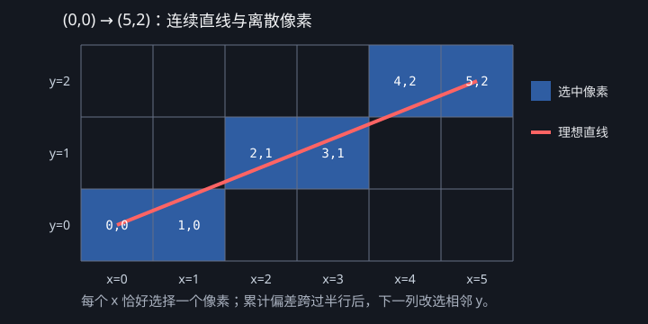

# Software Renderer 第二课：Bresenham 直线光栅化

本课解决的问题是：给定两个连续平面上的端点，怎样选择一组整数像素，让它们尽量接近理想直线。

对应源码：[samples/software_renderer/02_lines/main.cpp](../../../samples/software_renderer/02_lines/main.cpp)。

## 1. 输入与输出

| 字段 | 内容 |
|---|---|
| 输入 | 起点、终点、颜色、Framebuffer |
| 计算 | 沿主轴逐像素前进，用整数误差决定何时改变另一坐标 |
| 输出 | Framebuffer 中一系列连续的着色像素 |
| 本课不做 | 线宽、抗锯齿、裁剪、三角形和 GPU 渲染 |

Rasterization 的中文含义是光栅化：把连续几何图元转换为离散像素覆盖结果。直线本身是连续对象，屏幕像素只能使用整数坐标，所以必须决定哪些像素代表它。

## 2. 为什么不按固定小数步长采样

如果参数 `t` 每次固定增加 `0.01`，短线可能重复写同一个像素，长线可能漏掉像素；步长还与线段长度绑定。我们需要让循环次数由主轴覆盖的像素数决定。

Bresenham 算法使用整数加减维护误差，不需要每一步重新计算浮点斜率。

## 3. 统一处理所有方向

源码先进行两次规范化：

1. 陡线的 y 变化大于 x 变化时，交换 x/y，让算法始终沿 x 前进；
2. 起点 x 大于终点 x 时交换端点，让循环始终从左到右。

写像素时，如果第一步交换过 x/y，就再交换回来。这样同一个主循环可以处理水平线、垂直线、正斜率、负斜率和反向端点。

## 4. 误差怎样决定 y 是否移动

设：

- `deltaX`：规范化后终点与起点的水平距离；
- `deltaY`：垂直距离的绝对值；
- `error`：当前整数像素与理想直线之间的累计偏差；
- `yStep`：y 应该向上走 `-1` 还是向下走 `+1`。

每让 x 前进一步，就执行：

```text
error = error - deltaY
```

当误差小于零时，说明理想直线已经更接近相邻像素行，因此让 y 前进一步，再加回 `deltaX`。

可以把 `error` 理解为经过整数缩放后的“半个像素行预算”：

- 理想直线每沿 x 前进 1，y 应增加 `deltaY / deltaX`；
- 为了避免每轮除法，所有量同时乘以 `deltaX`；
- 所以每前进一列，预算减少 `deltaY`；
- 预算小于 0 表示累计的理想 y 位移已经跨过半行，应改选相邻 y；
- y 前进一整行等价于在缩放后的单位里消耗了一个 `deltaX`，所以给预算加回 `deltaX`，继续计算下一次跨行时机。

这里的“加回”不是消除误差，而是已经通过移动 y 处理掉一整行偏差后，重新记录剩余偏差。

最小例子：从 `(0, 0)` 到 `(5, 2)`，最终选择：

```text
(0,0), (1,0), (2,1), (3,1), (4,2), (5,2)
```



这个例子里 `deltaX=5`、`deltaY=2`、初始 `error=2`。误差序列为：

| 写入像素 | 减去 `deltaY` 后 | 是否移动 y | 加回 `deltaX` 后 |
|---|---:|---|---:|
| `(0,0)` | 0 | 否 | 0 |
| `(1,0)` | -2 | 是 | 3 |
| `(2,1)` | 1 | 否 | 1 |
| `(3,1)` | -1 | 是 | 4 |
| `(4,2)` | 2 | 否 | 2 |
| `(5,2)` | 0 | 否 | 0 |

## 5. 构建与运行

```powershell
.\scripts\build-windows.ps1 -Config Release -Target emberframe_sr_02_lines
.\bin\Release\emberframe_sr_02_lines.exe
```

输出文件：

```text
bin/Release/lines.ppm
```

预期结果是从中心向多个方向发散的彩色直线，覆盖缓坡、陡坡、水平和垂直情况。

### 逐轮追踪模式

短直线 `(0,0) → (5,2)`：

```powershell
.\bin\Release\emberframe_sr_02_lines.exe --trace 0 0 5 2
```

陡直线 `(2,1) → (4,9)`：

```powershell
.\bin\Release\emberframe_sr_02_lines.exe --trace 2 1 4 9
```

终端会逐轮打印：规范化后的主轴坐标、写入的真实像素、减去 `deltaY` 前后的误差、是否推进副轴，以及下一轮误差。追踪模式的图片输出为 `bin/Release/line_trace.ppm`。

观察第二条命令：输入的 y 跨度更大，所以 `steep=yes`；规范化后主轴从 1 走到 9，但 `pixel=(x,y)` 会交换回原坐标。

## 6. 限制与下一课

当前线宽固定为一个像素，也没有抗锯齿。它已经足够说明“连续几何怎样选择离散像素”。下一课会从一维线段覆盖推进到二维三角形区域覆盖。

理解检查：

1. 为什么陡线要交换 x/y？
2. 为什么要统一从较小 x 走向较大 x？
3. `error` 小于零时为什么要移动 y？
4. Bresenham 输出的是数学直线，还是一组像素坐标？
