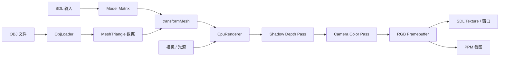

# 第 8 课：CPU Renderer 收尾整合

## 本课解决什么问题

前七课一次只展开一个算法。本课不再添加新的渲染效果，而是把这些步骤组合成可复用的 `CpuRenderer`，加入 OBJ 模型加载、SDL 实时显示、交互控制和单帧统计，形成可以独立运行与解释的收尾项目。

| 项目 | 内容 |
|---|---|
| 输入 | OBJ 模型、Model 旋转、相机、光源、Framebuffer 尺寸 |
| 计算 | OBJ 解析 → 变换 → 两遍光栅化 → 光照/阴影 → RGB 上传 |
| 输出 | SDL 实时查看器，或 Headless PPM 图片与统计数据 |
| 工程目标 | 分离模型加载、渲染器和应用层，不在 `main` 中重复全部算法 |
| 限制 | 单线程、无近裁剪、无抗锯齿、程序生成纹理、固定光照模型 |

## 模块关系



应用层负责“什么时候渲染、用户输入是什么”；`CpuRenderer` 负责“给定场景和参数后如何生成像素”；`ObjLoader` 负责“如何把文件解析为三角形”。

## A1—A7 在哪里汇合

| 前置课 | A8 中的对应职责 |
|---|---|
| A1 Framebuffer | 保存 RGB 字节、清屏、输出 PPM、上传 SDL Texture |
| A2 直线 | 不直接进入最终三角形管线，但建立了离散像素选择思维 |
| A3 三角形 | 边函数、包围盒、像素中心和重心坐标 |
| A4 深度 | 相机深度缓冲和光源深度缓冲 |
| A5 变换 | Model、View、Projection、Viewport 和背面剔除 |
| A6 纹理 | UV、`uv/w`、`1/w` 和棋盘格采样 |
| A7 光照阴影 | Lambert、Blinn-Phong、Shadow Map 两个 Pass |

## OBJ 加载器做了什么

OBJ（Wavefront OBJ）是文本模型格式。本课支持：

- `v x y z`：位置；
- `vt u v`：纹理坐标；
- `vn x y z`：法线；
- `f ...`：面索引；
- 正索引与负相对索引；
- 将四边形或更多顶点的面按扇形拆为三角形；
- 文件没有法线时，用叉积计算面法线。

教学资产 `textured_cube.obj` 有 6 个四边形，加载后应得到 12 个三角形。加载器不处理 MTL 材质、骨骼和复杂资产管线；后续正式 Vulkan 引擎会使用 glTF，而不是继续扩张这个教学解析器。

## 一帧的完整调用链

1. SDL 收集键盘和退出事件；
2. 根据按键更新模型角度和光源角度；
3. `transformMesh` 用 Model Matrix 变换 OBJ 顶点和法线；
4. 加入静态地面，形成当前帧场景；
5. `CpuRenderer::render` 清理颜色、相机深度和光源深度；
6. Shadow Pass 从光源视角写最近深度；
7. Camera Pass 完成背面剔除、光栅化、深度测试、透视插值、纹理、光照和阴影；
8. RGB Framebuffer 上传到 SDL Streaming Texture；
9. SDL 把纹理呈现在窗口，并在标题中显示统计数据。

## 构建与运行

```powershell
.\scripts\build-windows.ps1 -Config Release -Target emberframe_sr_08_cpu_renderer
.\bin\Release\emberframe_sr_08_cpu_renderer.exe
```

控制方式：

| 按键 | 行为 |
|---|---|
| `A/D` 或左右方向键 | 旋转模型 |
| `Q/E` | 绕场景移动光源 |
| `R` | 恢复初始模型与光源角度 |
| `S` | 保存 `cpu_renderer_screenshot.ppm` |
| `Esc` | 退出 |

## 无窗口验证

```powershell
.\bin\Release\emberframe_sr_08_cpu_renderer.exe --headless
```

它只渲染一帧并退出，生成：

- `cpu_renderer.ppm`；
- `cpu_renderer_shadow.ppm`；
- 三角形数、可见三角形数、着色片元数、阴影查询数和单帧毫秒数。

也可以指定其他 OBJ：

```powershell
.\bin\Release\emberframe_sr_08_cpu_renderer.exe --headless D:\models\example.obj
```

模型必须至少包含合法位置和面，缺少 UV 时会使用 `(0,0)`，缺少法线时会计算面法线。

## 统计数字分别说明什么

- `submittedTriangles`：地面与模型提交到渲染器的总三角形数；
- `visibleTriangles`：通过背面剔除且投影面积非零的三角形数；
- `shadedFragments`：通过相机深度测试并真正计算颜色的像素候选；
- `shadowTests`：最终着色时查询 Shadow Map 的次数；
- `renderMs`：当前 CPU 单线程实现完成一帧的时间。

一次数字不能证明性能好坏。做 Benchmark 时需要固定模型、相机、分辨率和构建配置，多帧采样后再比较。

## 必做修改与故障实验

### 修改实验一：模型与光源独立变化

分别按 `A/D` 和 `Q/E`。模型旋转应改变可见面与纹理方向；光源移动应改变明暗、高光与地面阴影，但不会改变模型几何位置。

### 修改实验二：替换模型

复制一个简单 OBJ 并通过命令行传入。先检查加载出的三角形数，再观察朝向、UV 和法线是否正确。

### 故障实验一：错误面序

在 `textured_cube.obj` 中把一个面的顶点顺序反转。该面的计算法线会反向，并可能被背面剔除；这说明 OBJ 索引顺序也是模型语义的一部分。

### 故障实验二：资源路径

传入不存在的 OBJ 路径。程序应明确报告 `Cannot open OBJ file` 并返回非零退出码，而不是显示空窗口。

### 故障实验三：法线变换限制

当前 `transformMesh` 直接用 Model Matrix 变换法线，只因为示例只做旋转。加入非均匀缩放后这种方法会错，正式方案需要 Model Matrix 左上 3×3 的逆转置矩阵。

## 完成检查

1. 能否从 OBJ 的 `f` 一直讲到 Framebuffer 的一个 RGB 像素？
2. 为什么 `main` 不应该包含全部光栅化细节？
3. Shadow Pass 和 Camera Pass 分别写入什么数据？
4. 为什么 SDL Texture 只是显示 CPU 结果，不代表本课使用 GPU 完成了光栅化？
5. OBJ 缺少法线时如何生成面法线，代价是什么？
6. `submittedTriangles`、`visibleTriangles`、`shadedFragments` 为什么不能互相替代？
7. 你能否独立完成一次模型/光源修改，并在运行前预测几何、光照和阴影各会如何变化？
8. 你能否解释当前实现的至少三个限制，以及它们分别应该在哪个模块修复？

通过这些问题和实验后，A8 才能标记为已掌握；仅仅运行出窗口仍只表示代码可用。
